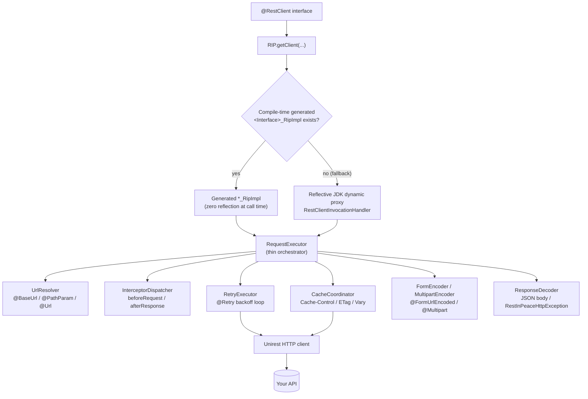
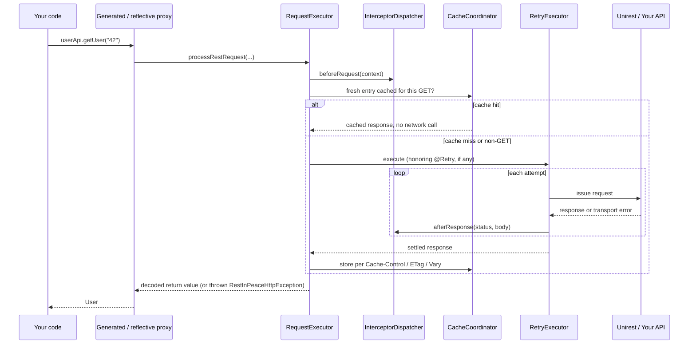

# REST-in-peace

**A Simple, Declarative and Peaceful REST Client for Java**

REST-in-peace lets you declare a REST API as a plain Java interface and get a
working HTTP client for it at runtime — no hand-written request-building
boilerplate. Annotate an interface, call `RIP.getClient(...)`, and invoke its
methods like any other Java call.

[](https://github.com/shrinivas93/REST-in-peace/actions/workflows/ci.yml)
[](https://github.com/shrinivas93/REST-in-peace/actions/workflows/sample-consumer-test.yml)
[](https://github.com/shrinivas93/REST-in-peace/releases/latest)
[](https://shrinivas93.github.io/REST-in-peace/)
[](https://shrinivas93.github.io/REST-in-peace/apidocs/)
[](#requirements)
[](LICENSE)

**[Field guide — every feature, plain Java and Spring side by side](https://shrinivas93.github.io/REST-in-peace/)**

```java
@RestClient
@BaseUrl("https://api.example.com")
public interface UserApi {

    @GET("/users/{id}")
    User getUser(@PathParam("id") String id);
}
```

```java
UserApi userApi = RIP.getClient(UserApi.class);
User user = userApi.getUser("42");
```

That's it — no `HttpClient` boilerplate, no manual JSON (de)serialization, no
hand-rolled retry loop. Everything below is what's available once you need
more than the basics: path/query/header params, file uploads, response
caching, retries with backoff, interceptors, async calls, and a real local
test server for unit tests.

---

## Table of contents

- [Why REST-in-peace?](#why-rest-in-peace)
- [Features](#features)
- [Requirements](#requirements)
- [Installation](#installation)
  - [Maven](#maven)
  - [Gradle](#gradle)
- [Quick start](#quick-start)
- [How it works](#how-it-works)
  - [Request lifecycle](#request-lifecycle)
  - [Compile-time vs. reflective proxies](#compile-time-vs-reflective-proxies)
- [Annotations reference](#annotations-reference)
  - [`@RestClient`](#restclient)
  - [`@BaseUrl`](#baseurl)
  - [HTTP method annotations](#http-method-annotations)
  - [`@PathParam`](#pathparam)
  - [`@Url`](#url)
  - [`@QueryParam`](#queryparam)
  - [`@HeaderParam`](#headerparam)
  - [`@QueryMap` / `@HeaderMap`](#querymap--headermap)
  - [`@Headers`](#headers)
  - [`@Body`](#body)
  - [`@Multipart` / `@Part` / `@PartMap`](#multipart--part--partmap)
  - [`@FormUrlEncoded` / `@Field` / `@FieldMap`](#formurlencoded--field--fieldmap)
- [Return types](#return-types)
  - [Binary downloads: `byte[]` and `File`](#binary-downloads-byte-and-file)
  - [Response headers and status: `RipResponse<T>`](#response-headers-and-status-ripresponset)
- [Error handling](#error-handling)
- [Async](#async)
- [Retries](#retries)
  - [Idempotency keys](#idempotency-keys)
- [Timeouts](#timeouts)
- [Per-client configuration: timeout and proxy](#per-client-configuration-timeout-and-proxy)
  - [JSON `ObjectMapper`](#json-objectmapper)
- [Response caching](#response-caching)
  - [`@NoCache`](#nocache)
- [Interceptors](#interceptors)
  - [Per-client interceptors](#per-client-interceptors)
  - [Pre-built interceptors](#pre-built-interceptors)
- [Compile-time proxy generation](#compile-time-proxy-generation)
- [Testing with `MockRestServer`](#testing-with-mockrestserver)
  - [JUnit 5 extension](#junit-5-extension)
- [Integrating with your project](#integrating-with-your-project)
  - [Spring / Spring Boot](#spring--spring-boot)
  - [Plain Java, CLI tools, and scripts](#plain-java-cli-tools-and-scripts)
  - [Kotlin, Scala, and other JVM languages](#kotlin-scala-and-other-jvm-languages)
- [Samples](#samples)
- [Project structure](#project-structure)
- [Development](#development)
  - [Building and testing](#building-and-testing)
  - [Code style](#code-style)
  - [Running the sample consumer locally](#running-the-sample-consumer-locally)
- [Contributing](#contributing)
- [Versioning and releases](#versioning-and-releases)
- [Roadmap](#roadmap)
- [FAQ / Troubleshooting](#faq--troubleshooting)
- [Acknowledgments](#acknowledgments)
- [License](#license)

---

## Why REST-in-peace?

Calling a REST API from Java usually means either pulling in a heavyweight
client generator, or hand-writing the same boilerplate for every endpoint:
build the URL, set headers, serialize the body, execute, check the status
code, deserialize the response, and do it all again for the next endpoint.

```java
// Without REST-in-peace
HttpResponse<String> response = Unirest.get("https://api.example.com/users/{id}")
        .routeParam("id", id)
        .queryString("verbose", verbose)
        .header("Authorization", "Bearer " + token)
        .asString();
if (response.getStatus() < 200 || response.getStatus() >= 300) {
    throw new RuntimeException("Request failed: " + response.getStatus());
}
User user = objectMapper.readValue(response.getBody(), User.class);
```

```java
// With REST-in-peace
@RestClient
interface UserApi {
    @GET("https://api.example.com/users/{id}")
    User getUser(@PathParam("id") String id, @QueryParam("verbose") Boolean verbose);
}

User user = userApi.getUser("42", true);
```

The declaration *is* the client. A non-2xx response, retries, caching, and
cross-cutting concerns like auth headers and logging are all handled by the
library instead of being re-implemented per call site — see
[Features](#features) below for the full list, and [How it works](#how-it-works)
for what actually happens under `getUser(...)`.

## Features

- Declarative REST clients defined as annotated Java interfaces
- `@BaseUrl` declares a base URL once instead of repeating it on every
  method, or pass one to `RIP.getClient(...)` when it's only known at
  runtime (e.g. one per deployment environment)
- All seven common HTTP verbs: `GET`, `POST`, `PUT`, `PATCH`, `DELETE`,
  `HEAD`, `OPTIONS`
- `@PathParam`, `@QueryParam`, `@HeaderParam`, and `@Body` parameter binding
- `@QueryMap`/`@HeaderMap` for a dynamic set of query params/headers not
  known until runtime
- `@Headers` sets fixed, always-the-same headers on a method, overridden by
  `@HeaderParam`/`@HeaderMap` for the same header name
- `@Url` binds a full URL as a parameter, bypassing `@BaseUrl`/`@PathParam`
  entirely, for a pagination `next` link or a HATEOAS action link that isn't
  a fixed template
- `@Multipart`/`@Part`/`@PartMap` for `multipart/form-data` uploads (form
  fields, `File`/`byte[]`/`InputStream` file parts, a dynamic set of parts
  not known until runtime, and an `UploadProgressListener` for progress
  reporting on a large file part)
- `@FormUrlEncoded`/`@Field`/`@FieldMap` sends an
  `application/x-www-form-urlencoded` body instead of JSON - for OAuth
  token endpoints and classic HTML-form-style POSTs
- Optional params with `required` and `defaultValue`
- Request bodies: raw strings are sent as-is, other objects are
  JSON-serialized automatically
- Responses: a `String` return type gives you the raw body; any other
  return type is deserialized from JSON automatically
- `byte[]` and `File` (via `@Destination`) return types for binary
  downloads, with an optional `DownloadProgressListener` for progress
  reporting
- `RipResponse<T>` wraps `T` with the response's status code and headers,
  for a method that needs more than just the body
- A non-2xx response always throws `RestInPeaceHttpException`, with
  `@ErrorType` to deserialize the error body into a class
- `CompletableFuture<T>` return types fire requests asynchronously
- `@Retry` re-issues a failed request with configurable backoff, for both
  synchronous and async methods; `idempotent = true` sends a stable
  `Idempotency-Key` header held identical across every attempt, so a
  server that honors idempotency keys (Stripe, PayPal, Adyen, Square) can
  treat a retried `POST`/`PATCH` as the same logical request instead of
  executing it twice
- `@Timeout` overrides the connect/read timeout for one method;
  `RipClientConfig` overrides base URL, timeout, proxy, cache, JSON
  `ObjectMapper`, and interceptors for one client (e.g. one per deployment
  environment). `RIP.setObjectMapper(...)` sets a custom mapper (Jackson, a
  configured Gson, ...) for the shared client
- Response caching honors the server's own `Cache-Control`/`ETag`/
  `Last-Modified` headers for `GET` requests — a fresh entry is served with
  zero network call, a stale revalidatable one sends
  `If-None-Match`/`If-Modified-Since` automatically. `Vary`-aware, with
  `@NoCache` to opt a single method out even when its client has a cache
  configured
- Global interceptors for cross-cutting concerns (auth headers, logging,
  metrics) without touching individual `@RestClient` interfaces;
  `RipClientConfig.Builder.interceptors(...)` adds interceptors for one
  client only (e.g. that service's own auth scheme), running in addition to
  every global one, not instead of them
- Optional **compile-time proxy generation** — an annotation processor
  emits a real, reflection-free implementation for a supported
  `@RestClient` interface at build time, with zero configuration and a
  transparent fallback to a reflective JDK dynamic proxy for anything it
  doesn't yet cover; see [Compile-time proxy generation](#compile-time-proxy-generation)
- `MockRestServer` — a real, local HTTP server for unit-testing
  `@RestClient` code without a real network dependency, with a JUnit 5
  extension for zero-boilerplate setup
- Interfaces are validated up front — misconfigured clients fail fast at
  `RIP.getClient(...)` time with a clear error, not on the first call
- Works from any JVM language (Java, Kotlin, Scala, ...) since it's just an
  annotated interface backed by a JDK dynamic proxy (or a generated class)

## Requirements

- Java 8 or newer
- Maven (or any build tool that resolves Maven coordinates — see
  [Gradle](#gradle) for an equivalent Gradle setup)

## Installation

Published to GitHub Packages under `com.shri:rest-in-peace`. GitHub Packages
requires authentication even for public read access — see
[GitHub's Maven registry docs](https://docs.github.com/en/packages/working-with-a-github-packages-registry/working-with-the-apache-maven-registry)
(Maven) or
[GitHub's Gradle registry docs](https://docs.github.com/en/packages/working-with-a-github-packages-registry/working-with-the-gradle-registry)
(Gradle) for configuring credentials.

Browse available versions on the
[Packages page](https://github.com/shrinivas93?tab=packages&repo_name=REST-in-peace)
or the [Releases page](https://github.com/shrinivas93/REST-in-peace/releases) —
replace `1.0.0.0-SNAPSHOT` below with the version you want (see
[Versioning and releases](#versioning-and-releases) for what the version
number means).

### Maven

```xml
<repositories>
    <repository>
        <id>github</id>
        <url>https://maven.pkg.github.com/shrinivas93/REST-in-peace</url>
    </repository>
</repositories>

<dependency>
    <groupId>com.shri</groupId>
    <artifactId>rest-in-peace</artifactId>
    <version>1.0.0.0-SNAPSHOT</version>
</dependency>
```

### Gradle

```groovy
repositories {
    maven {
        url = uri("https://maven.pkg.github.com/shrinivas93/REST-in-peace")
        credentials {
            username = project.findProperty("gpr.user") ?: System.getenv("GITHUB_ACTOR")
            password = project.findProperty("gpr.token") ?: System.getenv("GITHUB_TOKEN")
        }
    }
}

dependencies {
    implementation("com.shri:rest-in-peace:1.0.0.0-SNAPSHOT")
}
```

Full API documentation is browsable at
[shrinivas93.github.io/REST-in-peace](https://shrinivas93.github.io/REST-in-peace/),
rebuilt from the exact commit of each release. Each published version also
ships a `-javadoc.jar` alongside the main jar in GitHub Packages.

## Quick start

Declare your API as an interface annotated with `@RestClient`, with each
method annotated with the HTTP verb and URL it calls:

```java
import com.shri.restinpeace.RIP;
import com.shri.restinpeace.annotation.marker.RestClient;
import com.shri.restinpeace.annotation.method.GET;
import com.shri.restinpeace.annotation.request.PathParam;
import com.shri.restinpeace.annotation.request.QueryParam;

@RestClient
public interface UserApi {

    @GET("https://api.example.com/users/{id}")
    String getUser(@PathParam("id") String id,
                   @QueryParam(value = "verbose", defaultValue = "false") Boolean verbose);
}
```

Get a client and call it like a normal method:

```java
UserApi userApi = RIP.getClient(UserApi.class);
String response = userApi.getUser("42", true);
```

`RIP.getClient(...)` validates the interface before handing back a proxy. If
anything is misconfigured — a method with no HTTP verb, an invalid URL, a
`{pathParam}` with no matching `@PathParam`, and so on — it throws a
`RestInPeaceException` immediately, with the full list of problems, instead
of failing later on the first call.

`getClient(...)` re-validates and re-resolves the interface every time it's
called — it doesn't cache the result — so call it once per
`@RestClient` interface and hold on to (or inject) the returned instance,
rather than calling `getClient(...)` again on every request; see
[Integrating with your project](#integrating-with-your-project) for how
this looks with a DI framework.

## How it works

### Request lifecycle

Every call — whatever the return type, whether it goes through the
reflective proxy or a compile-time-generated one — funnels through the same
pipeline, built as a small set of single-purpose collaborators rather than
one large class:



A single call weaves through interceptors, an optional cache short-circuit,
and the retry loop in a fixed order:



Each collaborator owns exactly one concern: `UrlResolver` never touches
caching, `CacheCoordinator` never touches retries, and so on —
`RequestExecutor` itself just sequences them. See
[Project structure](#project-structure) for where each one lives.

### Compile-time vs. reflective proxies

`RIP.getClient(...)` always tries a compile-time-generated implementation
first (`Class.forName(restClient.getName() + "_RipImpl")`), and transparently
falls back to a reflective JDK dynamic proxy (`java.lang.reflect.Proxy`) if
none exists — either because the annotation processor never ran, or because
the interface uses a shape the processor doesn't yet cover. Both paths are
functionally identical from your code's point of view and share the exact
same `RequestExecutor` pipeline described above; the generated path just
skips reflection entirely at call time. See
[Compile-time proxy generation](#compile-time-proxy-generation) for what
that buys you and how to opt in.

## Annotations reference

### `@RestClient`

Marks an interface as a REST client. Required on every interface passed to
`RIP.getClient(...)`.

### `@BaseUrl`

Declares the base URL once on the interface, so methods can use a relative
path instead of repeating the full URL every time:

```java
@RestClient
@BaseUrl("https://api.example.com")
interface UserApi {
    @GET("/users/{id}")
    User getUser(@PathParam("id") String id);
}
```

A method URL that's already absolute (starts with `http://` or `https://`)
ignores `@BaseUrl` and is used as-is — a method can always opt out with its
own full URL. A relative method URL on an interface with no `@BaseUrl` fails
validation. `@BaseUrl` can itself contain a `{placeholder}`, resolved by a
`@PathParam` the same as any method URL.

#### Choosing the base URL per environment

`@BaseUrl`'s value has to be a compile-time constant, so it can't itself
hold something environment-dependent. For an app that deploys the same
`@RestClient` interface against a different base URL per environment (dev,
staging, prod), pass the resolved URL to `RIP.getClient(...)` instead:

```java
UserApi api = RIP.getClient(UserApi.class, System.getenv("USER_API_BASE_URL"));
```

This takes priority over `@BaseUrl` on the interface, so `@BaseUrl` is
optional when every relative method URL is covered by the runtime value.
Precedence, most specific first: an absolute method URL always wins, then
the `baseUrl` passed to `getClient(...)`, then `@BaseUrl` on the interface —
a relative method URL covered by none of these fails validation.

For more than just the base URL varying per environment — a connect/read
timeout or a proxy that differs too — pass a
[`RipClientConfig`](#per-client-configuration-timeout-and-proxy) to
`getClient(...)` instead of a plain `String`.

### HTTP method annotations

One of `@GET`, `@POST`, `@PUT`, `@PATCH`, `@DELETE`, `@HEAD`, `@OPTIONS` on
each method, holding the URL template:

```java
@GET("https://api.example.com/items/{id}")
String getItem(@PathParam("id") String id);
```

Every method must have exactly one of these — none or more than one fails
validation.

### `@PathParam`

Substitutes a `{placeholder}` in the URL template with the argument value.
Every `{placeholder}` in the URL must have a matching `@PathParam`, checked
at validation time.

```java
@GET("https://api.example.com/items/{id}")
String getItem(@PathParam("id") String id);
```

The value is percent-encoded before substitution, so a `/`, `?`, `#`, or a
space in it lands as literal content of that one path segment instead of
producing a broken or subtly wrong URL (e.g. an unencoded `?` would
otherwise start a query string partway through the path).

### `@Url`

For a call whose URL isn't a fixed template known in advance - a pagination
`next` link, a HATEOAS action link embedded in a previous response - use
`@Url` on a `String` parameter instead of a method URL template:

```java
@GET
Page<Item> nextPage(@Url String url);
```

```java
Page<Item> page = itemApi.firstPage();
while (page.next != null) {
    page = itemApi.nextPage(page.next);
    process(page.items);
}
```

The HTTP method annotation (`@GET` above) is left with no `value()` -
combining `@Url` with a static URL template fails validation, since there'd
be two conflicting sources of truth for the URL. `@BaseUrl`, a runtime base
URL, and `@PathParam` are all bypassed entirely when `@Url` is used - there's
no template left for them to apply to - but `@QueryParam`/`@HeaderParam`/etc.
still work normally, appended to the given URL. At most one `@Url` parameter
is allowed per method, and a `null` argument throws at call time.

### `@QueryParam`

Appends a query string parameter. Supports `required` (throws at call time
if no value and no default is available) and `defaultValue` (used when the
argument is `null`):

```java
@GET("https://api.example.com/items")
String search(@QueryParam(value = "q", required = true) String query,
               @QueryParam(value = "page", defaultValue = "1") Integer page);
```

A `Collection` argument repeats the param once per element instead of
being sent as one mangled value:

```java
@GET("https://api.example.com/items")
String search(@QueryParam("tag") List<String> tags);

// search(List.of("a", "b")) sends ?tag=a&tag=b
```

### `@HeaderParam`

Sets an HTTP header, with the same `required`/`defaultValue` semantics as
`@QueryParam`:

```java
@GET("https://api.example.com/items")
String search(@HeaderParam(value = "Authorization", required = true) String token);
```

### `@QueryMap` / `@HeaderMap`

For a set of query params or headers whose names aren't known until
runtime — a search endpoint's open-ended filter set, or caller-supplied
headers in a multi-tenant app — annotate a `Map<String, ?>` parameter
instead of adding one `@QueryParam`/`@HeaderParam` per name. Each map entry
becomes one query param or header; a `null` map, or a `null` entry value,
is skipped rather than throwing:

```java
@GET("https://api.example.com/search")
String search(@QueryParam("q") String query, @QueryMap Map<String, String> filters);

@GET("https://api.example.com/users/{id}")
User getUser(@PathParam("id") String id, @HeaderMap Map<String, String> extraHeaders);
```

`@QueryMap`/`@HeaderMap` can be combined with fixed `@QueryParam`/`@HeaderParam`
parameters on the same method — the fixed ones for names you always know,
the map for everything else. At most one parameter per method may be
annotated `@QueryMap`, and at most one `@HeaderMap`. Like `@QueryParam`, a
`@QueryMap` entry whose value is a `Collection` is repeated once per
element.

### `@Headers`

Sets one or more fixed HTTP headers on a method — for a header whose value
is always the same (`Accept`, `Cache-Control`, an API version), not derived
from a call argument. Each entry is a `"Name: Value"` string, split on its
first `:` with whitespace trimmed around both sides — `"Name:Value"`,
`"Name : Value"`, and `"Name    :     Value"` are all equivalent:

```java
@GET("https://api.example.com/users")
@Headers({ "Cache-Control: no-cache", "X-Api-Version: 2" })
List<User> listUsers();
```

`@Headers` can be combined with `@HeaderParam`/`@HeaderMap` on the same
method; if both set the same header name, `@HeaderParam`/`@HeaderMap` wins,
since a per-call value is more specific than an always-on method annotation.
An entry with no `:`, or an empty header name, fails validation.

### `@Body`

Sends a request body. Only valid on `POST`, `PUT`, `PATCH`, and `DELETE` —
using it on `GET`, `HEAD`, or `OPTIONS` fails validation. A `String` value is
sent as-is; any other object is JSON-serialized automatically:

```java
@POST("https://api.example.com/items")
String createItem(@Body Item item);

@POST("https://api.example.com/items/raw")
String createRaw(@Body String rawJson);
```

At most one parameter per method may be annotated `@Body`.

### `@Multipart` / `@Part` / `@PartMap`

Sends a `multipart/form-data` body instead of `@Body`'s JSON/raw-string one —
for file uploads and classic HTML-form-style POSTs:

```java
@POST("https://api.example.com/users/{id}/avatar")
@Multipart
String uploadAvatar(@PathParam("id") String id, @Part("caption") String caption, @Part("file") File avatar);
```

`@Multipart` goes on the method (same HTTP methods `@Body` supports —
`GET`/`HEAD`/`OPTIONS` fail validation); `@Part` goes on each field. A
`String` is sent as a plain form field; `File`, `byte[]`, and `InputStream`
are all sent as a file part. A method can't combine `@Multipart` with a
`@Body` parameter, and needs at least one `@Part`/`@PartMap` to be worth
declaring multipart at all. `@Part`'s `required` works the same as
`@QueryParam`'s — `false` by default, silently skipping a `null` argument;
`true` throws at call time instead.

A `byte[]`/`InputStream` part has no filename of its own, so the multipart
field needs one from somewhere — `@Part`'s `fileName` supplies it (also
usable to override a `File` part's own name), defaulting to the part's
`value()` when left unset:

```java
@POST("https://api.example.com/users/{id}/avatar")
@Multipart
String uploadAvatarBytes(@PathParam("id") String id,
        @Part(value = "file", fileName = "avatar.png") byte[] avatarBytes);
```

For a set of parts not known until runtime, `@PartMap` on a `Map<String, ?>`
parameter adds one part per entry — the `@Part`/`@Multipart` counterpart to
`@QueryMap`/`@HeaderMap`. Each value is handled the same way a `@Part` value
would be, with the entry's key doubling as the filename for a
`byte[]`/`InputStream` value:

```java
@POST("https://api.example.com/uploads")
@Multipart
String upload(@PartMap Map<String, Object> parts);

// upload(mapOf("caption", "vacation photo", "file", photoBytes));
```

`@PartMap` combines with fixed `@Part` parameters on the same method, a
`null` map or a `null` entry value is skipped rather than an error, and at
most one `@PartMap` parameter per method is allowed, same as `@QueryMap`/
`@HeaderMap`.

A `@PartMap` entry has no per-entry `fileName` to set, unlike a fixed
`@Part` - wrap a `File`/`byte[]`/`InputStream` value in `PartValue.of(value,
fileName)` when an entry needs a name other than its key:

```java
Map<String, Object> parts = new LinkedHashMap<>();
parts.put("caption", "vacation photo");                          // plain form field
parts.put("thumb", photoBytes);                                  // filename defaults to "thumb"
parts.put("file", PartValue.of(photoBytes, "photo.jpg"));        // filename "photo.jpg" instead of "file"
api.upload(parts);
```

Add an `UploadProgressListener` parameter to observe upload progress on a
large `File`/`InputStream` part - only valid alongside `@Multipart`:

```java
@POST("https://api.example.com/users/{id}/avatar")
@Multipart
String uploadAvatar(@PathParam("id") String id, @Part("file") File avatar, UploadProgressListener onProgress);
```

```java
avatarApi.uploadAvatar("42", avatar, (field, bytesWritten, totalBytes) ->
        System.out.printf("%s: %d / %d%n", field, bytesWritten, totalBytes));
```

It's only called for `File`/`InputStream` parts - a `String`/`byte[]` part
is written in one shot with nothing meaningful to report. `field` is the
part's name (its `@Part`/`@PartMap` key), needed to tell parts apart since
calls for different parts interleave rather than running one at a time.
Pass `null` for a call that doesn't need progress reporting.

### `@FormUrlEncoded` / `@Field` / `@FieldMap`

Sends an `application/x-www-form-urlencoded` body instead of `@Body`'s
JSON/raw-string one — for OAuth token endpoints and classic HTML forms:

```java
@POST("https://api.example.com/oauth/token")
@FormUrlEncoded
String getToken(@Field("grant_type") String grantType, @Field("client_id") String clientId);
```

`@FormUrlEncoded` goes on the method (same HTTP methods `@Body` supports);
`@Field` goes on each parameter, encoding it as one `name=value` pair, with
the same `required` semantics as `@QueryParam`/`@Part` (`false` by default,
silently skipping a `null` argument; `true` throws at call time instead). A
`Collection` value repeats the key once per element (`tag=a&tag=b`), the
same convention `@QueryParam` uses. A method can't combine `@FormUrlEncoded`
with `@Body` or `@Multipart` — a method has exactly one body-encoding
strategy, if any.

For a set of fields not known until runtime, `@FieldMap` on a
`Map<String, ?>` parameter adds one field per entry — the
`@FormUrlEncoded` counterpart to `@QueryMap`/`@PartMap`:

```java
@POST("https://api.example.com/search")
@FormUrlEncoded
String search(@FieldMap Map<String, Object> filters);
```

`@FieldMap` combines with fixed `@Field` parameters on the same method, a
`null` map or a `null` entry value is skipped rather than an error, and at
most one `@FieldMap` parameter per method is allowed.

## Return types

A method's declared return type controls what you get back:

```java
@GET("https://api.example.com/users/{id}")
String getUserRaw(@PathParam("id") String id);   // raw response body

@GET("https://api.example.com/users/{id}")
User getUser(@PathParam("id") String id);        // response JSON deserialized into User

@POST("https://api.example.com/events")
void fireEvent(@Body Event event);               // response body discarded
```

`String` gives you the raw response body. `void` fires the request and
discards the response. Anything else is deserialized from the response body
as JSON, the same way `@Body` serializes non-`String` request bodies. These
rules apply to a successful (2xx) response — see below for anything else.

### Binary downloads: `byte[]` and `File`

A `String` return type is fine for text, but decoding a binary response
(an image, a PDF, a zip) as a `String` corrupts it. Declare `byte[]`
instead to get the exact bytes back:

```java
@GET("https://api.example.com/reports/{id}/pdf")
byte[] downloadReport(@PathParam("id") String id);
```

For a large response, buffering the whole thing into a `byte[]` wastes
memory. Declare `File` instead, with a `@Destination File` parameter
saying where to write it - the same `File` instance comes back once the
download finishes:

```java
@GET("https://api.example.com/reports/{id}/pdf")
File downloadReport(@PathParam("id") String id, @Destination File target);
```

```java
File pdf = reportApi.downloadReport("42", new File("/tmp/report.pdf"));
```

Both work with `CompletableFuture<byte[]>`/`CompletableFuture<File>` for
an async download, and `byte[]` also works wrapped in `RipResponse<byte[]>`
when you need the status/headers alongside the bytes. A non-2xx response
still throws `RestInPeaceHttpException` as usual - the error body is
decoded as text (a JSON or plain-text error payload is far more likely
than a binary one), and a `File` destination is left untouched rather
than written with error content.

Add a `DownloadProgressListener` parameter to any of the above to observe
progress as the response streams in:

```java
@GET("https://api.example.com/reports/{id}/pdf")
File downloadReport(@PathParam("id") String id, @Destination File target,
        DownloadProgressListener onProgress);
```

```java
reportApi.downloadReport("42", target, (bytesWritten, totalBytes) ->
        System.out.printf("%d / %d%n", bytesWritten, totalBytes));
```

`totalBytes` is `-1` if the server didn't send a `Content-Length`. Pass
`null` for a call that doesn't need progress reporting.

### Response headers and status: `RipResponse<T>`

The rules above give you the body only. Declare `RipResponse<T>` instead of
`T` (or `CompletableFuture<RipResponse<T>>` for an async method) when a call
also needs the status code or a response header:

```java
@GET("https://api.example.com/users/{id}")
RipResponse<User> getUser(@PathParam("id") String id);
```

```java
RipResponse<User> response = userApi.getUser("42");
System.out.println(response.getStatus());               // e.g. 200
System.out.println(response.getHeader("ETag"));          // first value, case-insensitive lookup
System.out.println(response.getHeaders());                // Map<String, List<String>>, every value
User user = response.getBody();                          // decoded exactly like a plain T return
```

`T` is decoded by the same rules as a plain return type (`String` for the
raw body, `Void` to discard it, anything else deserialized from JSON).
`RipResponse<T>` only ever wraps a successful response — a non-2xx status
still throws `RestInPeaceHttpException` as described below, it's never
wrapped.

## Error handling

A response outside the 200–299 range always throws
`RestInPeaceHttpException`, whatever the method's return type — including
`void`:

```java
try {
    User user = userApi.getUser("42");
} catch (RestInPeaceHttpException e) {
    System.out.println(e.getStatus());     // e.g. 404
    System.out.println(e.getRawBody());    // the raw response body, always available
}
```

By default `getErrorBody()` just returns the same raw body as `getRawBody()`.
Annotate the method with `@ErrorType` to have the error body deserialized
into a class instead, the same way a successful response is deserialized
into the return type:

```java
@GET("/users/{id}")
@ErrorType(ApiError.class)
User getUser(@PathParam("id") String id);
```

```java
catch (RestInPeaceHttpException e) {
    ApiError error = e.getErrorBody();
    System.out.println(error.code);
}
```

`getErrorBody()` is an unchecked generic getter — it trusts the caller to
ask for the same type the method's `@ErrorType` declared (or `String` if it
has none). A transport failure (no response at all - a connection refused,
a timeout) throws the underlying transport exception directly, not
`RestInPeaceHttpException`, which specifically means "the server answered,
and the answer was an error."

## Async

Return `CompletableFuture<T>` instead of `T` to fire the request without
blocking the calling thread — `T` follows the same rules as a synchronous
return type (`String` for the raw body, anything else deserialized from
JSON):

```java
@GET("https://api.example.com/users/{id}")
CompletableFuture<User> getUserAsync(@PathParam("id") String id);
```

```java
CompletableFuture<User> future = userApi.getUserAsync("42");
future.thenAccept(user -> System.out.println(user.name));
```

A raw `CompletableFuture` (no type parameter) fails validation — the
library needs to know what to deserialize the response into.

Making any async call starts Unirest's async HTTP client on non-daemon
threads, so a short-lived program (a script, a CLI tool) won't exit on its
own afterward. Two ways to deal with that:

- Call `RIP.useDaemonThreadsForAsync()` once at startup, before making any
  async call — daemon threads don't keep the JVM alive, so your program
  exits normally once its own work is done. Not the default, since it
  reconfigures Unirest's shared global client; skip this if your app
  already configures Unirest's async client itself.
- Or call `kong.unirest.Unirest.shutDown()` when you're done making
  requests.

## Retries

Annotate a method with `@Retry` to re-issue a request that fails with a
transport error (connection refused, timeout) or one of a configurable set
of status codes:

```java
@GET("https://api.example.com/users/{id}")
@Retry(times = 3, delayMillis = 200, backoffMultiplier = 2.0)
User getUser(@PathParam("id") String id);
```

`times` is the maximum number of attempts in total (default 3); `delayMillis`
is how long to wait before the first retry (default 200); `backoffMultiplier`
is what that delay is multiplied by after each attempt (default 2.0 - use
`1.0` for a fixed delay instead of exponential backoff). `retryOnStatus`
controls which HTTP status codes count as retryable (default `429, 502, 503,
504`) - a transport error is always retried regardless of this list. `times`
must be at least 1, or the method fails validation.

`@Retry` works on both a synchronous return type and a `CompletableFuture`
one - retrying an async call schedules the next attempt on a background
thread instead of blocking the caller. Every attempt, including ones that
get retried, is still reported to any registered interceptor's
`afterResponse`, so a `LoggingInterceptor` or similar sees each individual
attempt, not just the final outcome.

### Idempotency keys

Retrying is only safe by default for a method whose HTTP verb is already
idempotent (`GET`/`PUT`/`DELETE`) — retrying a `POST`/`PATCH` that actually
succeeded server-side but whose response was lost in transit (a timeout or
dropped connection after the server committed) risks double-executing it (a
duplicate charge, a duplicate order). `idempotent = true` closes that gap:

```java
@POST("https://api.example.com/charges")
@Retry(times = 3, delayMillis = 200, idempotent = true)
String createCharge(@Body Charge charge);
```

It generates one `Idempotency-Key` header value per logical call and holds
it identical across every attempt, so a server that honors idempotency keys
(as Stripe, PayPal, Adyen, and Square all do) can recognize a retried
attempt as the same logical request instead of a new one. Default `false` —
harmless (but redundant) to set on `GET`/`PUT`/`DELETE`, most meaningful on
`POST`/`PATCH`.

## Timeouts

Annotate a method with `@Timeout` to override the connect/read timeout for
that method's calls only — an endpoint whose expected latency doesn't match
the rest of the client (a slow report-export endpoint, a health check that
should fail fast):

```java
@GET("https://api.example.com/reports/export")
@Timeout(readMillis = 120_000)
String exportReport();
```

`connectMillis` and `readMillis` are independent — set one, both, or
neither — and both default to `-1`, meaning "leave this one at whatever it
would otherwise be." `@Timeout` takes priority over a
[`RipClientConfig`](#per-client-configuration-timeout-and-proxy)'s timeout,
which in turn takes priority over the shared client's own configured
default. A negative value other than `-1` fails validation.

## Per-client configuration: timeout and proxy

Pass a `RipClientConfig` to `getClient(...)` instead of a plain `String`
base URL when a client's environment differs in more than just its base
URL — a connect/read timeout, a proxy, or a JSON `ObjectMapper`:

```java
UserApi prodApi = RIP.getClient(UserApi.class, RipClientConfig.builder()
        .baseUrl(prodBaseUrl)
        .connectTimeoutMillis(2_000)
        .readTimeoutMillis(10_000)
        .proxy("proxy.example.com", 8080)   // or proxy(host, port, username, password)
        .objectMapper(new JacksonObjectMapper(myJacksonMapper))
        .build());
```

Every setting is optional and independent. Setting a connect/read timeout,
a proxy, or an `objectMapper` gives that client its own dedicated Unirest
client instance (its own connection pool) instead of sharing the app-wide
static one — a config with only `baseUrl` set keeps sharing it, same as
`RIP.getClient(Class, String)`. Precedence is the same three-tier shape as
`@BaseUrl`'s: a method's own setting (`@Timeout`, or an absolute URL) beats
this config, which beats whatever's left as the shared client's own
default.

### JSON `ObjectMapper`

RIP's JSON (de)serialization for `@Body`/response types delegates entirely
to whatever `kong.unirest.ObjectMapper` is configured on the relevant
Unirest client — Gson-backed (`kong.unirest.JsonObjectMapper`) by default,
bundled transitively via Unirest, no Jackson dependency shipped. Two ways
to use a different one:

- **Every client sharing the app-wide static Unirest client** (i.e. every
  client without a `RipClientConfig` that sets its own timeout/proxy/
  `objectMapper`): `RIP.setObjectMapper(new JacksonObjectMapper(myMapper))`
  once at startup.
- **One `RipClientConfig`-configured client** with its own dedicated
  Unirest instance: `RipClientConfig.builder().objectMapper(...)`, as
  above — `RIP.setObjectMapper(...)` has no effect on it, since it isn't
  sharing the static client's config.

If no mapper ends up configured at all (only possible by explicitly
clearing one with `setObjectMapper(null)`), RIP fails with a
`RestInPeaceException` naming the problem, rather than a bare Unirest
exception with no mention of RIP.

For anything else `RipClientConfig` doesn't cover — TLS/mutual-TLS,
connection pooling, cookies, compression, and everything else
`kong.unirest.Config` exposes — configure `kong.unirest.Unirest`'s shared
client directly (it's a hard dependency, always on the classpath) before
making any calls.

## Response caching

Honor the server's own `Cache-Control`/`ETag`/`Last-Modified` headers
instead of hitting the network on every call. Attach a `Cache` per client,
or as a shared default for every client without its own:

```java
RIP.setCache(new InMemoryCache());   // shared default for every client

UserApi api = RIP.getClient(UserApi.class, RipClientConfig.builder()
        .cache(new InMemoryCache())  // or one client's own, instead
        .build());
```

Only a `GET` whose response carries a `Cache-Control max-age`, an `ETag`, or
a `Last-Modified` is ever stored — a response with none of those is never
cached, matching "honor what the server says" rather than inventing caching
the server never asked for:

- A **fresh** entry (`age < max-age`) is served straight from the cache,
  with zero network call.
- A **stale but revalidatable** entry (has an `ETag`/`Last-Modified`) sends
  `If-None-Match`/`If-Modified-Since` automatically; a `304 Not Modified`
  response refreshes the entry's freshness window and returns the
  previously-cached body without hitting your code with anything different.
- A response naming a `Vary` header (e.g. `Vary: Accept-Language`) is never
  served to a later request whose current value for that header differs
  from the one in force when it was stored, so a cache never serves the
  wrong language/format variant. `Vary: *` is never cached at all, same as
  `no-store`.

`InMemoryCache` (a `ConcurrentHashMap`-backed, process-local store) ships as
the default `Cache` implementation — zero new dependency. Implement `Cache`
yourself (`get`/`put`/`evict`/`clear`) to back it with Redis, Caffeine, or
anything else.

### `@NoCache`

Opts a single method out of caching even when its client has one
configured — for an endpoint that's cacheable in principle but needs to be
observed live at one particular call site (a live price feed on an
otherwise-cacheable catalog client):

```java
@GET("https://api.example.com/prices/{symbol}")
@NoCache
Price getLivePrice(@PathParam("symbol") String symbol);
```

Response caching is scoped to `String`/POJO `GET` responses for now — not
`byte[]`/`File` downloads.

## Interceptors

Register a global hook that runs on every request/response made through
RIP, without touching any `@RestClient` interface:

```java
RIP.addInterceptor(new RequestInterceptor() {
    @Override
    public void beforeRequest(RequestContext context) {
        context.addHeader("Authorization", "Bearer " + currentToken());
    }

    @Override
    public void afterResponse(RequestContext context, int status, Object body) {
        System.out.println(context.getHttpMethod() + " " + context.getUrl() + " -> " + status);
    }
});
```

Both methods are observers: `beforeRequest` can add headers or abort the
call by throwing, and `afterResponse` sees the status and response body (a
`String`, a deserialized object, or `null` for `void` methods) once the
response is back — but neither can cause a request to be re-sent on its
own; see [`@Retry`](#retries) above for that. On an error response,
`afterResponse` still runs and sees the same body a catch block would get
from [`RestInPeaceHttpException.getErrorBody()`](#error-handling) - the raw
body, or the `@ErrorType`-deserialized one if the method declares it - the
call to `afterResponse` happens before the exception is thrown.
`RIP.clearInterceptors()` removes everything that's registered.

When several interceptors are registered, they run "onion"-style: `beforeRequest`
runs in registration order, but `afterResponse` runs in the *reverse* order —
the first interceptor registered wraps every other one and is the last to see
the response. Register an interceptor first if it needs to bracket everything
else's work (e.g. a timer measuring total call overhead); register it last if
it needs to sit closest to the actual network call (e.g. a timer measuring
only network latency).

### Per-client interceptors

`RIP.addInterceptor(...)` registers a *global* interceptor, applied to every
client. For a concern specific to one client instead — that service's own
auth scheme, say, when another `@RestClient` interface talks to a different
service entirely — use `RipClientConfig.Builder.interceptors(...)`:

```java
StripeApi stripe = RIP.getClient(StripeApi.class, RipClientConfig.builder()
        .baseUrl("https://api.stripe.com")
        .interceptors(Collections.singletonList(
                new HeaderInterceptor("Authorization", () -> "Bearer " + stripeKey)))
        .build());
```

A client's own interceptors run *in addition to*, not instead of, every
globally registered one — global interceptors bracket everything, including
a client's own, the same "onion" ordering described above (global
`beforeRequest` first, global `afterResponse` last).

### Pre-built interceptors

A few ready-to-use interceptors cover the common cases so you don't have to
write a `RequestInterceptor` from scratch:

```java
// Attach a header to every request - useful for auth tokens.
RIP.addInterceptor(new HeaderInterceptor("Authorization", "Bearer " + currentToken()));

// Or pass a Supplier when the value can change between calls (e.g. a
// token that gets refreshed) - it's re-evaluated on every request.
RIP.addInterceptor(new HeaderInterceptor("Authorization", () -> currentToken()));

// Need several headers? Register them all in one interceptor instead
// of one HeaderInterceptor per header.
Map<String, String> staticHeaders = new LinkedHashMap<>();
staticHeaders.put("X-Api-Key", "abc123");
staticHeaders.put("X-Client-Version", "1.2.3");
RIP.addInterceptor(HeaderInterceptor.of(staticHeaders));

// Or a Map<String, Supplier<String>> when some of those values can
// change between calls.
Map<String, Supplier<String>> headerSuppliers = new LinkedHashMap<>();
headerSuppliers.put("Authorization", () -> "Bearer " + currentToken());
headerSuppliers.put("X-Client-Version", () -> "1.2.3");
RIP.addInterceptor(new HeaderInterceptor(headerSuppliers));

// Log a line before each request goes out and another when its
// response comes back, including elapsed time.
RIP.addInterceptor(new LoggingInterceptor());

// Or route log lines wherever you want instead of System.out.
RIP.addInterceptor(new LoggingInterceptor(logger::info));

// Attach a fresh correlation/request ID to every call - useful for
// tracing across service boundaries. Defaults to a random UUID under
// the X-Request-Id header.
RIP.addInterceptor(new CorrelationIdInterceptor());

// Or use a custom header name and/or ID generator.
RIP.addInterceptor(new CorrelationIdInterceptor("X-Trace-Id", () -> traceIdGenerator.next()));

// Time every request and report method/url/status/duration to a sink -
// wire it to Micrometer, a homegrown registry, or just print it.
RIP.addInterceptor(new MetricsInterceptor((httpMethod, url, status, durationMillis) ->
        System.out.printf("%s %s -> %d (%dms)%n", httpMethod, url, status, durationMillis)));
```

`CorrelationIdInterceptor` also stashes the generated ID on the
`RequestContext` under `CorrelationIdInterceptor.ID_ATTRIBUTE`, so another
interceptor registered alongside it (e.g. `MetricsInterceptor`, or your own)
can read it back via `context.getAttribute(...)` to correlate its own
output with the same call.

`MetricsInterceptor` only reports a call that actually receives a
response — a transport failure (no response at all) never reaches
`afterResponse`, so it produces no sample. A `@Retry`'d call reports one
sample per attempt, not just the final one, since every attempt gets its
own `afterResponse` notification.

## Compile-time proxy generation

Every `@RestClient` interface works out of the box via a reflective JDK
dynamic proxy — no build-time step required. For a supported subset of
method shapes, an annotation processor (`RestClientProcessor`, bundled in
the main artifact — no extra dependency) additionally generates a real,
reflection-free `<Interface>_RipImpl` class at compile time, which
`RIP.getClient(...)` picks up automatically (see
[Compile-time vs. reflective proxies](#compile-time-vs-reflective-proxies)).

You don't opt in to anything — if your build already runs annotation
processing (the Maven/Gradle default for a dependency that ships one), the
generated class exists on your classpath and is used automatically; there's
nothing to configure and nothing changes about how you call the client. If
a method's shape isn't yet covered by the processor, that one interface
transparently falls back to the reflective proxy — same behavior, just
without the compile-time class.

This matters most for:

- **Cold-start-sensitive environments** (serverless, CLI tools) — no
  reflective proxy construction cost.
- **GraalVM native-image** — a reflective `java.lang.reflect.Proxy` needs
  explicit reflection configuration to survive native-image's closed-world
  analysis; the generated implementation is an ordinary class needing none.
  `RestClientProcessor` also emits a `reflect-config.json` alongside each
  generated class for the one reflective lookup `RIP.getClient(...)` itself
  still does (`Class.forName(...)`), so a native-image build needs zero
  hand-written reflection config for a fully-covered interface.

See [`docs/design/compile-time-proxy-generation.md`](docs/design/compile-time-proxy-generation.md)
for the full design write-up (goals, what's generated, and the running log
of what each rollout step actually landed as), and
[`samples/compile-time-proxy-consumer`](samples/compile-time-proxy-consumer)
for a standalone project showing exactly what a downstream consumer sees —
including a GraalVM native-image build and run, exercised by CI's
`native-image-smoke-test` job on every push.

## Testing with `MockRestServer`

Unit-test code that calls a `@RestClient` interface without a real network
dependency — `MockRestServer` is a real, local HTTP server (not a fake
transport swapped in underneath Unirest), so `@Retry`, `@Timeout`, and every
registered interceptor all run completely unmodified against it:

```java
MockRestServer server = MockRestServer.start();
server.on(HTTPMethod.GET, "/orders/{id}", MockResponse.json(new Order("42", "shipped")));

OrderApi api = RIP.getClient(OrderApi.class, server.baseUrl());
Order order = api.getOrder("42");

assertEquals("shipped", order.status);
assertEquals(1, server.countOf(HTTPMethod.GET, "/orders/{id}"));
server.close();
```

`on(...)` registers a sticky response for a method+path, with `{name}`
placeholder matching the same as a real `@GET`/`@PathParam` template; an
unmatched request fails loudly (a `500` with a clear message) instead of
silently succeeding for the wrong reason. `MockResponse.ok(body)`,
`.json(object)`, `.status(code, body)`, `.noContent()`, and `.notModified()`
cover the common status shapes.

For scripting a sequence of responses — proving `@Retry` actually
recovers — `enqueueFor(...)` scripts a one-time response ahead of a route's
sticky one, and `onFlaky(...)` is sugar for the common "fail N times then
succeed" shape:

```java
server.onFlaky(HTTPMethod.GET, "/orders/{id}", 2,
        MockResponse.status(503, ""), MockResponse.json(new Order("42", "shipped")));

Order order = orderApiWithRetry.getOrder("42");   // succeeds on the 3rd attempt
```

`RecordedRequest` (via `server.getRecordedRequests()`/`takeRequest()`)
exposes exactly what was actually sent — path, query params, headers, body
(`getBody()`, `getParts()` for a decoded `@Multipart` body,
`getFormFields()` for a decoded `@FormUrlEncoded` one) — for asserting on
what your code actually sent, not just what came back.

### JUnit 5 extension

`MockRestServerExtension` removes the `start()`/`close()` and
per-test-class `reset()` boilerplate — one server per test class, reset
before each test:

```java
@ExtendWith(MockRestServerExtension.class)
class OrderApiTest {

    @Test
    void getOrder_returnsDecodedBody(MockRestServer server) {
        server.on(HTTPMethod.GET, "/orders/{id}", MockResponse.json(new Order("42", "shipped")));
        OrderApi api = RIP.getClient(OrderApi.class, server.baseUrl());

        assertEquals("shipped", api.getOrder("42").status);
    }
}
```

## Integrating with your project

`RIP.getClient(...)` re-validates and re-resolves its interface every call
(see [Quick start](#quick-start)), so the general rule for any framework is:
**construct each client once and reuse it**, whether that's a manually held
`static final` field, a DI-managed singleton bean, or a value cached in
whatever container your app already uses.

### Spring / Spring Boot

For **Spring Boot 4.x on Java 17+**, the optional
`rest-in-peace-spring-boot-starter` module (see
[`docs/design/spring-boot-starter.md`](docs/design/spring-boot-starter.md)
for the full design) auto-registers every `@RestClient` interface on the
classpath as a Spring bean, removing the one-`@Bean`-per-interface
boilerplate entirely:

```java
@RestClient(baseUrlProperty = "user-api.base-url")
public interface UserApi {
    @GET("/users/{id}")
    User getUser(@PathParam("id") String id);
}
```

```java
@SpringBootApplication
@EnableRestInPeaceClients
public class Application { ... }
```

```yaml
user-api:
  base-url: https://api.example.com
rest-in-peace:
  clients:
    user-api:
      connect-timeout-millis: 2000
      read-timeout-millis: 10000
```

Then inject `UserApi` like any other Spring bean — constructor injection
into a `@Service` works exactly the same as it would for a hand-written
client. `ObjectMapper`/`Cache`/`RequestInterceptor` beans already in the
context get wired in automatically too (qualified to a specific client via
`@Qualifier`, or shared by every client as a single unqualified bean), and
`@AutoConfigureMockRestServer` redirects every registered client to a
`MockRestServer` for tests. See
[`samples/spring-boot-consumer`](samples/spring-boot-consumer) for a
complete, runnable example.

**Everywhere else** (Spring on Java 8-16, Micronaut, or simply preferring
explicit `@Bean` methods over classpath scanning), expose each
`@RestClient` interface as a singleton bean by hand, resolving
environment-specific settings (base URL, timeout) from your framework's
own configuration:

```java
@Configuration
public class RipClientsConfig {

    @Bean
    public UserApi userApi(@Value("${user-api.base-url}") String baseUrl) {
        return RIP.getClient(UserApi.class, baseUrl);
    }

    @Bean
    public StripeApi stripeApi(@Value("${stripe.api-key}") String apiKey) {
        return RIP.getClient(StripeApi.class, RipClientConfig.builder()
                .baseUrl("https://api.stripe.com")
                .connectTimeoutMillis(2_000)
                .interceptors(Collections.singletonList(
                        new HeaderInterceptor("Authorization", () -> "Bearer " + apiKey)))
                .build());
    }
}
```

Global interceptors (`RIP.addInterceptor(...)`) are a natural fit for an
`ApplicationRunner`/`@PostConstruct` hook that runs once at startup, before
any client is used.

### Plain Java, CLI tools, and scripts

No framework required — hold the client in a `static final` field (or pass
it around explicitly) and call it directly:

```java
public final class Clients {
    public static final UserApi USER_API = RIP.getClient(UserApi.class);

    private Clients() {}
}
```

For a short-lived program that only ever makes synchronous calls, there's
nothing else to configure. If it makes any async (`CompletableFuture<T>`)
call, see the JVM-doesn't-exit note under [Async](#async).

### Kotlin, Scala, and other JVM languages

RIP has no Java-specific runtime magic beyond an annotated interface backed
by a JDK dynamic proxy (or a generated class) — it works from any JVM
language that can declare and implement a Java interface. In Kotlin:

```kotlin
@RestClient
@BaseUrl("https://api.example.com")
interface UserApi {
    @GET("/users/{id}")
    fun getUser(@PathParam("id") id: String): User
}

val userApi = RIP.getClient(UserApi::class.java)
val user = userApi.getUser("42")
```

## Samples

[`samples/compile-time-proxy-consumer`](samples/compile-time-proxy-consumer)
is a standalone project showing what a real downstream consumer sees from
the [compile-time proxy generation](#compile-time-proxy-generation)
feature - add the library as an ordinary dependency, write a plain
`@RestClient` interface, and get back a real generated implementation with
zero extra configuration, including a working GraalVM native-image build.
See its own [README](samples/compile-time-proxy-consumer/README.md) for how
to build and run it.

[`samples/spring-boot-consumer`](samples/spring-boot-consumer) is a
standalone project showing what a real downstream consumer sees from the
[Spring Boot starter](#spring--spring-boot) - add both `rest-in-peace` and
`rest-in-peace-spring-boot-starter` as ordinary dependencies, annotate one
`@RestClient` interface, and inject it like any other Spring bean with
zero hand-written `@Bean` method. See its own
[README](samples/spring-boot-consumer/README.md) for how to build and run
it.

## Project structure

```text
REST-in-peace/
├── pom.xml                               # parent of core/ and spring-boot-starter/ - both inherit
│                                          # its version, so a single release bumps them together
├── core/                                 # the rest-in-peace artifact
│   ├── pom.xml
│   ├── src/main/java/com/shri/restinpeace/
│   │   ├── RIP.java                  # entry point: RIP.getClient(...)
│   │   ├── RipClientConfig.java      # per-client base URL/timeout/proxy/cache/interceptors
│   │   ├── RipResponse.java          # T + status + headers wrapper
│   │   ├── annotation/               # every @RestClient-facing annotation
│   │   │   ├── marker/                 #   @RestClient, @BaseUrl
│   │   │   ├── method/                 #   @GET/@POST/@PUT/@PATCH/@DELETE/@HEAD/@OPTIONS
│   │   │   ├── request/                #   @PathParam, @QueryParam, @Body, @Multipart, ...
│   │   │   ├── retry/                  #   @Retry
│   │   │   ├── timeout/                #   @Timeout
│   │   │   ├── cache/                  #   @NoCache
│   │   │   └── error/                  #   @ErrorType
│   │   ├── internal/                 # RequestExecutor + its 7 single-purpose collaborators
│   │   │   ├── RequestExecutor.java    #   orchestrator; also generated code's entry points
│   │   │   ├── UrlResolver.java        #   @BaseUrl / @PathParam / @Url resolution
│   │   │   ├── InterceptorDispatcher.java
│   │   │   ├── CacheCoordinator.java
│   │   │   ├── RetryExecutor.java
│   │   │   ├── FormEncoder.java        #   @FormUrlEncoded
│   │   │   ├── MultipartEncoder.java   #   @Multipart
│   │   │   └── ResponseDecoder.java
│   │   ├── proxy/                    # RestClientInvocationHandler (reflective JDK proxy)
│   │   ├── processor/                # RestClientProcessor (compile-time codegen) + validator
│   │   ├── validator/                # ReflectiveRestClientValidator - fail-fast validation
│   │   ├── interceptor/               # RequestInterceptor + pre-built interceptors
│   │   ├── cache/                     # Cache, InMemoryCache, CachedResponse
│   │   ├── mock/                      # MockRestServer test double
│   │   ├── download/ upload/ multipart/  # progress listeners, PartValue
│   │   └── exception/                 # RestInPeaceException, RestInPeaceHttpException
│   └── src/test/java/com/shri/restinpeace/
│       ├── AbstractRipIntegrationTest.java   # shared local-server fixture
│       └── Rip*IntegrationTest.java          # one class per feature area
├── spring-boot-starter/                  # optional Spring Boot 4.x/Java 17 auto-configuration -
│                                          # sibling module of core/, same version, own pom.xml
├── samples/compile-time-proxy-consumer/  # standalone downstream-consumer sample
├── samples/spring-boot-consumer/         # standalone downstream-consumer sample (Spring Boot)
├── docs/design/                          # design write-ups (compile-time codegen, ...)
├── .github/workflows/                    # CI, release, javadoc, publish pipelines
├── CONTRIBUTING.md, CHANGELOG.md, ROADMAP.md, LICENSE
└── README.md
```

`core/` and `spring-boot-starter/` are sibling Maven modules under the root
`pom.xml` - both inherit their version from it, so they're always released
and published together as one version, never independently. `samples/*`
are deliberately **not** modules — each resolves the artifacts it needs as
an ordinary external Maven dependency, the same way a real downstream
consumer would, rather than through reactor resolution. See
[`docs/design/compile-time-proxy-generation.md`](docs/design/compile-time-proxy-generation.md)
for why that's intentional for samples specifically.

Every `annotation/*` subpackage is an `@interface` your code references
directly; everything under `internal/` is package-private and never part of
the public API (see [How it works](#how-it-works)).

## Development

### Building and testing

```bash
git clone https://github.com/shrinivas93/REST-in-peace.git
cd REST-in-peace
mvn clean test
```

`mvn` at the repo root cascades into every module — `core/` and
`spring-boot-starter/` — so the command above builds and tests both. To
work on just one, scope with `-pl` (`-am` also builds any reactor modules
it depends on):

```bash
mvn test -pl core                    # core only
mvn test -pl spring-boot-starter -am # the starter, and core since it depends on it
```

If your local JDK is newer than 8 (likely), also run this before pushing —
CI enforces it for `core` specifically, and it's the only way to actually
catch a post-8 API slipping in (a plain `mvn test` silently compiles
against your local JDK's own class library). This only applies to `core` —
`spring-boot-starter` targets Java 17:

```bash
mvn -Dmaven.compiler.release=8 clean test -pl core
```

To check the generated API docs build cleanly (zero warnings is the bar CI
holds every change to) — this one needs to target `core/` directly, since
the aggregator POM has no javadoc plugin config of its own:

```bash
mvn javadoc:javadoc --file core/pom.xml
```

### Code style

- Tabs for indentation, matching the existing source.
- No comments unless something is genuinely non-obvious (a hidden
  constraint, a workaround, a subtle invariant) — well-named code and
  Javadoc cover the rest. Every public class, annotation, method, and field
  should have a Javadoc comment.
- Keep changes minimal and scoped to what's being asked — no speculative
  abstractions or unrelated cleanup mixed into a fix.

### Running the sample consumer locally

core's published POM references the shared parent POM (`pom.xml`), so
install that too (`-N`, non-recursive: just that one POM) before core
itself:

```bash
mvn install -N                                # install the parent POM locally
mvn install -DskipTests -pl core              # install this library's current commit locally
cd samples/compile-time-proxy-consumer
mvn compile dependency:build-classpath -Dmdep.outputFile=cp.txt \
    -Drest-in-peace.version="$(grep -A1 -F '<artifactId>rest-in-peace-parent</artifactId>' ../../pom.xml | grep -oP '(?<=<version>)[^<]+(?=</version>)')"
java -cp "target/classes:$(cat cp.txt)" com.example.consumer.Main
```

See [`.github/workflows/sample-consumer-test.yml`](.github/workflows/sample-consumer-test.yml)
for the exact steps CI runs, including the GraalVM native-image build.

## Contributing

Contributions are welcome — see [`CONTRIBUTING.md`](CONTRIBUTING.md) for the
full guide (build/test commands, code style, and the release process for
maintainers). The short version:

- Branch from `develop`, open your PR against `develop`.
- `master` only ever advances via a pull request from `develop` — direct
  pushes to `master` are blocked by branch protection, with a narrow
  exception for `release.yml`'s own automated version-bump commit.
- Every PR and every push to `develop`/`master` runs the full test suite on
  Java 8 (see the CI badge at the top of this file).
- Update [`CHANGELOG.md`](CHANGELOG.md) under `[Unreleased]` as part of any
  user-facing change.

## Versioning and releases

Versions follow `1.0.0.N` — an auto-incrementing build counter via
`maven-release-plugin`, not semantic versioning; check
[`CHANGELOG.md`](CHANGELOG.md) for what actually changed in a given release,
and look for a `**Breaking:**` note called out explicitly when a release
does contain a breaking change. `rest-in-peace` and
`rest-in-peace-spring-boot-starter` share one version — both inherit it from
their common parent POM, so a single release bumps them together and they
can never drift out of sync. Every release is tagged, published to
[GitHub Packages](https://github.com/shrinivas93/REST-in-peace/packages),
and listed on the [Releases page](https://github.com/shrinivas93/REST-in-peace/releases)
with auto-generated notes linking back to the merged PRs it contains.

## Roadmap

[`ROADMAP.md`](ROADMAP.md) tracks library-maturity items that aren't tied to
a specific issue — some already shipped and checked off, some intentionally
parked with the reasoning for later, some still open. Worth a look before
proposing a large new feature, to see whether it's already been scoped out
(or scoped in) there.

## FAQ / Troubleshooting

**My short-lived program hangs after an async call instead of exiting.**
Unirest's async client runs on non-daemon threads by default. Call
`RIP.useDaemonThreadsForAsync()` once at startup, or
`Unirest.shutDown()` when you're done — see [Async](#async).

**I get `RestInPeaceException: No JSON ObjectMapper is configured.`**
You (or something in your app) called `RIP.setObjectMapper(null)` (or the
shared Unirest client's own mapper was explicitly cleared). Configure one
with `RIP.setObjectMapper(...)` — see [JSON `ObjectMapper`](#json-objectmapper).

**GitHub Packages says I'm unauthorized even though the repo is public.**
GitHub Packages requires authentication for *every* read, public repos
included — see the credential setup links under [Installation](#installation).

**A `@RestClient` interface I just wrote throws at `RIP.getClient(...)`
time instead of on the first call.**
That's [validation](#quick-start) working as intended — the exception
message lists every problem found (missing HTTP verb, unmatched
`{pathParam}`, conflicting annotations, ...) so you can fix them all at
once instead of discovering them one call at a time.

**Why does my interface's generated `_RipImpl` seem to be missing / a
change to it isn't picked up?**
The annotation processor only covers a subset of method shapes (see
[Compile-time proxy generation](#compile-time-proxy-generation)) — anything
outside that subset silently falls back to the reflective proxy, which is
by design, not an error. If you're testing a genuinely-covered method and
still don't see the generated class, do a full rebuild (`mvn clean
compile`) — annotation processors don't always re-run on an incremental one.

**Something else isn't covered here.**
Open an issue, or check [`docs/design/compile-time-proxy-generation.md`](docs/design/compile-time-proxy-generation.md)
and [`ROADMAP.md`](ROADMAP.md) for design rationale that might already
answer it.

## Acknowledgments

Built on top of:

- [Unirest for Java](https://github.com/Kong/unirest-java) — the underlying
  HTTP client and default (Gson-backed) JSON `ObjectMapper`.
- [JUnit 5](https://junit.org/junit5/) — the test framework, including the
  `MockRestServerExtension` integration.
- [`maven-release-plugin`](https://maven.apache.org/maven-release/maven-release-plugin/) —
  drives the tag-and-version-bump half of the [release process](#versioning-and-releases).

## License

[MIT](LICENSE)
