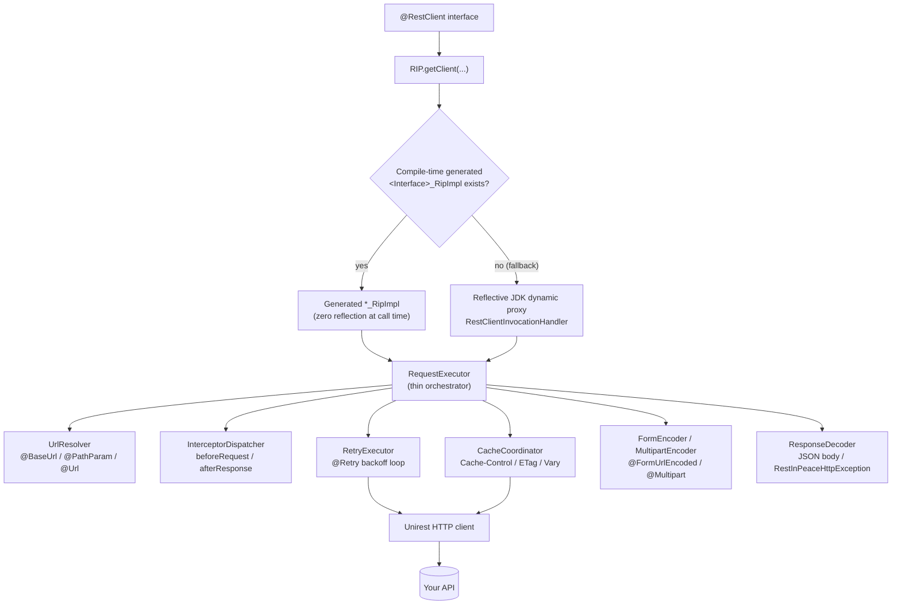
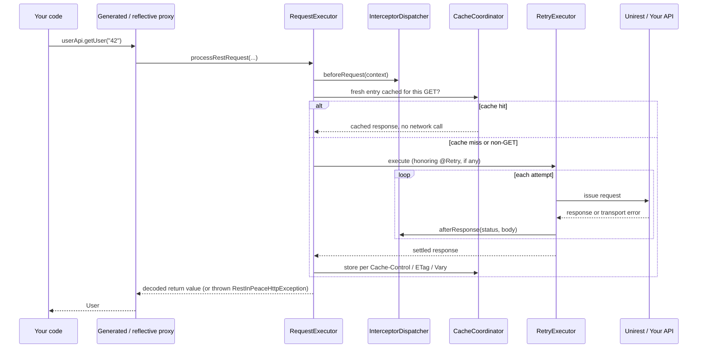

# REST-in-peace

**A Simple, Declarative and Peaceful REST Client for Java**

REST-in-peace lets you declare a REST API as a plain Java interface and get a
working HTTP client for it at runtime — no hand-written request-building
boilerplate. Annotate an interface, call `RIP.getClient(...)`, and invoke its
methods like any other Java call.

[](https://github.com/shrinivas93/REST-in-peace/actions/workflows/ci.yml)
[](https://codecov.io/gh/shrinivas93/REST-in-peace)
[](https://github.com/shrinivas93/REST-in-peace/releases/latest)
[](https://central.sonatype.com/artifact/io.github.shrinivas93/rest-in-peace)
[](https://shrinivas93.github.io/REST-in-peace/)
[](https://shrinivas93.github.io/REST-in-peace/apidocs/)
[](#requirements)
[](LICENSE)

**[Field guide — every feature, plain Java and Spring side by side](https://shrinivas93.github.io/REST-in-peace/)**

```java
@RestClient
@BaseUrl("https://api.example.com")
public interface UserApi {

    @GET("/users/{id}")
    User getUser(@PathParam("id") String id);
}
```

```java
UserApi userApi = RIP.getClient(UserApi.class);
User user = userApi.getUser("42");
```

That's it — no `HttpClient` boilerplate, no manual JSON (de)serialization, no
hand-rolled retry loop. Everything below is what's available once you need
more than the basics: path/query/header params, file uploads, response
caching, retries with backoff, interceptors, async calls, and a real local
test server for unit tests.

---

## Table of contents

- [Why REST-in-peace?](#why-rest-in-peace)
- [Features](#features)
- [Requirements](#requirements)
- [Installation](#installation)
  - [Maven](#maven)
  - [Gradle](#gradle)
- [Quick start](#quick-start)
- [How it works](#how-it-works)
  - [Request lifecycle](#request-lifecycle)
  - [Compile-time vs. reflective proxies](#compile-time-vs-reflective-proxies)
- [Annotations reference](#annotations-reference)
  - [`@RestClient`](#restclient)
  - [`@BaseUrl`](#baseurl)
  - [HTTP method annotations](#http-method-annotations)
  - [`@PathParam`](#pathparam)
  - [`@Url`](#url)
  - [`@QueryParam`](#queryparam)
  - [`@HeaderParam`](#headerparam)
  - [`@QueryMap` / `@HeaderMap`](#querymap--headermap)
  - [`@Headers`](#headers)
  - [`@Body`](#body)
  - [`@Multipart` / `@Part` / `@PartMap`](#multipart--part--partmap)
  - [`@FormUrlEncoded` / `@Field` / `@FieldMap`](#formurlencoded--field--fieldmap)
- [Return types](#return-types)
  - [Generic collection return types: `List<User>`](#generic-collection-return-types-listuser)
  - [Binary downloads: `byte[]` and `File`](#binary-downloads-byte-and-file)
  - [Response headers and status: `RipResponse<T>`](#response-headers-and-status-ripresponset)
- [Pagination](#pagination)
- [Error handling](#error-handling)
- [Async](#async)
- [Pluggable return types (`CallAdapter`)](#pluggable-return-types-calladapter)
- [Reactive (Project Reactor)](#reactive-project-reactor)
- [Retries](#retries)
  - [Retry budget](#retry-budget)
  - [Circuit breaker](#circuit-breaker)
  - [Bulkhead](#bulkhead)
  - [Idempotency keys](#idempotency-keys)
  - [Interface-level and client-wide defaults](#interface-level-and-client-wide-defaults)
- [Timeouts](#timeouts)
- [Per-client configuration: timeout and proxy](#per-client-configuration-timeout-and-proxy)
  - [JSON `ObjectMapper`](#json-objectmapper)
- [Response caching](#response-caching)
  - [Stale-while-revalidate](#stale-while-revalidate)
  - [Negative caching](#negative-caching)
  - [`@NoCache`](#nocache)
  - [Time-based and manual eviction](#time-based-and-manual-eviction)
  - [Query string in the cache key](#query-string-in-the-cache-key)
- [Interceptors](#interceptors)
  - [Short-circuiting a request](#short-circuiting-a-request)
  - [Reproducing a call with `curl`](#reproducing-a-call-with-curl)
  - [Per-client interceptors](#per-client-interceptors)
  - [Pre-built interceptors](#pre-built-interceptors)
- [Compile-time proxy generation](#compile-time-proxy-generation)
  - [Why isn't `List<User>` code-generated?](#why-isnt-listuser-code-generated)
- [OpenAPI to `@RestClient` generator](#openapi-to-restclient-generator)
- [Testing with `MockRestServer`](#testing-with-mockrestserver)
  - [JUnit 5 extension](#junit-5-extension)
- [Integrating with your project](#integrating-with-your-project)
  - [Spring / Spring Boot](#spring--spring-boot)
  - [Plain Java, CLI tools, and scripts](#plain-java-cli-tools-and-scripts)
  - [Kotlin, Scala, and other JVM languages](#kotlin-scala-and-other-jvm-languages)
- [Samples](#samples)
- [Project structure](#project-structure)
- [Development](#development)
  - [Building and testing](#building-and-testing)
  - [Code style](#code-style)
  - [Running the sample consumer locally](#running-the-sample-consumer-locally)
- [Contributing](#contributing)
- [Versioning and releases](#versioning-and-releases)
- [Roadmap](#roadmap)
- [FAQ / Troubleshooting](#faq--troubleshooting)
- [Acknowledgments](#acknowledgments)
- [License](#license)

---

## Why REST-in-peace?

Calling a REST API from Java usually means either pulling in a heavyweight
client generator, or hand-writing the same boilerplate for every endpoint:
build the URL, set headers, serialize the body, execute, check the status
code, deserialize the response, and do it all again for the next endpoint.

```java
// Without REST-in-peace
HttpResponse<String> response = Unirest.get("https://api.example.com/users/{id}")
        .routeParam("id", id)
        .queryString("verbose", verbose)
        .header("Authorization", "Bearer " + token)
        .asString();
if (response.getStatus() < 200 || response.getStatus() >= 300) {
    throw new RuntimeException("Request failed: " + response.getStatus());
}
User user = objectMapper.readValue(response.getBody(), User.class);
```

```java
// With REST-in-peace
@RestClient
interface UserApi {
    @GET("https://api.example.com/users/{id}")
    User getUser(@PathParam("id") String id, @QueryParam("verbose") Boolean verbose);
}

User user = userApi.getUser("42", true);
```

The declaration *is* the client. A non-2xx response, retries, caching, and
cross-cutting concerns like auth headers and logging are all handled by the
library instead of being re-implemented per call site — see
[Features](#features) below for the full list, and [How it works](#how-it-works)
for what actually happens under `getUser(...)`.

## Features

- Declarative REST clients defined as annotated Java interfaces
- `@BaseUrl` declares a base URL once instead of repeating it on every
  method, or pass one to `RIP.getClient(...)` when it's only known at
  runtime (e.g. one per deployment environment)
- All seven common HTTP verbs: `GET`, `POST`, `PUT`, `PATCH`, `DELETE`,
  `HEAD`, `OPTIONS`
- `@PathParam`, `@QueryParam`, `@HeaderParam`, and `@Body` parameter binding
- `@QueryMap`/`@HeaderMap` for a dynamic set of query params/headers not
  known until runtime
- `@Headers` sets fixed, always-the-same headers on a method, overridden by
  `@HeaderParam`/`@HeaderMap` for the same header name
- `@Url` binds a full URL as a parameter, bypassing `@BaseUrl`/`@PathParam`
  entirely, for a pagination `next` link or a HATEOAS action link that isn't
  a fixed template
- `@Multipart`/`@Part`/`@PartMap` for `multipart/form-data` uploads (form
  fields, `File`/`byte[]`/`InputStream` file parts, a dynamic set of parts
  not known until runtime, and an `UploadProgressListener` for progress
  reporting on a large file part)
- `@FormUrlEncoded`/`@Field`/`@FieldMap` sends an
  `application/x-www-form-urlencoded` body instead of JSON - for OAuth
  token endpoints and classic HTML-form-style POSTs
- Optional params with `required` and `defaultValue`
- Request bodies: raw strings are sent as-is, other objects are
  JSON-serialized automatically
- Responses: a `String` return type gives you the raw body; any other
  return type is deserialized from JSON automatically, including a generic
  collection like `List<User>` (decoded element-by-element into the
  declared type, not left as raw maps) - also inside `RipResponse<T>`/
  `CompletableFuture<T>`; see [Generic collection return types](#generic-collection-return-types-listuser)
- `byte[]` and `File` (via `@Destination`) return types for binary
  downloads, with an optional `DownloadProgressListener` for progress
  reporting
- `RipResponse<T>` wraps `T` with the response's status code and headers,
  for a method that needs more than just the body
- `@Paginated` follows a next-page pointer automatically into a `Page<T>`,
  reusing the client's full `@Retry`/cache/circuit-breaker/interceptor
  pipeline for every page fetch; see [Pagination](#pagination) for what's
  implemented so far
- A non-2xx response always throws `RestInPeaceHttpException`, with
  `@ErrorType` to deserialize the error body into a class
- `CompletableFuture<T>` return types fire requests asynchronously
- `@Retry` re-issues a failed request with configurable backoff, for both
  synchronous and async methods; `idempotent = true` sends a stable
  `Idempotency-Key` header held identical across every attempt, so a
  server that honors idempotency keys (Stripe, PayPal, Adyen, Square) can
  treat a retried `POST`/`PATCH` as the same logical request instead of
  executing it twice. `@Retry`/`@Timeout` can also be declared once on the
  `@RestClient` interface as a default every method without its own falls
  back to, same as `@BaseUrl`; a `RetryConfig` on `RipClientConfig` sets a
  client-wide default below that. `retryBudget(maxRetries, windowMillis)`
  caps the *total* retries a client performs across every call in a rolling
  window, on top of each call's own `times()`
- `@Timeout` overrides the connect/read timeout for one method;
  `RipClientConfig` overrides base URL, timeout, proxy, cache, JSON
  `ObjectMapper`, retry policy, and interceptors for one client (e.g. one
  per deployment environment). `RIP.setObjectMapper(...)` sets a custom
  mapper (Jackson, a configured Gson, ...) for the shared client
- Response caching honors the server's own `Cache-Control`/`ETag`/
  `Last-Modified` headers for `GET` requests — a fresh entry is served with
  zero network call, a stale revalidatable one sends
  `If-None-Match`/`If-Modified-Since` automatically, and
  `stale-while-revalidate=N` serves the stale entry immediately while
  refreshing it in the background. `negativeCacheTtlMillis` opts a client
  into caching a confirmed `404` too, regardless of its own headers.
  `Vary`-aware, with `@NoCache` to opt a single method out even when its
  client has a cache configured. `InMemoryCache` also supports a max-age
  constructor for time-based eviction regardless of server freshness, plus
  manual eviction
  of one entry via the public `Cache.key(...)` formula. Whether the cache
  key includes the query string is configurable per client or as a shared
  default via `cacheKeyIncludesQueryString(...)`
- `RestInPeaceHttpException.isClientError()`/`isServerError()`/`isRedirect()`/`is(int)`
  for branching on a status range in a `catch` block, plus
  `getRetryAfterMillis()` to read the response's own `Retry-After` header
  even for a method with no `@Retry`
- Global interceptors for cross-cutting concerns (auth headers, logging,
  metrics) without touching individual `@RestClient` interfaces;
  `RipClientConfig.Builder.interceptors(...)` adds interceptors for one
  client only (e.g. that service's own auth scheme), running in addition to
  every global one, not instead of them. `shortCircuit` skips the network
  call entirely with a synthetic response - a feature-flag bypass, a canary
  short-circuit, or a lightweight record/replay mode
- Optional **compile-time proxy generation** — an annotation processor
  emits a real, reflection-free implementation for a supported
  `@RestClient` interface at build time, with zero configuration and a
  transparent fallback to a reflective JDK dynamic proxy for anything it
  doesn't yet cover; see [Compile-time proxy generation](#compile-time-proxy-generation)
- `MockRestServer` — a real, local HTTP server for unit-testing
  `@RestClient` code without a real network dependency, with a JUnit 5
  extension for zero-boilerplate setup
- **Spec-first client generation** — `OpenApiClientGenerator` reads an
  OpenAPI 3.x JSON document and generates a `@RestClient` interface (paths,
  HTTP methods, parameters, base URL) instead of hand-writing one; see
  [OpenAPI to `@RestClient` generator](#openapi-to-restclient-generator)
- Interfaces are validated up front — misconfigured clients fail fast at
  `RIP.getClient(...)` time with a clear error, not on the first call
- Works from any JVM language (Java, Kotlin, Scala, ...) since it's just an
  annotated interface backed by a JDK dynamic proxy (or a generated class)

## Requirements

- Java 8 or newer
- Maven (or any build tool that resolves Maven coordinates — see
  [Gradle](#gradle) for an equivalent Gradle setup)

## Installation

Published to [Maven Central](https://central.sonatype.com/artifact/io.github.shrinivas93/rest-in-peace)
under `io.github.shrinivas93:rest-in-peace` (core) and
`io.github.shrinivas93:rest-in-peace-spring-boot-starter` (the
[Spring Boot starter](#spring--spring-boot)) — no repository declaration or
credentials needed, just add the dependency.
`io.github.shrinivas93:rest-in-peace-reactor` (the
[`Mono<T>`/`Flux<T>` `CallAdapter`s](#reactive-project-reactor)) isn't
published yet - see [`ROADMAP.md`](ROADMAP.md) for status; build it locally
in the meantime, per [Reactive (Project Reactor)](#reactive-project-reactor)
below. The other two coordinates are also
published to GitHub Packages, which does require authentication even for
public read access — see
[GitHub's Maven registry docs](https://docs.github.com/en/packages/working-with-a-github-packages-registry/working-with-the-apache-maven-registry)
(Maven) or
[GitHub's Gradle registry docs](https://docs.github.com/en/packages/working-with-a-github-packages-registry/working-with-the-gradle-registry)
(Gradle) if you'd rather use that instead.

Browse available versions on
[Maven Central](https://central.sonatype.com/artifact/io.github.shrinivas93/rest-in-peace/versions)
or the [Releases page](https://github.com/shrinivas93/REST-in-peace/releases) —
replace `1.0.0.52` below with the version you want (see
[Versioning and releases](#versioning-and-releases) for what the version
number means).

### Maven

```xml
<dependency>
    <groupId>io.github.shrinivas93</groupId>
    <artifactId>rest-in-peace</artifactId>
    <version>1.0.0.52</version>
</dependency>
```

### Gradle

```groovy
dependencies {
    implementation("io.github.shrinivas93:rest-in-peace:1.0.0.52")
}
```

Full API documentation is browsable at
[shrinivas93.github.io/REST-in-peace](https://shrinivas93.github.io/REST-in-peace/),
rebuilt from the exact commit of each release. Each published version also
ships `-sources.jar` and `-javadoc.jar` alongside the main jar.

## Quick start

Declare your API as an interface annotated with `@RestClient`, with each
method annotated with the HTTP verb and URL it calls:

```java
import com.shri.restinpeace.RIP;
import com.shri.restinpeace.annotation.marker.RestClient;
import com.shri.restinpeace.annotation.method.GET;
import com.shri.restinpeace.annotation.request.PathParam;
import com.shri.restinpeace.annotation.request.QueryParam;

@RestClient
public interface UserApi {

    @GET("https://api.example.com/users/{id}")
    String getUser(@PathParam("id") String id,
                   @QueryParam(value = "verbose", defaultValue = "false") Boolean verbose);
}
```

Get a client and call it like a normal method:

```java
UserApi userApi = RIP.getClient(UserApi.class);
String response = userApi.getUser("42", true);
```

`RIP.getClient(...)` validates the interface before handing back a proxy. If
anything is misconfigured — a method with no HTTP verb, an invalid URL, a
`{pathParam}` with no matching `@PathParam`, and so on — it throws a
`RestInPeaceException` immediately, with the full list of problems, instead
of failing later on the first call.

`getClient(...)` re-validates and re-resolves the interface every time it's
called — it doesn't cache the result — so call it once per
`@RestClient` interface and hold on to (or inject) the returned instance,
rather than calling `getClient(...)` again on every request; see
[Integrating with your project](#integrating-with-your-project) for how
this looks with a DI framework.

## How it works

### Request lifecycle

Every call — whatever the return type, whether it goes through the
reflective proxy or a compile-time-generated one — funnels through the same
pipeline, built as a small set of single-purpose collaborators rather than
one large class:


```mermaid
flowchart TD
    A["@RestClient interface"] --> B["RIP.getClient(...)"]
    B --> C{"Compile-time generated\n&lt;Interface&gt;_RipImpl exists?"}
    C -- "yes" --> D["Generated *_RipImpl\n(zero reflection at call time)"]
    C -- "no (fallback)" --> E["Reflective JDK dynamic proxy\nRestClientInvocationHandler"]
    D --> F["RequestExecutor\n(thin orchestrator)"]
    E --> F
    F --> G["UrlResolver\n@BaseUrl / @PathParam / @Url"]
    F --> H["InterceptorDispatcher\nbeforeRequest / afterResponse"]
    F --> I["CacheCoordinator\nCache-Control / ETag / Vary"]
    F --> J["RetryExecutor\n@Retry backoff loop"]
    F --> K["FormEncoder / MultipartEncoder\n@FormUrlEncoded / @Multipart"]
    F --> L["ResponseDecoder\nJSON body / RestInPeaceHttpException"]
    J --> M["Unirest HTTP client"]
    I --> M
    M --> N[("Your API")]
```

A single call weaves through interceptors, an optional cache short-circuit,
and the retry loop in a fixed order:


```mermaid
sequenceDiagram
    participant App as Your code
    participant Proxy as Generated / reflective proxy
    participant RE as RequestExecutor
    participant IC as InterceptorDispatcher
    participant Cache as CacheCoordinator
    participant Retry as RetryExecutor
    participant HTTP as Unirest / Your API

    App->>Proxy: userApi.getUser("42")
    Proxy->>RE: processRestRequest(...)
    RE->>IC: beforeRequest(context)
    RE->>Cache: fresh entry cached for this GET?
    alt cache hit
        Cache-->>RE: cached response, no network call
    else cache miss or non-GET
        RE->>Retry: execute (honoring @Retry, if any)
        loop each attempt
            Retry->>HTTP: issue request
            HTTP-->>Retry: response or transport error
            Retry->>IC: afterResponse(status, body)
        end
        Retry-->>RE: settled response
        RE->>Cache: store per Cache-Control / ETag / Vary
    end
    RE-->>Proxy: decoded return value (or thrown RestInPeaceHttpException)
    Proxy-->>App: User
```

Each collaborator owns exactly one concern: `UrlResolver` never touches
caching, `CacheCoordinator` never touches retries, and so on —
`RequestExecutor` itself just sequences them. See
[Project structure](#project-structure) for where each one lives.

### Compile-time vs. reflective proxies

`RIP.getClient(...)` always tries a compile-time-generated implementation
first (`Class.forName(restClient.getName() + "_RipImpl")`), and transparently
falls back to a reflective JDK dynamic proxy (`java.lang.reflect.Proxy`) if
none exists — either because the annotation processor never ran, or because
the interface uses a shape the processor doesn't yet cover. Both paths are
functionally identical from your code's point of view and share the exact
same `RequestExecutor` pipeline described above; the generated path just
skips reflection entirely at call time. See
[Compile-time proxy generation](#compile-time-proxy-generation) for what
that buys you and how to opt in.

## Annotations reference

### `@RestClient`

Marks an interface as a REST client. Required on every interface passed to
`RIP.getClient(...)`.

A `default` (or `static`) method on the interface is exempt from every rule
below and is never dispatched as an HTTP call — it's invoked as ordinary
Java, letting you add ergonomic wrappers directly on the interface:

```java
@RestClient
interface UserApi {
    @GET("/users/{id}")
    User getUser(@PathParam("id") String id);

    default Optional<User> tryGetUser(String id) {
        try {
            return Optional.of(getUser(id));
        } catch (RestInPeaceHttpException e) {
            return Optional.empty();
        }
    }
}
```

### `@BaseUrl`

Declares the base URL once on the interface, so methods can use a relative
path instead of repeating the full URL every time:

```java
@RestClient
@BaseUrl("https://api.example.com")
interface UserApi {
    @GET("/users/{id}")
    User getUser(@PathParam("id") String id);
}
```

A method URL that's already absolute (starts with `http://` or `https://`)
ignores `@BaseUrl` and is used as-is — a method can always opt out with its
own full URL. A relative method URL on an interface with no `@BaseUrl` fails
validation. `@BaseUrl` can itself contain a `{placeholder}`, resolved by a
`@PathParam` the same as any method URL.

#### Choosing the base URL per environment

`@BaseUrl`'s value has to be a compile-time constant, so it can't itself
hold something environment-dependent. For an app that deploys the same
`@RestClient` interface against a different base URL per environment (dev,
staging, prod), pass the resolved URL to `RIP.getClient(...)` instead:

```java
UserApi api = RIP.getClient(UserApi.class, System.getenv("USER_API_BASE_URL"));
```

This takes priority over `@BaseUrl` on the interface, so `@BaseUrl` is
optional when every relative method URL is covered by the runtime value.
Precedence, most specific first: an absolute method URL always wins, then
the `baseUrl` passed to `getClient(...)`, then `@BaseUrl` on the interface —
a relative method URL covered by none of these fails validation.

For more than just the base URL varying per environment — a connect/read
timeout or a proxy that differs too — pass a
[`RipClientConfig`](#per-client-configuration-timeout-and-proxy) to
`getClient(...)` instead of a plain `String`.

### HTTP method annotations

One of `@GET`, `@POST`, `@PUT`, `@PATCH`, `@DELETE`, `@HEAD`, `@OPTIONS` on
each method, holding the URL template:

```java
@GET("https://api.example.com/items/{id}")
String getItem(@PathParam("id") String id);
```

Every method must have exactly one of these — none or more than one fails
validation.

**Every verb, side by side** — the only difference between them is which
ones accept a body (`@Body`/`@Multipart`/`@FormUrlEncoded` all require
`POST`, `PUT`, `PATCH`, or `DELETE`; using any of them on `GET`, `HEAD`, or
`OPTIONS` fails validation):

```java
@GET("https://api.example.com/items/{id}")
Item get(@PathParam("id") String id);

@POST("https://api.example.com/items")
Item create(@Body Item item);

@PUT("https://api.example.com/items/{id}")
Item replace(@PathParam("id") String id, @Body Item item);

@PATCH("https://api.example.com/items/{id}")
Item update(@PathParam("id") String id, @Body Map<String, Object> patch);

@DELETE("https://api.example.com/items/{id}")
void delete(@PathParam("id") String id);

// DELETE is the one non-intuitive case: RFC 7231 allows a body on DELETE,
// and RIP permits @Body/@Multipart/@FormUrlEncoded there too, even though
// most real APIs never use it.
@DELETE("https://api.example.com/items/bulk")
void deleteMany(@Body List<String> ids);

@HEAD("https://api.example.com/items/{id}")
RipResponse<Void> exists(@PathParam("id") String id);

@OPTIONS("https://api.example.com/items")
RipResponse<Void> supportedMethods();
```

<details>
<summary><strong>❌ Common mistakes</strong></summary>

```java
// WRONG — two method annotations on one method.
@GET("/items")
@POST("/items")
String doSomething();
```
Fails validation: *"has more than one HTTP method annotations."* A method
can mean one verb — if you need both a `GET` and a `POST` against the same
path, that's two interface methods, not one annotated twice.

```java
// WRONG — no method annotation at all.
String getItem(@PathParam("id") String id);
```
Fails validation from the other direction: *"is not annotated with any of
the HTTP method annotations."* RIP has no "default verb" — every method
needs an explicit one.

```java
// WRONG — @Body on a GET.
@GET("/items")
Item get(@Body Item filter);
```
Fails validation: *"is annotated with @Body but HTTP method GET does not
support a request body."* Encode filter criteria that belong on a `GET` as
`@QueryParam`/`@QueryMap` instead — a `GET` body is technically possible on
the wire with some HTTP libraries, but it's unsupported by many
servers/proxies/caches, which is exactly why RIP refuses to build one for
you here. If your server genuinely requires a `GET` with a body, that's a
non-standard server you'll need to talk to with a raw HTTP client outside
RIP for that one call — RIP always builds a standards-conforming request.

</details>

### `@PathParam`

Substitutes a `{placeholder}` in the URL template with the argument value.
Every `{placeholder}` in the URL must have a matching `@PathParam`, checked
at validation time.

```java
@GET("https://api.example.com/items/{id}")
String getItem(@PathParam("id") String id);
```

The value is percent-encoded before substitution, so a `/`, `?`, `#`, or a
space in it lands as literal content of that one path segment instead of
producing a broken or subtly wrong URL (e.g. an unencoded `?` would
otherwise start a query string partway through the path).

**Multiple placeholders, any order, any type** — `@PathParam` doesn't have
to be a `String`; any argument is converted with `String.valueOf(...)`
before encoding:

```java
@GET("https://api.example.com/orgs/{org}/repos/{repo}/issues/{number}")
Issue getIssue(@PathParam("number") int number,
               @PathParam("repo") String repo,
               @PathParam("org") String org);

// getIssue(42, "rest-in-peace", "shrinivas93") ->
// GET https://api.example.com/orgs/shrinivas93/repos/rest-in-peace/issues/42
```

Parameter order in the method signature doesn't need to match the order
placeholders appear in the URL — each `@PathParam`'s own `value()` is what's
matched against `{...}`, not position.

<details>
<summary><strong>❌ Common mistakes</strong></summary>

```java
// WRONG — the URL has {id}, but nothing is annotated @PathParam("id").
@GET("https://api.example.com/items/{id}")
String getItem(String id);
```
Fails validation: *"has path param 'id' in its URL that is not annotated on
any parameter with @PathParam."* An un-annotated `String` parameter isn't
assumed to be a path param by position — RIP has no implicit binding here.

```java
// WRONG — @PathParam("itemId") names something the URL never declares.
@GET("https://api.example.com/items/{id}")
String getItem(@PathParam("itemId") String id);
```
Fails validation: *"has a @PathParam('itemId') that does not appear as
'{itemId}' in its URL."* The annotation's `value()` and the URL's
`{placeholder}` name have to match exactly, including case — `{id}` and
`{Id}` are different placeholders as far as this check is concerned.

</details>

### `@Url`

For a call whose URL isn't a fixed template known in advance - a pagination
`next` link, a HATEOAS action link embedded in a previous response - use
`@Url` on a `String` parameter instead of a method URL template:

```java
@GET
Page<Item> nextPage(@Url String url);
```

```java
Page<Item> page = itemApi.firstPage();
while (page.next != null) {
    page = itemApi.nextPage(page.next);
    process(page.items);
}
```

The HTTP method annotation (`@GET` above) is left with no `value()` -
combining `@Url` with a static URL template fails validation, since there'd
be two conflicting sources of truth for the URL. `@BaseUrl`, a runtime base
URL, and `@PathParam` are all bypassed entirely when `@Url` is used - there's
no template left for them to apply to - but `@QueryParam`/`@HeaderParam`/etc.
still work normally, appended to the given URL. At most one `@Url` parameter
is allowed per method, and a `null` argument throws at call time.

**A full-URL `@Url` still composes with everything except the template
itself** — query params, headers, even a request body:

```java
@POST
@Headers("X-Trace: enabled")
String followAction(@Url String actionUrl, @QueryParam("dryRun") boolean dryRun, @Body ActionPayload payload);

// A HATEOAS-style action link embedded in a previous response, still
// getting query params/headers/body applied on top of it:
String result = api.followAction(previousResponse.actions().get("cancel"), true, payload);
```

<details>
<summary><strong>❌ Common mistakes</strong></summary>

```java
// WRONG — a static URL *and* a @Url parameter on the same method.
@GET("https://api.example.com/items")
String get(@Url String url);
```
Fails validation: *"has both a @Url parameter and a static URL
'https://api.example.com/items' - remove one or the other."* Leave the
method annotation's `value()` empty (just `@GET`) when a method uses `@Url`.

```java
// WRONG — @Url combined with @PathParam.
@GET
String get(@Url String url, @PathParam("id") String id);
```
Fails validation: *"has both a @Url parameter and a @PathParam parameter -
@PathParam has no effect when @Url is used."* There's no template for
`@PathParam` to substitute into once the whole URL is supplied directly -
bake the id into the URL string yourself before calling.

```java
// WRONG — two @Url parameters on one method.
@GET
String get(@Url String primary, @Url String fallback);
```
Fails validation: *"has more than one parameter annotated with @Url."*
Exactly one dynamic URL source per method, same reasoning as `@Body`.

```java
// WRONG — @Url on a non-String parameter.
@GET
String get(@Url URI uri);
```
Fails validation: *"has a @Url parameter of type java.net.URI - only
String is supported."* Call `.toString()` yourself before passing it in.

```java
// WRONG — passing null at call time.
api.get(null);
```
Throws `RestInPeaceException`: *"Missing value for @Url parameter in
method ...get."* Unlike `@QueryParam`/`@HeaderParam`, `@Url` has no
`defaultValue` to fall back to — there's no sensible default for an entire
missing URL.

</details>

### `@QueryParam`

Appends a query string parameter. Supports `required` (throws at call time
if no value and no default is available) and `defaultValue` (used when the
argument is `null`):

```java
@GET("https://api.example.com/items")
String search(@QueryParam(value = "q", required = true) String query,
               @QueryParam(value = "page", defaultValue = "1") Integer page);
```

A `Collection` argument repeats the param once per element instead of
being sent as one mangled value:

```java
@GET("https://api.example.com/items")
String search(@QueryParam("tag") List<String> tags);

// search(List.of("a", "b")) sends ?tag=a&tag=b
```

**Every combination of `required`/`defaultValue`/plain-optional** side by
side:

```java
@GET("https://api.example.com/items")
String search(
        @QueryParam(value = "q", required = true) String query,        // throws if null
        @QueryParam(value = "page", defaultValue = "1") Integer page,   // "1" if null
        @QueryParam("sort") String sort);                               // omitted entirely if null
```

A `null` argument for a plain optional `@QueryParam` (no `required`, no
`defaultValue`) is simply left out of the URL - `search("x", null, null)`
sends `?q=x` with no `page`/`sort` at all, not `?q=x&page=&sort=`.

<details>
<summary><strong>❌ Common mistakes</strong></summary>

```java
// WRONG — calling a required param with null.
api.search(null, 1, null);
```
Throws `RestInPeaceException`: *"Missing required value for param 'q'."*
`required = true` means exactly that — it's not a hint, it's enforced on
every call, not just checked once at validation time (validation can't
know what a caller will pass at runtime).

```java
// Easy to misread: required AND defaultValue together.
@QueryParam(value = "status", required = true, defaultValue = "active") String status
```
This compiles and never actually throws — `defaultValue` is checked
*before* `required`, so a `null` argument always resolves to `"active"`
long before the required check would ever fire. If a default exists, a
value is never truly "required" in practice. Pick one: `required` for
"the caller must decide," `defaultValue` for "assume this if they don't."
</details>

### `@HeaderParam`

Sets an HTTP header, with the same `required`/`defaultValue` semantics as
`@QueryParam`:

```java
@GET("https://api.example.com/items")
String search(@HeaderParam(value = "Authorization", required = true) String token);
```

**Multiple headers, mixing fixed and conditional:**

```java
@GET("https://api.example.com/items")
String search(
        @HeaderParam(value = "Authorization", required = true) String token,
        @HeaderParam(value = "X-Request-Id") String requestId,
        @HeaderParam(value = "Accept-Language", defaultValue = "en-US") String language);
```

<details>
<summary><strong>❌ Common mistakes</strong></summary>

```java
// WRONG — forgetting a value-less sentinel header is still "a value".
api.search("", null, null);
```
`""` (empty string) is **not** `null` — `required` only rejects a missing
argument, not an empty one. `search("", ...)` sends a literal
`Authorization: ` header with an empty value, which almost certainly isn't
what you want and won't trip any RIP-level validation. Check for blank
tokens yourself before calling if that distinction matters to your API.
</details>

### `@QueryMap` / `@HeaderMap`

For a set of query params or headers whose names aren't known until
runtime — a search endpoint's open-ended filter set, or caller-supplied
headers in a multi-tenant app — annotate a `Map<String, ?>` parameter
instead of adding one `@QueryParam`/`@HeaderParam` per name. Each map entry
becomes one query param or header; a `null` map, or a `null` entry value,
is skipped rather than throwing:

```java
@GET("https://api.example.com/search")
String search(@QueryParam("q") String query, @QueryMap Map<String, String> filters);

@GET("https://api.example.com/users/{id}")
User getUser(@PathParam("id") String id, @HeaderMap Map<String, String> extraHeaders);
```

`@QueryMap`/`@HeaderMap` can be combined with fixed `@QueryParam`/`@HeaderParam`
parameters on the same method — the fixed ones for names you always know,
the map for everything else. At most one parameter per method may be
annotated `@QueryMap`, and at most one `@HeaderMap`. Like `@QueryParam`, a
`@QueryMap`/`@HeaderMap` entry whose value is a `Collection` is repeated
once per element under the same name, instead of one entry with a single
mangled `toString()` value.

**A fully dynamic multi-tenant example**, mixing a fixed param, a fixed
header, and two runtime-sized maps on one call:

```java
@GET("https://api.example.com/search")
String search(@QueryParam("q") String query,
               @HeaderParam("X-Tenant-Id") String tenantId,
               @QueryMap Map<String, Object> filters,
               @HeaderMap Map<String, String> extraHeaders);
```

```java
Map<String, Object> filters = new LinkedHashMap<>();
filters.put("category", "electronics");
filters.put("tag", Arrays.asList("sale", "new"));   // repeats: &tag=sale&tag=new
filters.put("inStock", null);                        // skipped entirely

api.search("laptop", "tenant-42", filters, Collections.singletonMap("X-Debug", "true"));
```

<details>
<summary><strong>❌ Common mistakes</strong></summary>

```java
// WRONG — two parameters both annotated @QueryMap on one method.
String search(@QueryMap Map<String, Object> a, @QueryMap Map<String, Object> b);
```
Fails validation: *"has more than one parameter annotated with @QueryMap."*
If you have two logically distinct maps, merge them into one `Map` before
calling, or promote the always-present ones to fixed `@QueryParam`s instead.

```java
// WRONG — @QueryMap on something that isn't a Map.
String search(@QueryMap List<String> filters);
```
Fails validation: *"has a parameter annotated with @QueryMap that is not a
Map."* A `List` has no key to use as the param name — if you just need a
repeated single-name param, use `@QueryParam` on the `Collection` directly
instead of `@QueryMap`.

</details>

### `@Headers`

Sets one or more fixed HTTP headers on a method — for a header whose value
is always the same (`Accept`, `Cache-Control`, an API version), not derived
from a call argument. Each entry is a `"Name: Value"` string, split on its
first `:` with whitespace trimmed around both sides — `"Name:Value"`,
`"Name : Value"`, and `"Name    :     Value"` are all equivalent:

```java
@GET("https://api.example.com/users")
@Headers({ "Cache-Control: no-cache", "X-Api-Version: 2" })
List<User> listUsers();
```

`@Headers` can be combined with `@HeaderParam`/`@HeaderMap` on the same
method; if both set the same header name, `@HeaderParam`/`@HeaderMap` wins,
since a per-call value is more specific than an always-on method annotation.
An entry with no `:`, or an empty header name, fails validation.

**Precedence in action** — the fixed `@Headers` entry is a floor, not a
final answer:

```java
@GET("https://api.example.com/items")
@Headers("X-Api-Version: 1")
List<Item> listItems(@HeaderParam("X-Api-Version") String overrideVersion);

// listItems(null)   -> sends X-Api-Version: 1        (the @Headers default)
// listItems("2")    -> sends X-Api-Version: 2         (the per-call value wins)
```

`@Headers` is method-only (`@Target(ElementType.METHOD)`) — there's no
interface-level form the way `@BaseUrl`/`@Retry`/`@Timeout` have one.
Repeat it on each method that needs the same fixed headers, or reach for a
global/per-client `HeaderInterceptor`/custom `RequestInterceptor` (see
[Interceptors](#interceptors)) when the same fixed set genuinely belongs
to every method on an interface:

```java
@RestClient
@BaseUrl("https://api.example.com")
public interface ItemApi {
    @GET("/items")
    @Headers({ "Accept: application/json", "X-Client: rest-in-peace" })
    List<Item> listItems();

    @GET("/items/{id}")
    @Headers({ "Accept: application/json", "X-Client: rest-in-peace" })
    Item getItem(@PathParam("id") String id);
}
```

<details>
<summary><strong>❌ Common mistakes</strong></summary>

```java
// WRONG — @Headers on the interface itself, expecting it to apply to
// every method the way @BaseUrl/@Retry/@Timeout do.
@RestClient
@Headers({ "Accept: application/json" })
public interface ItemApi { ... }
```
Does not compile — `@Headers` is `@Target(ElementType.METHOD)` only,
so placing it on a type (an interface) is a Java compilation error, not a
RIP validation error. Put it on each method instead, or use a
`HeaderInterceptor`/custom interceptor for a value that's genuinely
constant across an entire client.

```java
// WRONG — missing the ':' separator entirely.
@Headers("X-Api-Version 2")
```
Fails validation: *"has a @Headers entry 'X-Api-Version 2' with no ':' -
expected 'Name: Value'."* A space instead of a colon is the single most
common typo here — `Headers` parses each string by splitting on the first
`:`, not by whitespace.

```java
// WRONG — empty header name before the colon.
@Headers(": application/json")
```
Fails validation: *"has a @Headers entry ': application/json' with an
empty header name."*

```java
// Technically valid, but probably not what you meant: a colon *in* the
// value (e.g. a URL) is fine — only the *first* colon is the separator.
@Headers("Link: <https://api.example.com/next>; rel=\"next\"")
```
This parses correctly as header `Link` with value
`<https://api.example.com/next>; rel="next"` — only the first `:` splits
the string, so a value containing its own colons (URLs, timestamps) is
safe. It's listed here because it surprises people the first time, not
because it's broken.

</details>

### `@Body`

Sends a request body. Only valid on `POST`, `PUT`, `PATCH`, and `DELETE` —
using it on `GET`, `HEAD`, or `OPTIONS` fails validation. A `String` value is
sent as-is; any other object is JSON-serialized automatically:

```java
@POST("https://api.example.com/items")
String createItem(@Body Item item);

@POST("https://api.example.com/items/raw")
String createRaw(@Body String rawJson);
```

At most one parameter per method may be annotated `@Body`.

**Every HTTP verb that accepts one, and a nested generic body:**

```java
@POST("https://api.example.com/items")
Item create(@Body Item item);

@PUT("https://api.example.com/items/{id}")
Item replace(@PathParam("id") String id, @Body Item item);

@PATCH("https://api.example.com/items/{id}")
Item patch(@PathParam("id") String id, @Body Map<String, Object> partialFields);

@POST("https://api.example.com/batch")
BatchResult createMany(@Body List<Item> items);   // a generic collection as the BODY, not the return type
```

A `null` `@Body` argument sends the request with **no body at all** —
both the reflective (`RequestExecutor`) and generated (`RestClientProcessor`)
dispatch paths skip applying a body entirely when the argument is `null`,
rather than serializing it as the JSON literal `null`. If an endpoint
distinguishes "no body sent" from a body containing `"field": null`, the
simplest way to produce the second case is a raw `@Body String` — sent
as-is with no `ObjectMapper` involved at all (see the plain `@Body`
example above), so `createRaw("{\"field\": null}")` sends exactly that:

```java
api.createRaw("{\"field\": null}");   // sent verbatim, bypassing the ObjectMapper entirely
```

Auto-serializing a `Map`/POJO into that same shape is less
straightforward than it looks, for two independent reasons: an empty
`Map` (or a POJO with the field simply left unset) serializes as `{}`,
not `{"field": null}` — the field has to actually be present with a
`null` value (`Collections.singletonMap("field", null)`, say) — and even
then, the zero-config default [`ObjectMapper`](#json-objectmapper)
(`kong.unirest.JsonObjectMapper`) builds its `Gson` instance internally
with no `serializeNulls()` call and no way to inject a custom `Gson` into
it, so Gson's own default (omit a `null`-valued field entirely) still
applies regardless of what the `Map`/POJO itself contains. Reach for the
raw-`String` approach above unless you have a specific reason to keep the
request POJO-typed — producing `{"field": null}` through auto-
serialization requires implementing your own `kong.unirest.ObjectMapper`
wrapping a `Gson` built via `new GsonBuilder().serializeNulls().create()`
and registering it with `RIP.setObjectMapper(...)`.

<details>
<summary><strong>❌ Common mistakes</strong></summary>

```java
// WRONG — @Body on a GET.
@GET("/items")
Item search(@Body SearchCriteria criteria);
```
Fails validation: *"is annotated with @Body but HTTP method GET does not
support a request body."* See the [HTTP method annotations](#http-method-annotations)
section above for the fix (query params instead).

```java
// WRONG — two @Body parameters on one method.
Item create(@Body Item a, @Body Item b);
```
Fails validation: *"has more than one parameter annotated with @Body."*
Wrap both into one object (or one `Map`) and send that instead — a request
has exactly one body on the wire, so RIP has exactly one `@Body` slot.

```java
// Misleading rather than broken: @Body combined with @QueryParam.
@POST("https://api.example.com/items")
Item create(@Body Item item, @QueryParam("dryRun") boolean dryRun);
```
This is perfectly valid and common (`?dryRun=true` alongside a JSON body) -
listed here only because it's easy to assume `@Body` "uses up" the method
the way `@Multipart`/`@FormUrlEncoded` exclude each other. `@Body` only
conflicts with the *other* body-encoding strategies, never with
`@QueryParam`/`@HeaderParam`/`@PathParam`.

</details>

### `@Multipart` / `@Part` / `@PartMap`

Sends a `multipart/form-data` body instead of `@Body`'s JSON/raw-string one —
for file uploads and classic HTML-form-style POSTs:

```java
@POST("https://api.example.com/users/{id}/avatar")
@Multipart
String uploadAvatar(@PathParam("id") String id, @Part("caption") String caption, @Part("file") File avatar);
```

`@Multipart` goes on the method (same HTTP methods `@Body` supports —
`GET`/`HEAD`/`OPTIONS` fail validation); `@Part` goes on each field. A
`String` is sent as a plain form field; `File`, `byte[]`, and `InputStream`
are all sent as a file part. A method can't combine `@Multipart` with a
`@Body` parameter, and needs at least one `@Part`/`@PartMap` to be worth
declaring multipart at all. `@Part`'s `required`/`defaultValue` work the
same as `@QueryParam`'s — a `null` argument falls back to `defaultValue`
if set, is silently skipped if `required` is `false` (the default), or
throws at call time if `required` is `true`.

A `byte[]`/`InputStream` part has no filename of its own, so the multipart
field needs one from somewhere — `@Part`'s `fileName` supplies it (also
usable to override a `File` part's own name), defaulting to the part's
`value()` when left unset:

```java
@POST("https://api.example.com/users/{id}/avatar")
@Multipart
String uploadAvatarBytes(@PathParam("id") String id,
        @Part(value = "file", fileName = "avatar.png") byte[] avatarBytes);
```

For a set of parts not known until runtime, `@PartMap` on a `Map<String, ?>`
parameter adds one part per entry — the `@Part`/`@Multipart` counterpart to
`@QueryMap`/`@HeaderMap`. Each value is handled the same way a `@Part` value
would be, with the entry's key doubling as the filename for a
`byte[]`/`InputStream` value:

```java
@POST("https://api.example.com/uploads")
@Multipart
String upload(@PartMap Map<String, Object> parts);

// upload(mapOf("caption", "vacation photo", "file", photoBytes));
```

`@PartMap` combines with fixed `@Part` parameters on the same method, a
`null` map or a `null` entry value is skipped rather than an error, and at
most one `@PartMap` parameter per method is allowed, same as `@QueryMap`/
`@HeaderMap`.

A `@PartMap` entry has no per-entry `fileName` to set, unlike a fixed
`@Part` - wrap a `File`/`byte[]`/`InputStream` value in `PartValue.of(value,
fileName)` when an entry needs a name other than its key:

```java
Map<String, Object> parts = new LinkedHashMap<>();
parts.put("caption", "vacation photo");                          // plain form field
parts.put("thumb", photoBytes);                                  // filename defaults to "thumb"
parts.put("file", PartValue.of(photoBytes, "photo.jpg"));        // filename "photo.jpg" instead of "file"
api.upload(parts);
```

Add an `UploadProgressListener` parameter to observe upload progress on a
large `File`/`InputStream` part - only valid alongside `@Multipart`:

```java
@POST("https://api.example.com/users/{id}/avatar")
@Multipart
String uploadAvatar(@PathParam("id") String id, @Part("file") File avatar, UploadProgressListener onProgress);
```

```java
avatarApi.uploadAvatar("42", avatar, (field, bytesWritten, totalBytes) ->
        System.out.printf("%s: %d / %d%n", field, bytesWritten, totalBytes));
```

It's only called for `File`/`InputStream` parts - a `String`/`byte[]` part
is written in one shot with nothing meaningful to report. `field` is the
part's name (its `@Part`/`@PartMap` key), needed to tell parts apart since
calls for different parts interleave rather than running one at a time.
Pass `null` for a call that doesn't need progress reporting.

**All four `@Part` value types on one method**, to see the shape
differences side by side:

```java
@POST("https://api.example.com/documents")
@Multipart
String upload(
        @Part("title") String title,                                    // plain form field
        @Part("document") File document,                                 // filename = document.getName()
        @Part(value = "thumbnail", fileName = "thumb.png") byte[] thumb,  // filename must be supplied
        @Part(value = "stream", fileName = "data.bin") InputStream data); // filename must be supplied
```

<details>
<summary><strong>❌ Common mistakes</strong></summary>

```java
// WRONG — @Multipart on a method with no @Part/@PartMap at all.
@POST("https://api.example.com/ping")
@Multipart
String ping();
```
Fails validation: *"is annotated with @Multipart but has no @Part or
@PartMap parameters."* An empty multipart body is never useful - if you
don't need a body, drop `@Multipart` entirely.

```java
// WRONG — @Multipart combined with @Body.
@POST("https://api.example.com/items")
@Multipart
String create(@Body Item item, @Part("file") File attachment);
```
Fails validation: *"is annotated with @Multipart and also has a @Body
parameter - use one or the other."* A request has one body-encoding
strategy; mix the JSON fields into the multipart body as additional
`@Part` string fields instead if you need both.

```java
// WRONG — @Multipart combined with @FormUrlEncoded.
@POST("https://api.example.com/items")
@Multipart
@FormUrlEncoded
String create(@Part("file") File f, @Field("name") String name);
```
Fails validation: *"is annotated with both @Multipart and @FormUrlEncoded -
use one or the other."*

```java
// WRONG — @Part on a method that isn't @Multipart.
@POST("https://api.example.com/items")
String create(@Part("file") File f);
```
Fails validation: *"has a @Part parameter but is not annotated with
@Multipart."* Forgetting the method-level `@Multipart` while adding
`@Part` parameters is the single most common mistake with this feature -
the two always travel together.

```java
// WRONG — an unsupported @Part value type.
@Multipart
String create(@Part("count") int count);
```
Fails validation: *"has a @Part parameter of type int - only String, File,
byte[], and InputStream are supported."* Send a number as a `String` form
field (`@Part("count") String count`, passing `String.valueOf(count)`) -
there's no numeric multipart field type on the wire anyway.

```java
// WRONG — UploadProgressListener without @Multipart.
String create(@Part("file") File f, UploadProgressListener onProgress);
```
Fails validation: *"has an UploadProgressListener parameter but is not
annotated with @Multipart."* Progress reporting only makes sense for a
multipart file upload - it has no meaning for a JSON `@Body` call, which
is written to the wire in one shot regardless.

```java
// Easy to get backwards: forgetting PartValue when a @PartMap entry needs
// its OWN filename, distinct from its map key.
Map<String, Object> parts = new LinkedHashMap<>();
parts.put("file", photoBytes);   // filename defaults to "file", NOT "photo.jpg"
```
A `@PartMap` entry's filename defaults to its *map key*, not anything
derived from the value - `"file"` above uploads as a part literally named
`file` with filename `file`, which is rarely what you want for a `byte[]`.
Wrap it in `PartValue.of(photoBytes, "photo.jpg")` (shown above) whenever
the filename needs to differ from the key.

</details>

### `@FormUrlEncoded` / `@Field` / `@FieldMap`

Sends an `application/x-www-form-urlencoded` body instead of `@Body`'s
JSON/raw-string one — for OAuth token endpoints and classic HTML forms:

```java
@POST("https://api.example.com/oauth/token")
@FormUrlEncoded
String getToken(@Field("grant_type") String grantType, @Field("client_id") String clientId);
```

`@FormUrlEncoded` goes on the method (same HTTP methods `@Body` supports);
`@Field` goes on each parameter, encoding it as one `name=value` pair, with
the same `required`/`defaultValue` semantics as `@QueryParam`/`@Part` (a
`null` argument falls back to `defaultValue` if set, is silently skipped if
`required` is `false` — the default — or throws at call time if `required`
is `true`). A `Collection` value repeats the key once per element
(`tag=a&tag=b`), the same convention `@QueryParam` uses. A method can't
combine `@FormUrlEncoded`
with `@Body` or `@Multipart` — a method has exactly one body-encoding
strategy, if any.

For a set of fields not known until runtime, `@FieldMap` on a
`Map<String, ?>` parameter adds one field per entry — the
`@FormUrlEncoded` counterpart to `@QueryMap`/`@PartMap`:

```java
@POST("https://api.example.com/search")
@FormUrlEncoded
String search(@FieldMap Map<String, Object> filters);
```

`@FieldMap` combines with fixed `@Field` parameters on the same method, a
`null` map or a `null` entry value is skipped rather than an error, and at
most one `@FieldMap` parameter per method is allowed.

**A realistic OAuth2 `client_credentials` grant**, combining fixed and
optional fields:

```java
@POST("https://auth.example.com/oauth/token")
@FormUrlEncoded
TokenResponse clientCredentials(
        @Field(value = "grant_type", defaultValue = "client_credentials") String grantType,
        @Field("client_id") String clientId,
        @Field("client_secret") String clientSecret,
        @Field(value = "scope", required = false) String scope);
```

<details>
<summary><strong>❌ Common mistakes</strong></summary>

```java
// WRONG — @FormUrlEncoded on a GET.
@GET("https://auth.example.com/token")
@FormUrlEncoded
String getToken(@Field("grant_type") String grantType);
```
Fails validation: *"is annotated with @FormUrlEncoded but HTTP method GET
does not support a request body."*

```java
// WRONG — no @Field/@FieldMap at all.
@POST("https://api.example.com/ping")
@FormUrlEncoded
String ping();
```
Fails validation: *"is annotated with @FormUrlEncoded but has no @Field or
@FieldMap parameters."*

```java
// WRONG — @FormUrlEncoded combined with @Body.
@POST("https://api.example.com/items")
@FormUrlEncoded
String create(@Body Item item, @Field("name") String name);
```
Fails validation: *"is annotated with @FormUrlEncoded and also has a @Body
parameter - use one or the other."*

```java
// WRONG — @Field without the method-level @FormUrlEncoded.
@POST("https://api.example.com/items")
String create(@Field("name") String name);
```
Fails validation: *"has a @Field parameter but is not annotated with
@FormUrlEncoded."* Same forgot-the-method-annotation mistake as `@Part`
above.

```java
// Sends the wrong Content-Type if you reach for the wrong annotation:
// @FormUrlEncoded is application/x-www-form-urlencoded (key=value&key=value,
// no file support); @Multipart is multipart/form-data (supports files,
// larger/binary-safe, heavier wire format). Picking @FormUrlEncoded for a
// file upload isn't a validation error - @Field only accepts values RIP
// can URL-encode as text, so there's no File/byte[]/InputStream @Field
// type to reach for by mistake - but it's the most common "why doesn't my
// server see the file" confusion between the two.
```

</details>

## Return types

A method's declared return type controls what you get back:

```java
@GET("https://api.example.com/users/{id}")
String getUserRaw(@PathParam("id") String id);   // raw response body

@GET("https://api.example.com/users/{id}")
User getUser(@PathParam("id") String id);        // response JSON deserialized into User

@POST("https://api.example.com/events")
void fireEvent(@Body Event event);               // response body discarded
```

`String` gives you the raw response body. `void` fires the request and
discards the response. Anything else is deserialized from the response body
as JSON, the same way `@Body` serializes non-`String` request bodies. These
rules apply to a successful (2xx) response — see below for anything else.

<details>
<summary><strong>❌ Common mistakes</strong></summary>

```java
// Not actually wrong, just a frequent misunderstanding: returning String
// does NOT mean "the JSON field called 'name'" or similar - it's always
// the ENTIRE raw response body, unparsed.
@GET("https://api.example.com/users/{id}")
String getUserName(@PathParam("id") String id);
// Returns {"id":"42","name":"Ada"} in full, not "Ada".
```
If you want one field, deserialize into a POJO (or `Map<String, Object>`)
and read the field yourself - `String` is an escape hatch for "give me the
bytes as text," not a field selector.

```java
// A POJO with a constructor mismatch against the response shape doesn't
// fail validation - RIP has no way to know your server's JSON shape ahead
// of time - it fails at CALL time instead, as a Gson deserialization
// exception, often with a confusing message if the field types mismatch
// (e.g. server sends "id": 42 as a number, your field is a String).
```
There's no compile-time or `RIP.getClient(...)`-time check that a POJO
actually matches your server's response shape - mismatches surface the
first time the method is actually called. Write a unit test against a real
response payload ([`MockRestServer`](#testing-with-mockrestserver) is built exactly for this)
rather than assuming the shape compiles because the Java side does.

</details>

### Generic collection return types: `List<User>`

A plain generic collection works too — decoded element-by-element into the
declared type parameter, not left as raw `LinkedTreeMap`s:

```java
@GET("https://api.example.com/users")
List<User> listUsers();
```

This also works wrapped in `RipResponse<List<User>>` or
`CompletableFuture<List<User>>` (including
`CompletableFuture<RipResponse<List<User>>>`), the same as any other return
shape. Internally this reads the method's *generic* return type
(`Method.getGenericReturnType()`) rather than the type-erased
`getReturnType()`, and decodes through `kong.unirest.GenericType` instead
of a plain `Class<?>` whenever the two differ - see
[Why isn't `List<User>` code-generated?](#why-isnt-listuser-code-generated)
for the one place this still falls back to the reflective proxy rather than
a fully generated implementation.

**Every wrapping combination, explicitly:**

```java
@GET("https://api.example.com/users")
List<User> listUsers();                                              // plain

@GET("https://api.example.com/users")
RipResponse<List<User>> listUsersWithHeaders();                       // + status/headers

@GET("https://api.example.com/users")
CompletableFuture<List<User>> listUsersAsync();                       // + async

@GET("https://api.example.com/users")
CompletableFuture<RipResponse<List<User>>> listUsersAsyncWithHeaders(); // both
```

A `Set<User>`/`Map<String, User>` works the same way — any generic
collection/map type Gson itself knows how to deserialize into, not just
`List`.

<details>
<summary><strong>❌ Common mistakes</strong></summary>

```java
// WRONG — a raw List with no type parameter.
@GET("https://api.example.com/users")
@SuppressWarnings("rawtypes")
List listUsers();
```
This compiles (with a raw-type warning) but decodes as a plain `List` of
`LinkedTreeMap`s, not `User`s — `ClassCastException` the moment you try to
treat an element as a `User`. There's no validation error for this one,
since a raw `List` is still a technically-valid return type — always
declare the type parameter.

</details>

### Binary downloads: `byte[]` and `File`

A `String` return type is fine for text, but decoding a binary response
(an image, a PDF, a zip) as a `String` corrupts it. Declare `byte[]`
instead to get the exact bytes back:

```java
@GET("https://api.example.com/reports/{id}/pdf")
byte[] downloadReport(@PathParam("id") String id);
```

For a large response, buffering the whole thing into a `byte[]` wastes
memory. Declare `File` instead, with a `@Destination File` parameter
saying where to write it - the same `File` instance comes back once the
download finishes:

```java
@GET("https://api.example.com/reports/{id}/pdf")
File downloadReport(@PathParam("id") String id, @Destination File target);
```

```java
File pdf = reportApi.downloadReport("42", new File("/tmp/report.pdf"));
```

Both work with `CompletableFuture<byte[]>`/`CompletableFuture<File>` for
an async download, and `byte[]` also works wrapped in `RipResponse<byte[]>`
when you need the status/headers alongside the bytes. A non-2xx response
still throws `RestInPeaceHttpException` as usual - the error body is
decoded as text (a JSON or plain-text error payload is far more likely
than a binary one), and a `File` destination is left untouched rather
than written with error content.

Add a `DownloadProgressListener` parameter to any of the above to observe
progress as the response streams in:

```java
@GET("https://api.example.com/reports/{id}/pdf")
File downloadReport(@PathParam("id") String id, @Destination File target,
        DownloadProgressListener onProgress);
```

```java
reportApi.downloadReport("42", target, (bytesWritten, totalBytes) ->
        System.out.printf("%d / %d%n", bytesWritten, totalBytes));
```

`totalBytes` is `-1` if the server didn't send a `Content-Length`. Pass
`null` for a call that doesn't need progress reporting.

<details>
<summary><strong>❌ Common mistakes</strong></summary>

```java
// WRONG — returns File but no @Destination parameter at all.
@GET("https://api.example.com/reports/{id}/pdf")
File downloadReport(@PathParam("id") String id);
```
Fails validation: *"returns File but has no @Destination parameter to
write the response to."* Unlike `byte[]`, a `File` return type needs
somewhere to write the bytes - RIP never invents a temp file location for
you implicitly.

```java
// WRONG — @Destination on a method that doesn't return File.
@GET("https://api.example.com/reports/{id}/pdf")
byte[] downloadReport(@PathParam("id") String id, @Destination File target);
```
Fails validation: *"has a @Destination parameter but does not return
File."* `@Destination` only makes sense paired with a `File` return - for
`byte[]`, the bytes themselves are the return value.

```java
// WRONG — two @Destination parameters.
File downloadReport(@PathParam("id") String id, @Destination File a, @Destination File b);
```
Fails validation: *"has more than one parameter annotated with
@Destination."*

```java
// WRONG — @Destination on a non-File parameter.
File downloadReport(@PathParam("id") String id, @Destination String targetPath);
```
Fails validation: *"has a @Destination parameter of type
java.lang.String - only File is supported."* Wrap the path in
`new File(targetPath)` before passing it.

```java
// WRONG — DownloadProgressListener on a non-binary return type.
User getUser(@PathParam("id") String id, DownloadProgressListener onProgress);
```
Fails validation: *"has a DownloadProgressListener parameter but does not
return byte[] or File."* Progress reporting only applies to a response
RIP streams as raw bytes - a JSON-decoded `User` is fully buffered and
parsed in one step, with no meaningful intermediate progress to report.

```java
// Easy mistake: assuming a FAILED download still writes partial content
// to the @Destination file.
File pdf = reportApi.downloadReport("bad-id", target);
// throws RestInPeaceHttpException — target is left untouched, not
// partially written or deleted, whatever it contained before the call.
```

</details>

### Response headers and status: `RipResponse<T>`

The rules above give you the body only. Declare `RipResponse<T>` instead of
`T` (or `CompletableFuture<RipResponse<T>>` for an async method) when a call
also needs the status code or a response header:

```java
@GET("https://api.example.com/users/{id}")
RipResponse<User> getUser(@PathParam("id") String id);
```

```java
RipResponse<User> response = userApi.getUser("42");
System.out.println(response.getStatus());               // e.g. 200
System.out.println(response.getHeader("ETag"));          // first value, case-insensitive lookup
System.out.println(response.getHeaders());                // Map<String, List<String>>, every value
User user = response.getBody();                          // decoded exactly like a plain T return
```

`T` is decoded by the same rules as a plain return type (`String` for the
raw body, `Void` to discard it, anything else deserialized from JSON).
`RipResponse<T>` only ever wraps a successful response — a non-2xx status
still throws `RestInPeaceHttpException` as described below, it's never
wrapped.

**`RipResponse<T>` composes with every other return-type rule** — a
generic collection, async, or both:

```java
@GET("https://api.example.com/users")
RipResponse<List<User>> listUsersWithHeaders();

@GET("https://api.example.com/users/{id}")
CompletableFuture<RipResponse<User>> getUserAsync(@PathParam("id") String id);
```

```java
userApi.getUserAsync("42").thenAccept(response -> {
    System.out.println(response.getStatus());
    System.out.println(response.getBody().name());
});
```

<details>
<summary><strong>❌ Common mistakes</strong></summary>

```java
// WRONG — a raw RipResponse with no type parameter.
@SuppressWarnings("rawtypes")
RipResponse getUser(@PathParam("id") String id);
```
Fails validation: *"returns a raw RipResponse with no type parameter."*
RIP needs to know what `T` to decode the body into — there's no "give me
the raw body" meaning for a raw `RipResponse` the way plain `String` has.

```java
// WRONG — RipResponse<File>.
RipResponse<File> downloadReport(@PathParam("id") String id);
```
Fails validation: *"returns RipResponse<File>, which is not supported -
use a plain File return type with @Destination instead."* `File` already
has its own dedicated mechanism (`@Destination`) for where the bytes land;
wrapping it in `RipResponse<T>` would leave `getBody()` returning the same
`File` you already passed in as `@Destination`, which adds nothing.
`RipResponse<byte[]>` works fine if you need both the bytes and the
headers.

```java
// Looks right, silently wrong: calling getBody() on an exceptional call.
try {
    RipResponse<User> response = userApi.getUser("missing");
} catch (RestInPeaceHttpException e) {
    // response isn't in scope here — RipResponse<T> is never populated for
    // a non-2xx status. Handle the error from the exception itself
    // (e.getStatus(), e.getRawBody()), not by trying to inspect a
    // response object that was never constructed.
}
```

</details>

## Pagination

`@Paginated` follows a next-page pointer automatically instead of leaving
the fetch-extract-repeat loop to hand-written code:

```java
@GET("/orders")
@Paginated(itemsField = "orders", pointerField = "next_cursor")
Page<Order> listOrders(@QueryParam("cursor") @PaginationCursor String cursor);
```

```java
Page<Order> page = orderApi.listOrders(null);
while (true) {
    for (Order order : page.items()) {
        process(order);
    }
    if (!page.hasNext()) {
        break;
    }
    page = page.next();       // re-fetches through @Retry/cache/circuit breaker/interceptors, same as any call
}
```

`page.next()` re-invokes the exact same method, substituting only the
`@QueryParam`/`@PathParam`/`@HeaderParam` parameter marked
`@PaginationCursor` with the freshly extracted value — every other argument
stays exactly as first supplied. `pointerKind = PointerKind.FULL_URL`
instead follows an extracted absolute URL verbatim (no `@PaginationCursor`
parameter at all), the same way an `@Url` parameter would. `hasMoreSource`/
`totalSource`/`totalPagesSource` (`RESPONSE_BODY` or `RESPONSE_HEADER`) let
a `has_more` boolean or a total-count comparison decide termination instead
of "the pointer is gone" — needed for an API (Stripe's, for one) that keeps
the pointer populated even on the genuinely last page. `page.rawResponse()`
returns that page's own `RipResponse<Void>` (status/headers, no body —
`page.items()` already has the content).

Declare `Stream<T>`/`Iterator<T>` instead of `Page<T>` on the exact same
method to auto-flatten every page into one lazy sequence, instead of
managing pages by hand:

```java
@GET("/orders")
@Paginated(itemsField = "orders", pointerField = "next_cursor")
Stream<Order> streamOrders(@QueryParam("cursor") @PaginationCursor String cursor);
```

```java
orderApi.streamOrders(null).forEach(this::process);   // fetches pages on demand as the stream is consumed
```

Both are lazy — no network call happens until the first `hasNext()`
(`Iterator<T>`) or terminal stream operation, unlike `Page<T>` itself,
which fetches its first page eagerly like any other RIP call.

For a POST-based API whose cursor is resent as a JSON request body field
(Elasticsearch's `search_after`, DynamoDB's `ExclusiveStartKey`) rather than
a query/path/header value, stack `@PaginationCursor` on a `@Body
Map<String,Object>` parameter instead, with `bodyField` naming the
(dotted-path) field inside that body to write the next-page value into:

```java
@POST("/orders/search")
@Paginated(itemsField = "orders", pointerField = "search_after")
Page<Order> searchOrders(@Body @PaginationCursor(bodyField = "search_after") Map<String, Object> body);
```

Every field the caller put in `body` on the first call — a filter, a page
size — carries forward unchanged on every subsequent page; only `bodyField`
gets overwritten, and the caller's own map is never mutated in place.

For a `since_id`/keyset-style API whose cursor isn't in the response
envelope at all but derived from the last item on the page (Stripe,
classic Twitter), set `pointerSource = ITEM_FIELD`:

```java
@GET("/charges")
@Paginated(itemsField = "data", pointerSource = ITEM_FIELD, pointerField = "id")
Page<Charge> listCharges(@QueryParam("starting_after") @PaginationCursor String startingAfter);
```

`pointerField` accepts a comma-separated list for a composite key (an
`(id, timestamp)` pair for a stable sort under concurrent writes) —
resent via either N separate `@PaginationCursor` parameters, positionally
matched to the N entries, or one `@Body` parameter whose comma-separated
`bodyField` names the same N values:

```java
@GET("/events")
@Paginated(itemsField = "events", pointerSource = ITEM_FIELD, pointerField = "id,createdAt")
Page<Event> listEvents(@QueryParam("lastId") @PaginationCursor String lastId,
        @QueryParam("lastTs") @PaginationCursor String lastTimestamp);
```

An API that follows GitHub/Shopify's convention of an RFC 8288 `Link`
response header (`<url>; rel="next", <url>; rel="last"`) needs no special
handling — a `FULL_URL` pointer sourced from that header is parsed
automatically, following the `rel="next"` target until a page's `Link`
header no longer has one:

```java
@GET("/repos")
@Paginated(itemsField = "", pointerKind = PointerKind.FULL_URL,
        pointerSource = PaginationSignalSource.RESPONSE_HEADER, pointerField = "Link")
Page<Repo> listRepos();
```

Not every API gives back a pointer to follow at all — a homegrown endpoint
might just expect the client to compute the next offset or page number
itself. Setting `pointerSource = NONE` and `advance` hands that arithmetic
to RIP: `INCREMENT_BY_PAGE_SIZE` advances the offset by `pageSize` each
fetch (stopping on a short page if there's no `total`/`totalPages` signal
to check instead), and `INCREMENT_BY_ONE` advances the page number by one
(stopping on an empty page absent any other signal):

```java
@GET("/orders")
@Paginated(itemsField = "orders", pointerSource = PaginationSignalSource.NONE,
        advance = PaginationAdvance.INCREMENT_BY_PAGE_SIZE, pageSize = 50,
        totalSource = PaginationSignalSource.RESPONSE_HEADER, totalField = "X-Total-Count")
Page<Order> listOrders(@QueryParam("offset") @PaginationCursor int offset);
```

Whatever the closed `@Paginated` attribute vocabulary can't reach — a
cursor needing decoding before reuse, termination logic combining several
signals with OR instead of the fixed precedence above, a page count that
needs a separate API call, and the other cases in the design doc's §10 —
drop down to `PaginationStrategy<T>`, a plain parameter (no annotation)
recognized by its declared type, the same idiom RIP already uses for
`CompletableFuture<T>`/`RipResponse<T>` return types:

```java
@GET("/orders")
Page<Order> listOrders(@QueryParam("status") String status, PaginationStrategy<Order> strategy);
```

```java
PaginationStrategy<Order> strategy = ctx -> ctx.items().isEmpty() ? Optional.empty()
        : Optional.of(PaginationRequest.withQueryParam("since",
                ctx.items().get(ctx.items().size() - 1).getId()));

Page<Order> page = api.listOrders("active", strategy);
```

The lambda is consulted after every fetch (including the first) with this
page's decoded `items()`, its parsed body, and its headers, and answers
just one question — what should the next request look like, or nothing if
this was the last page — via `PaginationRequest.toUrl`/`withQueryParam`/
`withPathParam`/`withHeader`/`withBodyField`, combinable with `.and(...)`
for more than one override at once. Unlike `@Paginated`, there's no
`itemsField` — the response body must itself be the JSON items array.
`@Paginated` and a `PaginationStrategy<T>` parameter are mutually
exclusive on one method - pick declarative or programmatic, not both.

**An explicit `hasMore`/`total` termination example** — when the pointer
field stays populated even on the genuinely last page (a real Stripe
quirk), let a separate signal decide instead:

```java
@GET("/charges")
@Paginated(itemsField = "data", pointerField = "next_cursor",
        hasMoreSource = PaginationSignalSource.RESPONSE_BODY, hasMoreField = "has_more")
Page<Charge> listCharges(@QueryParam("cursor") @PaginationCursor String cursor);
```

```java
// Response: {"data": [...], "next_cursor": "c9", "has_more": false}
// -> page.hasNext() is false, even though next_cursor is non-empty,
//    because hasMoreSource overrides pointer-presence as the signal.
```

<details>
<summary><strong>❌ Common mistakes</strong></summary>

```java
// WRONG — @Paginated AND a PaginationStrategy<T> parameter on one method.
@GET("/orders")
@Paginated(itemsField = "orders", pointerField = "next_cursor")
Page<Order> listOrders(@QueryParam("cursor") @PaginationCursor String cursor,
        PaginationStrategy<Order> strategy);
```
Fails validation: *"is annotated with @Paginated and also has a
PaginationStrategy<T> parameter - use one or the other."* Declarative and
programmatic pagination are mutually exclusive on one method — pick one.

```java
// WRONG — returns Page<T> with no @Paginated and no PaginationStrategy<T>.
@GET("/orders")
Page<Order> listOrders();
```
Fails validation: *"returns Page<T> but is not annotated with @Paginated
and has no PaginationStrategy<T> parameter."* `Page<T>` isn't a return
type RIP infers paging behavior from automatically — one of the two
mechanisms has to be present to say *how* to find the next page.

```java
// WRONG — @Paginated combined with @Url.
@RestClient
interface OrderApi {
    @GET   // no @BaseUrl needed here - a @Url parameter bypasses it entirely
    @Paginated(itemsField = "orders", pointerField = "next_cursor")
    Page<Order> listOrders(@Url String url, @QueryParam("cursor") @PaginationCursor String cursor);
}
```
Fails validation: *"is annotated with both @Paginated and @Url - remove
one or the other."*

```java
// WRONG — advance() set without pointerSource = NONE.
@Paginated(itemsField = "orders", pointerField = "next_cursor",
        advance = PaginationAdvance.INCREMENT_BY_ONE)
Page<Order> listOrders(@QueryParam("cursor") @PaginationCursor String cursor);
```
Fails validation: *"sets advance() but pointerSource is not NONE -
advance() is only meaningful for client-driven pagination with no
server-given pointer (pointerSource = NONE)."* `advance` and a real
server-given pointer are two different termination strategies — mixing
them leaves it ambiguous which one actually governs the next page.

```java
// WRONG — INCREMENT_BY_PAGE_SIZE with no pageSize set (defaults to 0).
@Paginated(itemsField = "orders", pointerSource = PaginationSignalSource.NONE,
        advance = PaginationAdvance.INCREMENT_BY_PAGE_SIZE)
Page<Order> listOrders(@QueryParam("offset") @PaginationCursor int offset);
```
Fails validation: *"sets advance = INCREMENT_BY_PAGE_SIZE, which needs
pageSize() to be a positive number."*

```java
// WRONG — pointerSource = NONE with no advance() set at all.
@Paginated(itemsField = "orders", pointerSource = PaginationSignalSource.NONE)
Page<Order> listOrders(@QueryParam("offset") @PaginationCursor int offset);
```
Fails validation: *"has pointerSource = NONE, which needs advance() to be
set for client-driven pagination."* `pointerSource = NONE` on its own
just means "there's no server pointer" — it still needs `advance` to say
how the client should move forward on its own.

```java
// WRONG — FULL_URL pointerKind with a @PaginationCursor parameter too.
@Paginated(itemsField = "", pointerKind = PointerKind.FULL_URL,
        pointerSource = PaginationSignalSource.RESPONSE_HEADER, pointerField = "Link")
Page<Repo> listRepos(@QueryParam("cursor") @PaginationCursor String cursor);
```
Fails validation: *"has pointerKind = FULL_URL but also has a
@PaginationCursor parameter - a full URL is followed as-is, with nothing
to inject."* A `FULL_URL` pointer *is* the next request — there's no
template left for a cursor value to be substituted into.

```java
// WRONG — a @PaginationCursor stacked on something other than
// @QueryParam/@PathParam/@HeaderParam/@Body. (@Paginated itself must be
// present and otherwise valid for this specific check to be the one that
// fires - without it, validation stops earlier at "not annotated with
// @Paginated" instead, per the first example in this section.)
@GET("/orders")
@Paginated(itemsField = "orders", pointerField = "next_cursor")
Page<Order> listOrders(@PaginationCursor String cursor);
```
Fails validation: *"has a @PaginationCursor parameter that must be
stacked on exactly one of @QueryParam/@PathParam/@HeaderParam/@Body."*
`@PaginationCursor` is a *marker* stacked on an existing request-building
annotation, not a carrier in its own right — it has to ride on top of one.

```java
// WRONG — comma-separated pointerField without pointerSource = ITEM_FIELD.
@Paginated(itemsField = "events", pointerField = "id,createdAt")
Page<Event> listEvents(@QueryParam("lastId") @PaginationCursor String lastId,
        @QueryParam("lastTs") @PaginationCursor String lastTimestamp);
```
Fails validation: *"has a comma-separated pointerField - a composite
pointer is only supported for pointerSource = ITEM_FIELD."* A
response-body/header pointer is always one value; only an item-derived
keyset cursor can be composite.

```java
// WRONG — the number of @PaginationCursor parameters doesn't match
// pointerField's comma-separated entry count.
@Paginated(itemsField = "events", pointerSource = PaginationSignalSource.ITEM_FIELD,
        pointerField = "id,createdAt")
Page<Event> listEvents(@QueryParam("lastId") @PaginationCursor String lastId);
```
Fails validation: *"has pointerKind = VALUE with pointerSource != NONE,
which needs 2 @PaginationCursor parameter(s) (matching pointerField's 2
comma-separated entries) - found 1."* `pointerField = "id,createdAt"`
promises two resent values; the method only supplies one.

```java
// WRONG — a @Body @PaginationCursor with an empty bodyField.
Page<Order> searchOrders(@Body @PaginationCursor Map<String, Object> body);
```
Fails validation: *"has a @PaginationCursor stacked on @Body but bodyField
is empty - set it to the JSON path inside the body to write the next-page
value to."* Unlike the query/path/header carriers (where the
`@QueryParam`/etc.'s own `value()` already names the field), a `@Body`
carrier has no other way to say which JSON field the cursor overwrites.

```java
// WRONG — a @Body @PaginationCursor on the wrong declared type.
Page<Order> searchOrders(@Body @PaginationCursor(bodyField = "search_after") Map<String, String> body);
```
Fails validation: *"has a @PaginationCursor stacked on @Body but the
parameter's declared type is not Map<String,Object>."* Must be exactly
`Map<String, Object>` — not `Map<String, String>`, not a POJO — since the
page-fetch loop needs to write an arbitrary-typed value (the cursor is
often a number or nested object) into it between fetches.

```java
// WRONG — a @PaginationCursor of an unsupported type.
Page<Order> listOrders(@QueryParam("cursor") @PaginationCursor Instant cursor);
```
Fails validation: *"has a @PaginationCursor parameter of type
java.time.Instant - only String, int, and long are supported."* Convert
to a `String`/`long` yourself (e.g. `Instant.toString()` or
`.toEpochMilli()`) before declaring the parameter.

```java
// WRONG — a PaginationStrategy<T>'s type argument doesn't match the
// method's own Page<T>/Stream<T>/Iterator<T> item type.
Page<Order> listOrders(PaginationStrategy<Item> strategy);   // Page<Order> but PaginationStrategy<Item>
```
Fails validation: *"PaginationStrategy<Item> parameter doesn't match its
Page<Order> return type..."* — the two type parameters have to agree,
since `PaginationStrategy<T>`'s `ctx.items()` and `Page<T>`'s own items
are the same decoded objects.

</details>

Testing a paginated method against `MockRestServer` usually means scripting
a short, fixed sequence of pages rather than one canned response — see
[`onPages(...)`](#testing-with-mockrestserver) in the testing section
below, which answers each successive request in order and then sticks on
the last response for anything after.

Every numbered chunk of the rollout plan (2 through 9) has now landed — see
[`docs/design/pagination-helper.md`](docs/design/pagination-helper.md) for
the full design and an exhaustive 46-row catalogue of real-world pagination
shapes mapped onto the feature surface above. Supported today: a
`VALUE`/`FULL_URL` pointer sourced from the response body/headers/last
item (including RFC 8288 `Link` headers and composite keyset cursors),
client-driven `advance` when there's no pointer at all, or the fully
programmatic `PaginationStrategy<T>` escape hatch, through a
`Page<T>`/`Stream<T>`/`Iterator<T>` return type — including an async
*first* fetch via `CompletableFuture<Page<T>>` (each subsequent
`page.next()` call is still synchronous). Only a fully async iteration
protocol (`page.next()` itself returning a `CompletableFuture<Page<T>>`)
remains deliberately deferred — see §11 of the design doc.

## Error handling

A response outside the 200–299 range always throws
`RestInPeaceHttpException`, whatever the method's return type — including
`void`:

```java
try {
    User user = userApi.getUser("42");
} catch (RestInPeaceHttpException e) {
    System.out.println(e.getStatus());     // e.g. 404
    System.out.println(e.getRawBody());    // the raw response body, always available
}
```

By default `getErrorBody()` just returns the same raw body as `getRawBody()`.
Annotate the method with `@ErrorType` to have the error body deserialized
into a class instead, the same way a successful response is deserialized
into the return type:

```java
@GET("/users/{id}")
@ErrorType(ApiError.class)
User getUser(@PathParam("id") String id);
```

```java
catch (RestInPeaceHttpException e) {
    ApiError error = e.getErrorBody();
    System.out.println(error.code);
}
```

`getErrorBody()` is an unchecked generic getter — it trusts the caller to
ask for the same type the method's `@ErrorType` declared (or `String` if it
has none). A transport failure (no response at all - a connection refused,
a timeout) throws the underlying transport exception directly, not
`RestInPeaceHttpException`, which specifically means "the server answered,
and the answer was an error."

`isClientError()` (400–499), `isServerError()` (500–599), `isRedirect()`
(300–399), and `is(int status)` are small convenience checks on the
exception itself, for when a `catch` block only needs to branch on the
status range rather than compare `getStatus()` to specific numbers:

```java
catch (RestInPeaceHttpException e) {
    if (e.isServerError()) {
        scheduleRetryLater();
    } else if (e.isClientError()) {
        throw new IllegalArgumentException("Bad request: " + e.getRawBody());
    }
}
```

**Ordering pitfall:** check `is(specificStatus)` *before* `isClientError()`/
`isServerError()`, not after — every status either of those two covers
already falls in its range, so a specific-status branch placed after one is
unreachable dead code:

```java
// Wrong - e.is(429) never runs, since isClientError() already matched it
if (e.isClientError()) { ... }
else if (e.is(429)) { ... }

// Right - the specific case is checked first
if (e.is(429)) { ... }
else if (e.isClientError()) { ... }
```

`getRetryAfterMillis()` returns the response's own `Retry-After` header
(delta-seconds or an HTTP-date, per RFC 1123) parsed to milliseconds from
now — the exact same parsing `@Retry` itself uses internally to honor a
server's backoff hint, surfaced here for a method with no `@Retry` at all
(or one that gave up after exhausting its attempts) that wants to honor it
manually. `null` if the header was absent or in neither supported format:

```java
catch (RestInPeaceHttpException e) {
    if (e.is(429) && e.getRetryAfterMillis() != null) {
        Thread.sleep(e.getRetryAfterMillis());
        return retryManually();
    }
}
```

## Async

Return `CompletableFuture<T>` instead of `T` to fire the request without
blocking the calling thread — `T` follows the same rules as a synchronous
return type (`String` for the raw body, anything else deserialized from
JSON):

```java
@GET("https://api.example.com/users/{id}")
CompletableFuture<User> getUserAsync(@PathParam("id") String id);
```

```java
CompletableFuture<User> future = userApi.getUserAsync("42");
future.thenAccept(user -> System.out.println(user.name));
```

A raw `CompletableFuture` (no type parameter) fails validation — the
library needs to know what to deserialize the response into.

Making any async call starts Unirest's async HTTP client on non-daemon
threads, so a short-lived program (a script, a CLI tool) won't exit on its
own afterward. Two ways to deal with that:

- Call `RIP.useDaemonThreadsForAsync()` once at startup, before making any
  async call — daemon threads don't keep the JVM alive, so your program
  exits normally once its own work is done. Covers every client sharing the
  app-wide static Unirest client *and* every `RipClientConfig`-backed
  client (its own dedicated Unirest instance) constructed after this call —
  a config'd client already built before this runs keeps whatever async
  client it was constructed with, so call this first. Not the default,
  since it reconfigures Unirest's shared global client; skip this if your app
  already configures Unirest's async client itself.
- Or call `kong.unirest.Unirest.shutDown()` when you're done making
  requests.

## Pluggable return types (`CallAdapter`)

Every return type above is one RIP knows about natively. For a return type
it doesn't — Project Reactor's `Mono<T>`/`Flux<T>`, or any other
programming model a consumer's codebase is already built around —
`CallAdapterFactory` is the escape hatch, without RIP taking a hard
dependency on any of them:

```java
public interface CallAdapter<T> {
    Type responseBodyType();                       // what to decode the response body into
    T adapt(CompletableFuture<Object> delegate);    // wraps the call RIP already dispatched
}

public interface CallAdapterFactory {
    Optional<CallAdapter<?>> get(Method method);    // recognize a method's return type, or decline
}
```

```java
RIP.addCallAdapterFactory(myFactory);   // call once at startup, before building any client
```

An adapter never dispatches its own HTTP call — `adapt` only ever
transforms the exact `CompletableFuture` RIP's own async dispatch path
already produced, guaranteeing the adapted call goes through the identical
`@Retry`/cache/circuit-breaker/bulkhead/interceptor pipeline as every other
call, dispatched exactly once. Every registered factory is consulted, in
registration order, and the first one to recognize a method wins.

A method returning a known-opaque reactive wrapper type (Project Reactor's
`Mono`/`Flux`, RxJava's `Single`/`Observable`/`Maybe`/`Completable`/
`Flowable`) with no factory registered to claim it fails validation by
name — pointing at registering a `CallAdapterFactory` — instead of
attempting to decode the response body directly into that type and
silently misbehaving.

Project Reactor is the first (and, so far, only) built-in consumer of this
SPI, shipped as its own `rest-in-peace-reactor` module rather than folded
into `core` — see [Reactive (Project Reactor)](#reactive-project-reactor)
below.

**Writing your own `CallAdapterFactory`** — a complete, runnable example
adapting a `404` into `Optional.empty()` instead of a thrown exception,
following the exact pattern `rest-in-peace-reactor`'s own
`MonoCallAdapterFactory` uses internally:

```java
public final class OptionalCallAdapterFactory implements CallAdapterFactory {

    @Override
    public Optional<CallAdapter<?>> get(Method method) {
        if (method.getReturnType() != Optional.class) {
            return Optional.empty();           // decline - not our return type
        }
        Type genericReturnType = method.getGenericReturnType();
        if (!(genericReturnType instanceof ParameterizedType)) {
            return Optional.empty();           // decline a raw Optional too - nothing to decode into
        }
        Type innerType = ((ParameterizedType) genericReturnType).getActualTypeArguments()[0];
        return Optional.of(new OptionalCallAdapter(innerType));
    }

    private static final class OptionalCallAdapter implements CallAdapter<Optional<Object>> {

        private final Type responseBodyType;

        private OptionalCallAdapter(Type responseBodyType) {
            this.responseBodyType = responseBodyType;
        }

        @Override
        public Type responseBodyType() {
            return responseBodyType;           // what to decode a successful body into
        }

        @Override
        public Optional<Object> adapt(CompletableFuture<Object> delegate) {
            try {
                return Optional.ofNullable(delegate.join());
            } catch (CompletionException e) {
                // delegate.join() always wraps an exceptional completion in
                // CompletionException, even for the already-unchecked
                // RestInPeaceHttpException - unwrap it to inspect the real cause.
                if (e.getCause() instanceof RestInPeaceHttpException
                        && ((RestInPeaceHttpException) e.getCause()).getStatus() == 404) {
                    return Optional.empty();
                }
                throw e;   // anything else propagates - only a 404 becomes "absent"
            }
        }
    }
}
```

```java
RIP.addCallAdapterFactory(new OptionalCallAdapterFactory());   // once, at startup

@RestClient
@BaseUrl("https://api.example.com")
public interface UserApi {
    @GET("/users/{id}")
    Optional<User> findUser(@PathParam("id") String id);   // empty instead of throwing on 404
}
```

```java
Optional<User> user = userApi.findUser("does-not-exist");
if (user.isPresent()) {
    process(user.get());
} else {
    System.out.println("no such user");
}
```

Note what this example deliberately does *not* do: `adapt(...)` blocks the
calling thread on `delegate.join()`, because `Optional<T>` has no lazy
subscription model the way `Mono<T>`/`Flux<T>` do - unlike
`MonoCallAdapterFactory`'s own `adapt`, which wraps `delegate` in a `Mono`
without ever blocking. A synchronous-looking adapted return type (plain
`Optional<T>`, a hypothetical `Try<T>`, …) always costs a blocking call
somewhere in `adapt()` itself; only an inherently async/lazy wrapper type
can adapt without one.

<details>
<summary><strong>❌ Common mistakes</strong></summary>

```java
// WRONG — a factory that tries to dispatch its own HTTP call instead of
// transforming the CompletableFuture RIP already produced.
@Override
public Optional<Object> adapt(CompletableFuture<Object> delegate) {
    return Optional.ofNullable(Unirest.get(someUrl).asString().getBody());   // never do this
}
```
Not a validation error — but it breaks every documented guarantee
`CallAdapter` makes: the call is now dispatched twice (once by RIP's
normal pipeline to produce `delegate`, once more here), bypassing
`@Retry`/cache/circuit-breaker/bulkhead/interceptors entirely for the
second one. `adapt` must only ever transform `delegate` — never issue a
new request.

```java
// WRONG — claiming a method whose return type RIP already handles natively.
@Override
public Optional<CallAdapter<?>> get(Method method) {
    if (method.getReturnType() == byte[].class) {
        return Optional.of(myByteArrayAdapter);   // never actually consulted
    }
    return Optional.empty();
}
```
`byte[]`/`File`/`CompletableFuture<T>`/`RipResponse<T>` are checked by
`RequestExecutor.processRestRequest` *before* any registered
`CallAdapterFactory` is ever consulted, both at dispatch time and in
`ReflectiveRestClientValidator`'s matching validation order — a factory
"claiming" one of these built-in shapes passes validation (its
`responseBodyType()` is checked and looks fine) but then silently never
runs at dispatch time, since the built-in branch always wins first. Only
claim a return type RIP has no built-in support for.

```java
// WRONG — registering a factory after building a client that uses it.
UserApi api = RIP.getClient(UserApi.class);   // validated NOW, before the factory exists
RIP.addCallAdapterFactory(new OptionalCallAdapterFactory());
```
`RIP.getClient(...)` validates the interface (including resolving any
`CallAdapter` a registered factory would provide) at the moment it's
called — a factory registered afterward doesn't retroactively validate or
fix a client already built. Always call `RIP.addCallAdapterFactory(...)`
for every factory you need before the first `RIP.getClient(...)` call that
depends on it.

</details>

## Reactive (Project Reactor)

The `rest-in-peace-reactor` module ships real `CallAdapterFactory`
implementations for Project Reactor's `Mono<T>` and plain `Flux<T>`, plus a
`PaginatedCallAdapterFactory` implementation for `@Paginated Flux<T>` (the
pagination-aware counterpart SPI — see [Pagination](#pagination) above) —
add the dependency, register once at startup, and any `@RestClient` method
can return any of the three directly, with no other configuration.
`rest-in-peace-reactor` isn't published yet (see the
[Installation](#installation) section above), so build it locally first -
`mvn install -N && mvn install -DskipTests -pl core,rest-in-peace-reactor`
from the repository root - then depend on whatever version that installs
(see [`samples/reactor-consumer`](samples/reactor-consumer) for a complete,
runnable example resolving it exactly this way):

```xml
<!-- Replace with whatever version `mvn install` above actually installed -
     it matches core's own version by construction (shared parent). A
     comment can't go inside <version> itself - Maven sees the element's
     text content as empty and rejects the POM - and an illustrative real
     version number would silently go stale as the parent version moves on,
     so REPLACE_WITH_INSTALLED_VERSION is deliberately not a real version:
     it fails to resolve instead of quietly resolving to the wrong one. -->
<dependency>
    <groupId>io.github.shrinivas93</groupId>
    <artifactId>rest-in-peace-reactor</artifactId>
    <version>REPLACE_WITH_INSTALLED_VERSION</version>
</dependency>
```

```java
RestInPeaceReactor.register();   // once, at startup, before building any client - covers both Mono<T> and Flux<T>
```

[`samples/reactor-consumer`](samples/reactor-consumer) is a standalone,
runnable project exercising `Mono<T>` and both `Flux<T>` flavors against a
real HTTP server - see its own [README](samples/reactor-consumer/README.md)
to build and run it.

### `Mono<T>`

```java
@RestClient
@BaseUrl("https://api.example.com")
interface UserApi {
    @GET("/users/{id}")
    Mono<User> getUser(@PathParam("id") String id);

    @GET("/users/{id}")
    Mono<RipResponse<User>> getUserWithResponse(@PathParam("id") String id);

    @GET("/reports/{id}")
    Mono<byte[]> downloadReport(@PathParam("id") String id);

    @POST("/events")
    Mono<Void> fireEvent(@Body Event event);
}
```

`Mono<Void>`, `Mono<RipResponse<T>>`, and `Mono<byte[]>` all work the same
way `CompletableFuture<Void>`/`CompletableFuture<RipResponse<T>>`/
`CompletableFuture<byte[]>` already do — the `Mono<T>` is just a different
wrapper over the identical dispatch. Two things worth calling out
explicitly:

- **Eager, not deferred.** The HTTP call is already dispatched by the time
  `getUser(id)` returns — before anything ever subscribes to the `Mono`.
  This matches `CompletableFuture<T>`'s own semantics elsewhere in RIP, but
  differs from Reactor's usual defer-until-subscribed convention. A caller
  who wants that instead wraps it themselves:
  `Mono.defer(() -> api.getUser(id))`.
- **Disposing genuinely cancels the in-flight call.** `.subscribe()`'s
  returned `Disposable`, or a fired `.timeout(...)`, cancels the underlying
  `CompletableFuture` (`cancel(true)`), aborting the in-flight request
  rather than merely discarding a result that keeps computing anyway.

A raw `Mono` (no type argument) fails validation by name, the same as an
unclaimed `Mono<T>` with no factory registered.

<details>
<summary><strong>❌ Common mistakes</strong></summary>

```java
// WRONG — returning Mono<T> without calling RestInPeaceReactor.register() first.
@GET("/users/{id}")
Mono<User> getUser(@PathParam("id") String id);
```
```java
UserApi api = RIP.getClient(UserApi.class);   // no RestInPeaceReactor.register() call anywhere yet
```
Fails validation: *"returns reactor.core.publisher.Mono, which RIP has no
built-in support for and no registered CallAdapterFactory claims. If this
is a Mono<T>/Flux<T>, add the rest-in-peace-reactor dependency and call
RestInPeaceReactor.register() ... before building this client."*
`RestInPeaceReactor.register()` has to run — once, at startup — before
*any* `RIP.getClient(...)` call for an interface that returns `Mono<T>`/
`Flux<T>`, not merely before the method is actually invoked.

```java
// WRONG — expecting subscribing twice to make two separate HTTP calls.
Mono<User> userMono = userApi.getUser("42");   // the HTTP call already happened HERE
userMono.subscribe(this::process);              // observes the one call's result
userMono.subscribe(this::processAgain);         // observes the SAME result again, no new call
```
Because dispatch is eager (see above), `getUser("42")` makes exactly one
HTTP call the moment it's invoked — every subscriber to the returned
`Mono` shares that same single outcome. If you need a fresh call per
subscription, wrap it yourself: `Mono.defer(() -> userApi.getUser("42"))`.

```java
// Easy to miss: disposing a Mono cancels the underlying HTTP call, which
// can race a response that's already arriving.
Disposable d = userApi.getUser("42").subscribe(this::process);
d.dispose();   // best-effort cancel - if the response had already fully
               // arrived microseconds earlier, process(...) may still run
```
Cancellation races the network the same way any cancellation does — it's
not a guarantee that `process(...)` never runs, only that RIP stops
waiting for (and attempting to cancel) a call that's still genuinely in
flight.

</details>

### `Flux<T>`

`rest-in-peace-reactor` also registers `Flux<T>` support, in two genuinely
different flavors distinguished by `@Paginated`'s presence — the same
`RestInPeaceReactor.register()` call above covers both, no separate setup:

```java
@RestClient
@BaseUrl("https://api.example.com")
interface OrderApi {
    @GET("/orders")
    Flux<Order> listOrders();   // flavor 1 — a single JSON array response

    @GET("/orders")
    @Paginated(itemsField = "orders", pointerField = "next_cursor")
    Flux<Order> fluxOrders(@QueryParam("cursor") @PaginationCursor String cursor);   // flavor 2 — real backpressure
}
```

- **Flavor 1 — a single response's JSON array, emitted item by item.**
  `listOrders()` decodes the response body as `List<Order>` (RIP's existing
  generic-collection decoding) and emits each item via `Flux.fromIterable`.
  There's no real backpressure here — the whole list is already decoded in
  memory before any item is emitted — so this flavor is a convenience for a
  consumer already writing Reactor-style pipelines over a normal,
  non-paginated endpoint, not a memory-efficiency feature.
- **Flavor 2 — `@Paginated` auto-flattened into a genuinely
  backpressure-aware stream.** `fluxOrders(cursor)` is a third
  return-type-driven flattening mode on `@Paginated`, alongside `Page<T>`
  (manual) and `Stream<T>`/`Iterator<T>` (see
  [Pagination](#pagination) above) — the next page is only fetched once
  the subscriber's own demand (`request(n)`) genuinely exceeds what's
  already buffered, so `.take(2)` or an explicit `request(2)` fetches at
  most as many pages as needed to satisfy it, never the whole result set
  up front. The first page is still fetched eagerly (blocking the calling
  thread, exactly like a plain `Page<T>` return type on the same method),
  matching RIP's "eager, not deferred" convention; every page after that
  runs on a background thread, since `Page<T>.next()` is a plain blocking
  call. Disposing (or a fired `.timeout(...)`) stops further pages from
  being fetched — best-effort for a fetch already genuinely in flight,
  since interrupting the worker thread doesn't guarantee the underlying
  blocking HTTP call itself aborts mid-request the way `Mono<T>`'s
  `CompletableFuture#cancel(true)` does.

Both flavors decline a raw `Flux` (no type argument). The plain flavor then
falls through to the by-name validation error; a raw `@Paginated Flux` is
rejected by pagination validation as an unsupported paginated return type.

<details>
<summary><strong>❌ Common mistakes</strong></summary>

```java
// WRONG — assuming flavor 1's Flux<T> is backpressure-aware the same way
// flavor 2 is, just because it's also a Flux.
@GET("/orders")
Flux<Order> listOrders();   // flavor 1 - NOT @Paginated
```
```java
orderApi.listOrders().take(1).subscribe(this::process);
// Still fetches and decodes EVERY order in the response body up front -
// take(1) only limits how many of the already-decoded items get emitted
// downstream, it doesn't make the server send fewer.
```
Only the `@Paginated` flavor (flavor 2) fetches lazily, page by page, in
response to actual downstream demand. Flavor 1 is sugar over an
already-fully-decoded `List<Order>` — reach for flavor 2 (add `@Paginated`
and a `@PaginationCursor` parameter) whenever the actual memory/network
cost of fetching everything up front matters.

```java
// WRONG — expecting .cancel()/.dispose() on flavor 2 to abort an
// in-flight page fetch as reliably as Mono<T>'s does.
Disposable d = orderApi.fluxOrders(null).subscribe(this::process);
d.dispose();   // best-effort - the worker thread is interrupted, but the
               // underlying blocking HTTP call (Page<T>.next()) may not
               // actually abort mid-request the way CompletableFuture#cancel(true) does for Mono<T>
```
Flavor 2's page fetches run via `Page<T>.next()` (a plain blocking call)
on a background thread, not via a cancellable `CompletableFuture` the way
`Mono<T>`'s single dispatch is — disposal stops *further* pages from being
fetched, but a fetch already in flight when disposal happens isn't
guaranteed to abort early.

```java
// WRONG — a @Paginated Flux<T> combined with a plain (non-@PaginationCursor)
// resend of the cursor by hand.
@GET("/orders")
@Paginated(itemsField = "orders", pointerField = "next_cursor")
Flux<Order> fluxOrders(@QueryParam("cursor") String cursor);   // missing @PaginationCursor
```
Fails the same `@Paginated` validation a `Page<T>`/`Stream<T>` method
would for the identical mistake — see the [Pagination](#pagination)
section's own "Common mistakes" above. The `Flux<T>` return type doesn't
exempt a method from any of `@Paginated`'s usual validation rules.

</details>

Every numbered chunk of the rollout plan has now landed — see
[`docs/design/reactor-call-adapter.md`](docs/design/reactor-call-adapter.md)
for the full design, the reasoning behind each real deviation from its
original sketch, and the exhaustive usage-example catalogue every shape
above is drawn from. `Kotlin coroutines` and RxJava remain deliberately out
of scope: the `CallAdapterFactory` SPI itself is library-agnostic, but a
second reactive library needs its own concrete consumer built against real
usage, not built ahead of one.

## Retries

Annotate a method with `@Retry` to re-issue a request that fails with a
transport error (connection refused, timeout) or one of a configurable set
of status codes:

```java
@GET("https://api.example.com/users/{id}")
@Retry(times = 3, delayMillis = 200, backoffMultiplier = 2.0)
User getUser(@PathParam("id") String id);
```

`times` is the maximum number of attempts in total (default 3); `delayMillis`
is how long to wait before the first retry (default 200); `backoffMultiplier`
is what that delay is multiplied by after each attempt (default 2.0 - use
`1.0` for a fixed delay instead of exponential backoff). `retryOnStatus`
controls which HTTP status codes count as retryable (default `429, 502, 503,
504`) - a transport error is always retried regardless of this list. `times`
must be at least 1, or the method fails validation.

If the failed response itself carries a `Retry-After` header (delta-seconds
or an HTTP-date), that value is used for the next wait instead of the
computed `delayMillis`/`backoffMultiplier` one - a server that tells you how
long to back off (common on `429`/`503`) is more authoritative than a value
fixed at compile time. `backoffMultiplier` still applies on top of it for
any further retry, so a run of `Retry-After`-guided waits keeps growing if
the server keeps asking for longer ones. A transport failure has no
response to read a header from, so it always falls back to `delayMillis`.

`jitterFactor` (default `0.0`, must be between `0.0` and `1.0`) randomizes
each *computed* delay (never a `Retry-After` one, which is already an
explicit server instruction) by up to that fraction in either direction -
`delay * (1 ± jitterFactor)` - so that many callers who all started
retrying at the same moment (every replica of a horizontally-scaled service
hitting the same downstream) don't retry in exact lockstep:

```java
@Retry(times = 3, delayMillis = 200, backoffMultiplier = 2.0, jitterFactor = 0.2)
```

`@Retry` works on both a synchronous return type and a `CompletableFuture`
one - retrying an async call schedules the next attempt on a background
thread instead of blocking the caller. Every attempt, including ones that
get retried, is still reported to any registered interceptor's
`afterResponse`, so a `LoggingInterceptor` or similar sees each individual
attempt, not just the final outcome.

**Every attribute combined, and a fixed-delay variant:**

```java
// Fixed 500ms delay between all 5 attempts - backoffMultiplier = 1.0.
@GET("https://api.example.com/users/{id}")
@Retry(times = 5, delayMillis = 500, backoffMultiplier = 1.0, retryOnStatus = { 429, 503 })
User getUser(@PathParam("id") String id);

// A single retry, no backoff math needed at all.
@GET("https://api.example.com/users/{id}")
@Retry(times = 2)
User getUserOnce(@PathParam("id") String id);
```

<details>
<summary><strong>❌ Common mistakes</strong></summary>

```java
// WRONG — times = 0.
@Retry(times = 0)
User getUser(@PathParam("id") String id);
```
Fails validation: *"is annotated with @Retry but times must be at least
1."* `times` is the *total* attempt count, including the first — `times =
1` means "no retries, just the one attempt" (a valid, if unusual, way to
say that explicitly); `0` would mean "never even try," which RIP refuses
to accept as almost certainly a typo for `1`.

```java
// WRONG — jitterFactor out of range.
@Retry(times = 3, jitterFactor = 1.5)
```
Fails validation: *"is annotated with @Retry but jitterFactor must be
between 0.0 and 1.0 inclusive."* A factor above `1.0` could make a
computed delay go negative; RIP rejects it rather than silently clamping.

```java
// Compiles fine, almost certainly wrong: retrying a non-idempotent POST
// without idempotent = true.
@POST("https://api.example.com/charges")
@Retry(times = 3)
String createCharge(@Body Charge charge);
```
No validation error — RIP has no way to know your endpoint isn't
idempotent from its signature alone. But a timeout *after* the server
already processed the charge, followed by a retry, can double-charge a
customer. Set `idempotent = true` (see below) for any `POST`/`PATCH`
you put `@Retry` on, unless you're certain the endpoint is naturally
idempotent (e.g. an upsert keyed by a client-supplied id).

```java
// RetryConfig.builder() throws the same way, for the same reasons, at
// build() time instead of RIP.getClient(...) validation time:
RetryConfig.builder().times(0).build();      // IllegalArgumentException: "times must be at least 1."
RetryConfig.builder().jitterFactor(2.0).build(); // IllegalArgumentException: "jitterFactor must be between 0.0 and 1.0 inclusive."
```

</details>

### Idempotency keys

Retrying is only safe by default for a method whose HTTP verb is already
idempotent (`GET`/`PUT`/`DELETE`) — retrying a `POST`/`PATCH` that actually
succeeded server-side but whose response was lost in transit (a timeout or
dropped connection after the server committed) risks double-executing it (a
duplicate charge, a duplicate order). `idempotent = true` closes that gap:

```java
@POST("https://api.example.com/charges")
@Retry(times = 3, delayMillis = 200, idempotent = true)
String createCharge(@Body Charge charge);
```

It generates one `Idempotency-Key` header value per logical call and holds
it identical across every attempt, so a server that honors idempotency keys
(as Stripe, PayPal, Adyen, and Square all do) can recognize a retried
attempt as the same logical request instead of a new one. Default `false` —
harmless (but redundant) to set on `GET`/`PUT`/`DELETE`, most meaningful on
`POST`/`PATCH`.

### Interface-level and client-wide defaults

Put `@Retry` on the `@RestClient` interface itself instead of repeating it
on every method — a method with its own `@Retry` uses that one *in full*
instead (the two are never merged field-by-field), same as `@BaseUrl`:

```java
@RestClient
@Retry(times = 3, delayMillis = 200, retryOnStatus = { 503 })
public interface UserApi {
    @GET("/users/{id}")
    User getUser(@PathParam("id") String id);   // uses the interface's @Retry

    @GET("/users/{id}/avatar")
    @Retry(times = 1)
    byte[] getAvatar(@PathParam("id") String id);   // its own @Retry wins instead
}
```

For a default that applies across every interface a given client talks to,
pass a `RetryConfig` on `RipClientConfig` instead — this is the lowest
priority of the three: a method's own `@Retry` wins over the interface's,
which wins over the client's `RetryConfig`:

```java
UserApi api = RIP.getClient(UserApi.class, RipClientConfig.builder()
        .retry(RetryConfig.builder().times(3).delayMillis(200).retryOnStatus(503).build())
        .build());
```

`RetryConfig.builder()` exposes the same fields as `@Retry`
(`times`/`delayMillis`/`backoffMultiplier`/`jitterFactor`/`retryOnStatus`/
`idempotent`), with the same defaults and validation.

### Retry budget

`@Retry#times()` (or a client's `RetryConfig`) caps how many attempts *one
call* makes. `retryBudget` caps something different: the *total* number of
retries the whole client performs across every call, in a rolling window —
so many concurrently failing calls each retrying independently don't
multiply an already-struggling downstream's request volume into a full
retry storm:

```java
UserApi api = RIP.getClient(UserApi.class, RipClientConfig.builder()
        .retryBudget(50, TimeUnit.MINUTES.toMillis(1))   // at most 50 retries/minute, client-wide
        .build());
```

Tokens refill continuously (a token bucket, not a once-a-minute burst):
starting full at `maxRetries`, regaining `maxRetries / windowMillis` tokens
per elapsed millisecond, capped at `maxRetries`. Once the budget is
exhausted, a call that would otherwise retry instead returns (or throws)
its current outcome immediately — exactly like reaching its own
`@Retry#times()`, just for a different reason. Not called at all (the
default) means no cap beyond each call's own `times()`, byte-for-byte
today's behavior.

### Circuit breaker

A retry budget caps how much a client retries; a circuit breaker decides
whether it should even try. Once a client's failure rate crosses a
threshold, it stops attempting calls entirely for a cooldown period,
failing fast with `CircuitOpenException` instead of paying the cost — a
full timeout, every `@Retry` attempt — of finding out a call would have
failed too:

```java
UserApi api = RIP.getClient(UserApi.class, RipClientConfig.builder()
        .circuitBreaker(CircuitBreakerConfig.builder()
                .slidingWindowSize(20)              // the last 20 calls
                .minimumNumberOfCalls(10)            // don't evaluate a rate below this
                .failureRateThreshold(50)             // trip at 50% failures
                .waitDurationInOpenState(Duration.ofSeconds(30))
                .permittedCallsInHalfOpenState(3)
                .build())
        .build());
```

The sliding window is count-based (the last N *calls*) by default, not
time-based (the last N *seconds*) — deterministic to test, and doesn't
misbehave for a low-traffic client where "the last 30 seconds" might
contain zero calls. `slidingWindowSize(Duration.ofSeconds(30))` selects a
time-based window instead, for a consumer who specifically wants "rate
over the last N seconds regardless of call volume." Only a 5xx response or
a transport-level failure (connection refused, timeout) counts as a
failure by default — a `404` from an ordinary existence check doesn't trip
anything; override with `recordFailureForStatus(IntPredicate)` if a
downstream's own error conventions differ.

Once tripped (**open**), every call fails immediately with
`CircuitOpenException` — never retried, even if `@Retry`'s own
`retryOnStatus` would otherwise retry the response that tripped it, since
every attempt would fail identically until the cooldown elapses. After
`waitDurationInOpenState`, the breaker goes **half-open**: the next
`permittedCallsInHalfOpenState` calls are let through as trials: all
succeeding closes the breaker (a fresh window); a high enough failure rate
among them re-opens it for another cooldown. Not configured at all (the
default) means every call is always attempted, byte-for-byte today's
behavior. Works identically for a `CompletableFuture`-returning method -
`CircuitOpenException` completes the future exceptionally rather than
being thrown, and is likewise never retried by an async `@Retry`. See
[`docs/design/circuit-breaker-bulkhead.md`](docs/design/circuit-breaker-bulkhead.md)
for the full design and every default's reasoning.

<details>
<summary><strong>❌ Common mistakes</strong></summary>

```java
CircuitBreakerConfig.builder().slidingWindowSize(0).build();
// IllegalArgumentException: "size must be at least 1."

CircuitBreakerConfig.builder().minimumNumberOfCalls(0).build();
// IllegalArgumentException: "minimumNumberOfCalls must be at least 1."

CircuitBreakerConfig.builder().failureRateThreshold(0).build();
CircuitBreakerConfig.builder().failureRateThreshold(101).build();
// Both: IllegalArgumentException: "failureRateThreshold must be between 1 and 100 inclusive."

CircuitBreakerConfig.builder().waitDurationInOpenState(Duration.ZERO).build();
// IllegalArgumentException: "waitDurationInOpenState must be positive."

CircuitBreakerConfig.builder().permittedCallsInHalfOpenState(0).build();
// IllegalArgumentException: "permittedCallsInHalfOpenState must be at least 1."
```

```java
// Easy to get backwards: minimumNumberOfCalls bigger than slidingWindowSize.
CircuitBreakerConfig.builder()
        .slidingWindowSize(5)
        .minimumNumberOfCalls(10)   // can never be reached by a window of 5
        .build();
```
Not rejected by validation (both values are independently valid), but the
breaker can never evaluate a failure rate at all — the window never holds
enough calls to reach `minimumNumberOfCalls`. Keep
`minimumNumberOfCalls <= slidingWindowSize`.

```java
// WRONG — setting both a CircuitBreakerConfig and a CircuitBreakerProvider
// expecting them to combine.
RipClientConfig.builder()
        .circuitBreaker(CircuitBreakerConfig.builder().build())
        .circuitBreaker(myResilience4jAdapter)   // silently replaces the config above
        .build();
```
Not an error — but only the *last* `circuitBreaker(...)` call takes
effect, same as any other builder setter. If you meant to configure RIP's
built-in breaker AND delegate to resilience4j, that's a contradiction:
pick exactly one implementation per client.

</details>

### Bulkhead

A circuit breaker reacts to a downstream *failing*; a bulkhead reacts to
volume alone, regardless of success or failure — it caps how many calls to
a client can be in flight at once, so one slow or hung downstream can't
starve every other call sharing the same connection pool/thread capacity
(the multi-tenant proxy, mixed-criticality caller, and webhook fan-out
personas in the design doc all hit this):

```java
UserApi api = RIP.getClient(UserApi.class, RipClientConfig.builder()
        .bulkhead(BulkheadConfig.builder()
                .maxConcurrentCalls(25)
                .maxWaitDuration(Duration.ofMillis(500))
                .build())
        .build());
```

Once `maxConcurrentCalls` calls are already in flight, the next call is
refused with `BulkheadFullException` — immediately by default
(`maxWaitDuration` unset, resilience4j's own default shape), or after
waiting up to `maxWaitDuration` for a permit to free up, for a bursty
caller that would rather queue briefly than fail outright. Unlike
`CircuitOpenException`, a full bulkhead *is* retried by `@Retry`'s ordinary
retry logic (falling through to the same path any transport failure takes)
— a permit can free up the moment any in-flight call completes, so a
retry's own backoff delay gives it a real chance to succeed, unlike a
circuit breaker's much longer, deterministic cooldown. Not configured at
all (the default) means no concurrency cap, byte-for-byte today's behavior.
Works identically for a `CompletableFuture`-returning method - waiting for
a permit never blocks the calling thread, even with `maxWaitDuration` set.
See
[`docs/design/circuit-breaker-bulkhead.md`](docs/design/circuit-breaker-bulkhead.md)
for the full design and every default's reasoning.

Already running resilience4j (or anything else) elsewhere in your stack?
`circuitBreaker`/`bulkhead` also accept a `CircuitBreakerProvider`/
`BulkheadProvider` instead, delegating the actual decision to that
existing instance instead of RIP's own built-in implementation above —
RIP never takes a hard dependency on resilience4j either way, only this
small SPI:

```java
CircuitBreaker r4jBreaker = CircuitBreaker.ofDefaults("payment-api");

RipClientConfig config = RipClientConfig.builder()
        .circuitBreaker(new CircuitBreakerProvider() {
            public boolean tryAcquirePermission() {
                return r4jBreaker.tryAcquirePermission();
            }
            public void onSuccess(long durationNanos, int statusCode) {
                if (statusCode >= 500) {
                    r4jBreaker.onError(durationNanos, TimeUnit.NANOSECONDS,
                            new RuntimeException("HTTP " + statusCode));
                } else {
                    r4jBreaker.onSuccess(durationNanos, TimeUnit.NANOSECONDS);
                }
            }
            public void onError(long durationNanos, Throwable t) {
                r4jBreaker.onError(durationNanos, TimeUnit.NANOSECONDS, t);
            }
        })
        .build());
```

Passing the status code to `onSuccess` (rather than RIP guessing at its
own failure threshold) keeps classification entirely up to your own
adapter, so it can honor whatever failure predicate your external
breaker's own config already uses. `.circuitBreaker(CircuitBreakerConfig)`
and `.circuitBreaker(CircuitBreakerProvider)` are mutually exclusive on
the same builder — whichever you call last wins. `bulkhead(BulkheadProvider)`
follows the identical shape (`tryAcquirePermission()`/`onComplete()`). See
each interface's own javadoc for the full reasoning.

<details>
<summary><strong>❌ Common mistakes</strong></summary>

```java
BulkheadConfig.builder().maxConcurrentCalls(0).build();
// IllegalArgumentException: "maxConcurrentCalls must be at least 1."

BulkheadConfig.builder().maxWaitDuration(Duration.ofMillis(-1)).build();
// IllegalArgumentException: "maxWaitDuration must not be negative."
```

```java
// Easy to misdiagnose: blaming the circuit breaker for a BulkheadFullException.
try {
    api.getUser("42");
} catch (CircuitOpenException e) {
    // never reached — a full bulkhead throws BulkheadFullException, a
    // completely different exception type with a different meaning
    // (too much concurrent volume, not a failure-rate trip).
}
```
The two resilience layers throw distinct exception types precisely so you
can tell "the downstream is failing" (`CircuitOpenException`) apart from
"we're sending it too much at once" (`BulkheadFullException`) — catch
both separately if your error handling needs to react differently to each.

```java
// Setting an unrealistically small bulkhead for the traffic the client
// actually sees - not a validation error, but a common production
// surprise: every call now contends for 1 permit.
RipClientConfig.builder().bulkhead(BulkheadConfig.builder().maxConcurrentCalls(1).build()).build();
```
`maxConcurrentCalls(1)` makes every call to this client fully
serialized — the second concurrent caller always waits (or fails, with no
`maxWaitDuration`) no matter how fast the downstream actually responds.
Size this from real observed concurrency, not a guess.

</details>

## Timeouts

Annotate a method with `@Timeout` to override the connect/read timeout for
that method's calls only — an endpoint whose expected latency doesn't match
the rest of the client (a slow report-export endpoint, a health check that
should fail fast):

```java
@GET("https://api.example.com/reports/export")
@Timeout(readMillis = 120_000)
String exportReport();
```

`connectMillis` and `readMillis` are independent — set one, both, or
neither — and both default to `-1`, meaning "leave this one at whatever it
would otherwise be." `@Timeout` can also be declared on the `@RestClient`
interface itself as a default every method without its own `@Timeout` falls
back to, the same interface-level pattern `@Retry` supports above — a
method's own `@Timeout` is still used in full instead of the interface's.
Precedence overall: a method's own `@Timeout`, then the interface's
`@Timeout`, then a
[`RipClientConfig`](#per-client-configuration-timeout-and-proxy)'s timeout,
then the shared client's own configured default. A negative value other
than `-1` fails validation.

**Setting only one of the two, and an interface-level default:**

```java
@RestClient
@BaseUrl("https://api.example.com")
@Timeout(connectMillis = 2_000, readMillis = 5_000)   // default for every method below
public interface ReportApi {

    @GET("/reports/{id}")
    Report getReport(@PathParam("id") String id);   // uses the interface default

    @GET("/reports/export")
    @Timeout(readMillis = 120_000)                   // overrides readMillis only; connectMillis still -1
    String exportReport();                           // (falls through to RipClientConfig/client default)

    @GET("/health")
    @Timeout(connectMillis = 500, readMillis = 500)  // fail fast, ignore the interface default entirely
    RipResponse<Void> healthCheck();
}
```

A method's `@Timeout(readMillis = 120_000)` with `connectMillis` left
unset does **not** inherit `connectMillis` from the interface-level
`@Timeout` above it — "a method's own `@Timeout` is used in full instead"
means the whole annotation, not a field-by-field merge. `connectMillis`
falls through past the interface annotation straight to
`RipClientConfig`/the client default.

<details>
<summary><strong>❌ Common mistakes</strong></summary>

```java
// WRONG — a negative value other than the -1 sentinel.
@Timeout(readMillis = -5000)
```
Fails validation: *"is annotated with @Timeout but readMillis must be -1
(unset) or a non-negative number of milliseconds."* Same check applies to
`connectMillis`. Use exactly `-1` (or omit the attribute - it defaults to
`-1`) to mean "unset," never another negative number.

```java
// Easy to misread as "inherits the rest": expecting field-level merging
// between a method's @Timeout and its interface's.
@RestClient
@Timeout(connectMillis = 2_000, readMillis = 5_000)
public interface ReportApi {
    @GET("/reports/export")
    @Timeout(readMillis = 120_000)   // connectMillis is -1 here, NOT 2_000
    String exportReport();
}
```
If you need both a specific `connectMillis` and a specific `readMillis` on
one method, set both explicitly on that method's own `@Timeout` — don't
rely on the interface-level one to fill the gap.

</details>

## Per-client configuration: timeout and proxy

Pass a `RipClientConfig` to `getClient(...)` instead of a plain `String`
base URL when a client's environment differs in more than just its base
URL — a connect/read timeout, a proxy, or a JSON `ObjectMapper`:

```java
UserApi prodApi = RIP.getClient(UserApi.class, RipClientConfig.builder()
        .baseUrl(prodBaseUrl)
        .connectTimeoutMillis(2_000)
        .readTimeoutMillis(10_000)
        .proxy("proxy.example.com", 8080)   // or proxy(host, port, username, password)
        .objectMapper(new JacksonObjectMapper(myJacksonMapper))
        .build());
```

Every setting is optional and independent. Setting a connect/read timeout,
a proxy, or an `objectMapper` gives that client its own dedicated Unirest
client instance (its own connection pool) instead of sharing the app-wide
static one — a config with only `baseUrl` set keeps sharing it, same as
`RIP.getClient(Class, String)`. Precedence is the same three-tier shape as
`@BaseUrl`'s: a method's own setting (`@Timeout`, or an absolute URL) beats
this config, which beats whatever's left as the shared client's own
default.

### JSON `ObjectMapper`

RIP's JSON (de)serialization for `@Body`/response types delegates entirely
to whatever `kong.unirest.ObjectMapper` is configured on the relevant
Unirest client — Gson-backed (`kong.unirest.JsonObjectMapper`) by default,
bundled transitively via Unirest, no Jackson dependency shipped. Two ways
to use a different one:

- **Every client sharing the app-wide static Unirest client** (i.e. every
  client without a `RipClientConfig` that sets its own timeout/proxy/
  `objectMapper`): `RIP.setObjectMapper(new JacksonObjectMapper(myMapper))`
  once at startup.
- **One `RipClientConfig`-configured client** with its own dedicated
  Unirest instance: `RipClientConfig.builder().objectMapper(...)`, as
  above — `RIP.setObjectMapper(...)` has no effect on it, since it isn't
  sharing the static client's config.

If no mapper ends up configured at all (only possible by explicitly
clearing one with `setObjectMapper(null)`), RIP fails with a
`RestInPeaceException` naming the problem, rather than a bare Unirest
exception with no mention of RIP.

A non-`String` `@Body` value defaults its request's `Content-Type` to
`application/json`, but only when nothing already set one explicitly —
combine a non-JSON-serializing `ObjectMapper` (XML, CBOR, ...) with a
matching `@Headers({"Content-Type: application/xml"})` entry on the same
method and that explicit choice is honored instead of silently overwritten:

```java
@POST("https://api.example.com/orders")
@Headers({ "Content-Type: application/xml" })
String createOrder(@Body Order order);
```

For anything else `RipClientConfig` doesn't cover — TLS/mutual-TLS,
connection pooling, cookies, compression, and everything else
`kong.unirest.Config` exposes — configure `kong.unirest.Unirest`'s shared
client directly (it's a hard dependency, always on the classpath) before
making any calls.

## Response caching

Honor the server's own `Cache-Control`/`ETag`/`Last-Modified` headers
instead of hitting the network on every call. Attach a `Cache` per client,
or as a shared default for every client without its own:

```java
RIP.setCache(new InMemoryCache());   // shared default for every client

UserApi api = RIP.getClient(UserApi.class, RipClientConfig.builder()
        .cache(new InMemoryCache())  // or one client's own, instead
        .build());
```

Only a `GET` whose response carries a `Cache-Control max-age`, an `ETag`, or
a `Last-Modified` is ever stored — a response with none of those is never
cached, matching "honor what the server says" rather than inventing caching
the server never asked for:

- A **fresh** entry (`age < max-age`) is served straight from the cache,
  with zero network call.
- A **stale but revalidatable** entry (has an `ETag`/`Last-Modified`) sends
  `If-None-Match`/`If-Modified-Since` automatically; a `304 Not Modified`
  response refreshes the entry's freshness window and returns the
  previously-cached body without hitting your code with anything different.
- A response naming a `Vary` header (e.g. `Vary: Accept-Language`) is never
  served to a later request whose current value for that header differs
  from the one in force when it was stored, so a cache never serves the
  wrong language/format variant. `Vary: *` is never cached at all, same as
  `no-store`.
- A response naming `Cache-Control: stale-while-revalidate=N` is, once
  stale, still served immediately for up to `N` further seconds — the
  network round trip happens in the background instead of blocking the
  caller, and the entry is transparently refreshed for the *next* call. See
  [Stale-while-revalidate](#stale-while-revalidate) below.

`InMemoryCache` (a `ConcurrentHashMap`-backed, process-local store) ships as
the default `Cache` implementation — zero new dependency. Implement `Cache`
yourself (`get`/`put`/`evict`/`clear`) to back it with Redis, Caffeine, or
anything else.

**A `Vary`-sensitive endpoint, to see what a header mismatch actually does:**

```java
@GET("https://api.example.com/items")
Item getItem(@HeaderParam("Accept-Language") String language);
```

```java
// Response: Cache-Control: max-age=60
//           Vary: Accept-Language
api.getItem("en-US");   // network call; cached, tagged with Accept-Language: en-US
api.getItem("en-US");   // served from cache - same Vary value
api.getItem("fr-FR");   // different Vary value -> treated as a cache miss, network call again
api.getItem("en-US");   // ALSO a network call now - the fr-FR response replaced the en-US entry
```

The cache holds exactly **one** entry per `(HTTP method, URL)` — there's no
per-`Vary`-value multi-entry store. `Vary` only decides whether *that one*
entry is usable for the *current* request (its own `matchesVary` check
compares the entry's originally-captured header values against the
request about to be sent); a mismatch is treated as a miss, and the
response that comes back **overwrites** the existing entry rather than
being stored alongside it. An endpoint whose clients alternate between
several `Vary`-distinguished values (several locales, say) will see a
real cache hit rate near zero — every alternation evicts the previous
variant. `Vary` here guards against ever *serving the wrong variant*, not
against *refetching an already-seen one* — those are different
guarantees, and RIP only makes the first one.

<details>
<summary><strong>❌ Common mistakes</strong></summary>

```java
// Not a bug, but the single most common "why isn't this cached" surprise:
// a response with NO Cache-Control/ETag/Last-Modified at all.
@GET("https://api.example.com/items")
Item getItem();
// Response headers: Content-Type: application/json   (nothing else)
```
Never cached, by design — RIP never invents freshness the server didn't
declare. If you control the server, add `Cache-Control: max-age=N`; if you
don't, `negativeCacheTtlMillis`-style unconditional caching isn't
available for a 2xx response (only for a confirmed `404` — see
[Negative caching](#negative-caching)) precisely because assuming a
*successful* response is safe to reuse without the server's own say-so is
a much easier way to serve stale/wrong data by accident.

```java
// WRONG — assuming a POST/PUT/DELETE participates in caching at all.
@POST("https://api.example.com/items")
Item create(@Body Item item);
```
Only `GET` responses are ever cached — a `POST`/`PUT`/`PATCH`/`DELETE`'s
response is never stored and never served from cache, whatever headers it
returns. This is intentional (caching a mutation's response is a different,
unsafe-by-default problem - see `@NoCache` below for the opposite
direction) but worth stating explicitly since nothing stops you from
attaching `Cache-Control` headers to a write endpoint's response
server-side and expecting RIP to honor them the way it does for `GET`.

```java
// Attaching a Cache but forgetting it's per-CLIENT, not per-interface.
UserApi cachedApi = RIP.getClient(UserApi.class, RipClientConfig.builder().cache(new InMemoryCache()).build());
UserApi uncachedApi = RIP.getClient(UserApi.class);   // no RipClientConfig at all

cachedApi.getUser("42");     // may be served from cache on a later call
uncachedApi.getUser("42");   // always a real network call - a completely separate client instance
```
Two `RIP.getClient(...)` calls for the same interface, one with a `Cache`
and one without, are two unrelated client instances with their own
independent caches (or none) — caching is never shared automatically
across every call to the same interface class unless they're all made
through the exact same configured client.

</details>

### Stale-while-revalidate

A stale entry normally blocks the caller on a synchronous revalidation
round trip (or a full re-fetch). A response naming
`Cache-Control: stale-while-revalidate=N` opts out of that: once stale, the
entry is still served as-is for up to `N` further seconds, while the real
network call happens in the background and refreshes the entry for the
*next* call — this call never sees the new response at all, only ever the
one already in hand:

```java
// Cache-Control: max-age=60, stale-while-revalidate=30
Item item = api.getItem("42");   // fresh for 60s, then still instantly
                                  // servable (stale) for 30s more while a
                                  // background call refreshes the entry
```

For a synchronous (non-`CompletableFuture`) call, the background refresh
runs on a small internal daemon-thread pool, created lazily on first use -
a `CompletableFuture`-returning call needs no such pool at all, since it's
already asynchronous; the refresh is simply chained onto the same future
without blocking the response already being handed back. Either way, a
failed background refresh (a thrown exception, a non-2xx/non-304 response
with no caching headers) is silently swallowed - the stale entry just keeps
being served until it ages out of its own stale-while-revalidate window
too, exactly as if the background attempt had never run. Once a call
arrives after that window has fully elapsed, caching falls back to the
usual synchronous revalidation (or re-fetch) described above.

### Negative caching

Every cached status above is only ever stored because the *server* said so
via its own `Cache-Control`/`ETag`/`Last-Modified`. A confirmed `404` is
different: `negativeCacheTtlMillis` opts a client into storing one anyway,
for a fixed TTL, regardless of whatever (if anything) the `404` response's
own headers say — so a client that already asked once for a resource that
doesn't exist stops hammering the downstream asking again:

```java
UserApi api = RIP.getClient(UserApi.class, RipClientConfig.builder()
        .cache(new InMemoryCache())
        .negativeCacheTtlMillis(TimeUnit.MINUTES.toMillis(1))   // a confirmed 404 stays cached for 1 minute
        .build());

api.getUser("does-not-exist");   // throws RestInPeaceHttpException(404, ...) - one real network call
api.getUser("does-not-exist");   // throws the same exception again - served from cache, zero network calls
```

Or as a shared default for every client without its own, via
`RIP.setNegativeCacheTtlMillis(long)`. Has no effect on a client with no
`Cache` configured at all, and is skipped the same way as ordinary caching
by `@NoCache`.

<details>
<summary><strong>❌ Common mistakes</strong></summary>

```java
// WRONG — a non-positive TTL.
RipClientConfig.builder().negativeCacheTtlMillis(0).build();
```
Throws `IllegalArgumentException`: *"ttlMillis must be positive."* `0`
would mean "cache for zero milliseconds," which is indistinguishable from
not caching at all — pass a real positive duration or don't call this
setter.

```java
// Easy mistake: expecting negative caching to apply to every error status.
RIP.getClient(UserApi.class, RipClientConfig.builder()
        .cache(new InMemoryCache())
        .negativeCacheTtlMillis(60_000)
        .build());

api.getUser("rate-limited");   // a 429, NOT a 404 - never negatively cached
```
`negativeCacheTtlMillis` only ever applies to a confirmed `404` — a `429`,
`500`, or any other non-2xx status is never cached under this mechanism
(or any other), since those aren't a confirmed "this doesn't exist," just
a transient failure. A client-side cache can't tell "rate limited right
now" from "might succeed on the very next call," so RIP never assumes it's
safe to serve a stale error for anything but the one unambiguous case.

</details>

### `@NoCache`

Opts a single method out of caching even when its client has one
configured — for an endpoint that's cacheable in principle but needs to be
observed live at one particular call site (a live price feed on an
otherwise-cacheable catalog client):

```java
@GET("https://api.example.com/prices/{symbol}")
@NoCache
Price getLivePrice(@PathParam("symbol") String symbol);
```

Response caching is scoped to `String`/POJO `GET` responses for now — not
`byte[]`/`File` downloads.

**On the interface vs. one specific call site** — `@NoCache` only has a
method-level form, deliberately: an interface-wide "never cache anything
from this client" is already just "don't attach a `Cache` to it" (no
annotation needed):

```java
@RestClient
@BaseUrl("https://api.example.com")
public interface CatalogApi {

    @GET("/items/{id}")
    Item getItem(@PathParam("id") String id);   // cacheable, if this client has a Cache

    @GET("/prices/{symbol}")
    @NoCache
    Price getLivePrice(@PathParam("symbol") String symbol);   // always live, even on a cached client
}
```

<details>
<summary><strong>❌ Common mistakes</strong></summary>

```java
// Not actually a mistake, just a frequent question: does @NoCache need a
// Cache configured to do anything?
UserApi api = RIP.getClient(UserApi.class);   // no .cache(...) at all
```
`@NoCache` is a no-op on a client with no `Cache` attached in the first
place — there's nothing to opt out of. It only matters on a client that
*does* have one, for the one method that shouldn't participate.

</details>

### Time-based and manual eviction

Everything above is about *freshness* — whether a cached entry is safe to
serve without asking the server again. Separately, `InMemoryCache` can also
cap how long it holds on to an entry at all, regardless of freshness, via an
optional max-age constructor argument:

```java
RIP.setCache(new InMemoryCache(TimeUnit.MINUTES.toMillis(10)));   // evict anything older than 10 minutes
```

An entry older than that is dropped the next time it's looked up (no
background thread) — the default no-arg `InMemoryCache()` never ages
entries out this way, relying solely on `Cache-Control`/`ETag` freshness.

To evict a specific entry on demand — after a write your code knows should
invalidate a particular cached `GET`, for instance — compute the same key
`CacheCoordinator` uses internally with the public `Cache.key(...)` helper
and pass it to `evict(...)`:

```java
cache.evict(Cache.key(HTTPMethod.GET, "https://api.example.com/users/42"));
```

The key is `"<HTTP method> <full URL, including any query string>"` — RIP
deliberately does *not* auto-invalidate cached `GET`s when a `POST`/`PUT`/
`DELETE` call is made to a related-looking URL, since guessing which cached
entries a given write should invalidate is a heuristic that's wrong in
either direction (URLs that look related but aren't, and unrelated-looking
URLs that actually are). `cache.clear()` drops every entry unconditionally.

<details>
<summary><strong>❌ Common mistakes</strong></summary>

```java
// WRONG — a non-positive max-age for InMemoryCache's eviction constructor.
new InMemoryCache(0);
```
Throws `IllegalArgumentException`: *"maxEntryAgeMillis must be positive."*
Use the no-arg `InMemoryCache()` constructor if you don't want age-based
eviction at all, rather than trying to express "never evict" as `0`.

```java
// WRONG — building the eviction key from a URL that doesn't match what
// was actually cached (missing query string, wrong casing, trailing slash).
cache.evict(Cache.key(HTTPMethod.GET, "https://api.example.com/users/42/"));  // trailing slash
// ...but the cached entry was stored under the URL with no trailing slash.
```
`Cache.key(...)` does no normalization — it's a literal
`"<method> <url>"` string. If the URL you evict doesn't match the exact
URL that was requested (including query string, when
`cacheKeyIncludesQueryString` is on), the eviction silently misses and the
stale entry stays cached. Build the eviction key from the same literal URL
your `@RestClient` method actually calls, not a hand-typed guess at it.

</details>

### Query string in the cache key

By default the cache key includes the query string, so `/items?page=1` and
`/items?page=2` are cached under separate entries — the right default for
an endpoint whose query params change what comes back. For one whose query
params don't (an analytics/tracking param, say, that the server ignores
when producing the response), that's wasted cache misses: turn it off per
client, or as a shared default:

```java
RIP.getClient(UserApi.class, RipClientConfig.builder()
        .cache(new InMemoryCache())
        .cacheKeyIncludesQueryString(false)   // this client only
        .build());

RIP.setCacheKeyIncludesQueryString(false);   // shared default for every client without its own setting
```

With it off, every query-string variant of the same path shares one cache
entry instead — trading that precision for a higher hit rate. It has no
effect on a client with no `Cache` configured at all, and (per the
per-client/shared-default precedence every other `RipClientConfig` setting
follows) a client's own `cacheKeyIncludesQueryString(...)` wins over
`RIP.setCacheKeyIncludesQueryString(...)`.

<details>
<summary><strong>❌ Common mistakes</strong></summary>

```java
// WRONG — turning this off for an endpoint where the query string DOES
// change the response.
RIP.getClient(SearchApi.class, RipClientConfig.builder()
        .cache(new InMemoryCache())
        .cacheKeyIncludesQueryString(false)
        .build());

api.search("laptops");   // cached under just the path
api.search("phones");    // served the CACHED "laptops" RESPONSE instead of a fresh search
```
This is the sharpest footgun in the whole caching feature: turning off
query-string-awareness for a client whose query params genuinely change
the response silently serves the wrong data with no error, no exception,
and no log line — it looks exactly like a correct cache hit. Only disable
this for a client where you've confirmed every cached endpoint's query
params are either absent or provably irrelevant to the response body
(pure tracking/analytics params the server ignores).

```java
// Misreading scope: expecting this to be settable per-METHOD like @NoCache.
@GET("/items")
@CacheKeyIncludesQueryString(false)   // doesn't exist — no such annotation
List<Item> listItems();
```
There's no method-level override for this setting — it's per-client
(`RipClientConfig`) or global (`RIP.setCacheKeyIncludesQueryString`) only.
If different methods on the same interface need different behavior here,
split them across two differently-configured clients for the same
interface, or avoid relying on query-string-insensitive caching at all for
the ones that need the query string to matter.

</details>

## Interceptors

Register a global hook that runs on every request/response made through
RIP, without touching any `@RestClient` interface:

```java
RIP.addInterceptor(new RequestInterceptor() {
    @Override
    public void beforeRequest(RequestContext context) {
        context.addHeader("Authorization", "Bearer " + currentToken());
    }

    @Override
    public void afterResponse(RequestContext context, int status, Object body) {
        System.out.println(context.getHttpMethod() + " " + context.getUrl() + " -> " + status);
    }
});
```

Both methods are observers: `beforeRequest` can add headers or abort the
call by throwing, and `afterResponse` sees the status and response body (a
`String`, a deserialized object, or `null` for `void` methods) once the
response is back — but neither can cause a request to be re-sent on its
own; see [`@Retry`](#retries) above for that. `beforeRequest` can also
inspect the outgoing request body via `context.getBody()` — the raw string
for a `@Body String` method, or the JSON it'll be serialized to for a POJO
`@Body`; `null` for a method with no `@Body` at all (a `@FormUrlEncoded`/
`@Multipart` body isn't captured this way). It's read-only in effect —
calling `context.setBody(...)` from an interceptor doesn't change what's
actually sent, since the request is already built by the time interceptors
run. On an error response,
`afterResponse` still runs and sees the same body a catch block would get
from [`RestInPeaceHttpException.getErrorBody()`](#error-handling) - the raw
body, or the `@ErrorType`-deserialized one if the method declares it - the
call to `afterResponse` happens before the exception is thrown.
`RIP.clearInterceptors()` removes everything that's registered.

When several interceptors are registered, they run "onion"-style: `beforeRequest`
runs in registration order, but `afterResponse` runs in the *reverse* order —
the first interceptor registered wraps every other one and is the last to see
the response. Register an interceptor first if it needs to bracket everything
else's work (e.g. a timer measuring total call overhead); register it last if
it needs to sit closest to the actual network call (e.g. a timer measuring
only network latency).

**Aborting a call from `beforeRequest`**, and ordering two interceptors
deliberately:

```java
RIP.addInterceptor(new RequestInterceptor() {   // registered FIRST: outermost
    @Override
    public void beforeRequest(RequestContext context) {
        if (!context.getUrl().startsWith("https://")) {
            throw new IllegalStateException("Refusing a non-HTTPS call: " + context.getUrl());
        }
    }
});

RIP.addInterceptor(new RequestInterceptor() {   // registered SECOND: innermost
    @Override
    public void beforeRequest(RequestContext context) {
        context.addHeader("Authorization", "Bearer " + currentToken());
    }
});
// beforeRequest order: HTTPS check, then auth header.
// afterResponse order (if the call proceeds): reversed - auth interceptor's
// afterResponse runs first, the HTTPS-check interceptor's runs last.
```

A `beforeRequest` throwing propagates straight out of the `@RestClient`
method call as whatever exception type it threw — it is **not** wrapped in
`RestInPeaceHttpException` (no HTTP response ever happened), and no later
interceptor's `beforeRequest`/`afterResponse` runs for that call at all.

<details>
<summary><strong>❌ Common mistakes</strong></summary>

```java
// WRONG — expecting context.setBody(...) to change what's sent.
RIP.addInterceptor(new RequestInterceptor() {
    @Override
    public void beforeRequest(RequestContext context) {
        context.setBody(redact(context.getBody()));   // has no effect on the wire
    }
});
```
`RequestContext` is built for *observation* by the time interceptors run —
the actual `HttpRequest` has already been constructed. `setBody(...)`
updates what `RequestContext` itself reports (to a *later* interceptor
reading `getBody()` in the same chain, or to your own code inspecting it),
not the bytes Unirest actually sends. There's no interceptor-level request
body rewriting in RIP today - if you need to mutate the actual body sent
over the wire, that has to happen before the call (e.g. in your own code
building the `@Body` argument), not from an interceptor.

```java
// WRONG — assuming afterResponse runs for a transport failure.
RIP.addInterceptor(new RequestInterceptor() {
    @Override
    public void afterResponse(RequestContext context, int status, Object body) {
        metrics.recordLatency(status);   // never called for a connection refused/timeout
    }
});
```
A transport-level failure (connection refused, DNS failure, a timeout with
no response at all) never produces a response, so `afterResponse` is never
invoked for it — only `beforeRequest` ran. If you need to observe *every*
attempt including transport failures, wrap the call site in your own
try/catch instead of relying on `afterResponse` alone.

```java
// Subtle: mutating interceptor-local state without thread-safety, for a
// client used from multiple threads (the common case - RIP clients are
// meant to be shared/reused, not built per-call).
RIP.addInterceptor(new RequestInterceptor() {
    private int callCount = 0;   // NOT thread-safe

    @Override
    public void beforeRequest(RequestContext context) {
        callCount++;   // a plain int increment races under concurrent calls
    }
});
```
An interceptor instance is shared across every concurrent call through
every client it's registered on — plain mutable fields need the same
thread-safety discipline as any other shared object (an `AtomicInteger`
here, for instance). RIP doesn't serialize calls through the interceptor
chain for you.

</details>

### Short-circuiting a request

`shortCircuit` skips the network call entirely, handing back a synthetic
response instead — a feature-flag bypass, a canary short-circuit, or a
lightweight record/replay mode built on the interceptor chain instead of a
real network dependency:

```java
RIP.addInterceptor(new RequestInterceptor() {
    @Override
    public ShortCircuitResponse shortCircuit(RequestContext context) {
        if (featureFlags.isEnabled("bypass-pricing-api")) {
            return ShortCircuitResponse.ok("{\"price\":0}");
        }
        return null;   // let the call proceed normally
    }
});
```

Called after every registered interceptor's `beforeRequest` has already run
(in that same FIFO order) — the first interceptor to return a non-`null`
`ShortCircuitResponse` wins, and the request is never sent. The synthetic
response is decoded exactly like a real one (including throwing
`RestInPeaceHttpException` for a non-2xx `ShortCircuitResponse.status(...)`),
and every registered interceptor's `afterResponse` still runs afterward,
same as it would for a real response. `ShortCircuitResponse.ok(body)`/
`.status(code, body)` build it; `.header(name, value)` adds response
headers.

A short-circuited response still goes through this client's own
caching/retry configuration exactly like a real one would — it may get
cached if it carries cacheable headers, or "retried" if its status matches
`@Retry#retryOnStatus()` (which just re-invokes `shortCircuit` again
instead of a real network call — harmless, if a little redundant, since no
network round trip happens either way).

<details>
<summary><strong>❌ Common mistakes</strong></summary>

```java
// WRONG — returning null from shortCircuit expecting it to short-circuit
// with an empty response.
@Override
public ShortCircuitResponse shortCircuit(RequestContext context) {
    return null;   // means "let the real call proceed," not "short-circuit with nothing"
}
```
`null` is the explicit "don't short-circuit, make the real call" signal —
there's no way to short-circuit with an intentionally empty/absent
response via `null`. Use `ShortCircuitResponse.status(204, "")` (or
whatever status/body combination you actually want) instead.

```java
// Easy to get backwards: assuming the FIRST registered interceptor's
// shortCircuit always wins, matching beforeRequest's own ordering.
RIP.addInterceptor(interceptorA);   // registered first
RIP.addInterceptor(interceptorB);   // registered second
```
`shortCircuit` is consulted in the same FIFO registration order as
`beforeRequest` (interceptorA's `shortCircuit` is checked before
interceptorB's) — that part matches intuition. What's easy to forget is
that it only runs *after every* interceptor's `beforeRequest` has already
executed, so a later interceptor's `beforeRequest` side effects (adding a
header, say) have already happened even if an earlier interceptor ends up
short-circuiting the call entirely — those side effects are simply never
observed on the wire, but they did run.

```java
// WRONG — expecting a short-circuited call to skip @Retry entirely.
@GET("https://api.example.com/items")
@Retry(times = 3, retryOnStatus = { 503 })
String getItems();
```
```java
@Override
public ShortCircuitResponse shortCircuit(RequestContext context) {
    return ShortCircuitResponse.status(503, "simulated outage");
}
```
This retries 3 times, each one re-invoking `shortCircuit` (not a real
network call) - useful for testing retry behavior without a server, but
easy to mistake for a single short-circuited response if you forgot the
method also carries `@Retry`.

</details>

### Reproducing a call with `curl`

`context.toCurlCommand()` renders the exact method, URL, headers, and body
(if any) as a copy-pasteable `curl` command — handy from `afterResponse` on
an error status, or from a `catch` block, to attach a reproduction to a bug
report without a screenshot:

```java
RIP.addInterceptor(new RequestInterceptor() {
    @Override
    public void afterResponse(RequestContext context, int status, Object body) {
        if (status >= 400) {
            System.err.println("Reproduce with:\n" + context.toCurlCommand());
        }
    }
});
// curl -X POST 'https://api.example.com/charges' -H 'Content-Type: application/json' -d '{"amount":500}'
```

Pass a `RequestContext.CurlVerbosity` to add one of `curl`'s own diagnostic
flags when the plain reproduction doesn't explain the failure:

| Level | Flag(s) | Adds |
|---|---|---|
| `NONE` (default) | *(none)* | just the method/URL/headers/body |
| `VERBOSE` | `-v` | request/response headers + connection info |
| `VV` | `-vv` | + per-line timestamps and a transfer/connection id |
| `VVV` | `-vvv` | + a raw hex-offset dump of the header/body bytes on the wire |
| `VVVV` | `-vvvv` | + `curl`'s own internal engine tracing (DNS, TCP, connection pool, ...) — the ceiling; a fifth+ `-v` adds nothing further |
| `TRACE` | `--trace-ascii - --trace-time` | a full, per-line-timestamped trace of everything on the wire, headers and both bodies |

```java
context.toCurlCommand(RequestContext.CurlVerbosity.VERBOSE);
// curl -X POST -v 'https://api.example.com/charges' -H 'Content-Type: application/json' -d '{"amount":500}'
```

**A caveat on `VV`/`VVV`/`VVVV`:** repeating `-v` to escalate verbosity is
real, reproducible behavior (verified directly against `curl 8.22.0`, the
latest release at the time of writing) — but it's *not* documented in
`curl`'s own `--help`/man page the way plain `-v` and `--trace-ascii` are.
It's most likely an internal debug counter that happens to respond to how
many times `-v` was given, not a committed CLI contract, so it could
plausibly change in a future `curl` release without notice. `TRACE` covers
similar ground (a full wire-level trace including both bodies) using only
documented, stable flags — prefer it over `VVVV` when that stability
matters more than matching exactly what someone would type by hand.

### Per-client interceptors

`RIP.addInterceptor(...)` registers a *global* interceptor, applied to every
client. For a concern specific to one client instead — that service's own
auth scheme, say, when another `@RestClient` interface talks to a different
service entirely — use `RipClientConfig.Builder.interceptors(...)`:

```java
StripeApi stripe = RIP.getClient(StripeApi.class, RipClientConfig.builder()
        .baseUrl("https://api.stripe.com")
        .interceptors(Collections.singletonList(
                new HeaderInterceptor("Authorization", () -> "Bearer " + stripeKey)))
        .build());
```

A client's own interceptors run *in addition to*, not instead of, every
globally registered one — global interceptors bracket everything, including
a client's own, the same "onion" ordering described above (global
`beforeRequest` first, global `afterResponse` last).

### Pre-built interceptors

A few ready-to-use interceptors cover the common cases so you don't have to
write a `RequestInterceptor` from scratch:

```java
// Attach a header to every request - useful for auth tokens.
RIP.addInterceptor(new HeaderInterceptor("Authorization", "Bearer " + currentToken()));

// Or pass a Supplier when the value can change between calls (e.g. a
// token that gets refreshed) - it's re-evaluated on every request.
RIP.addInterceptor(new HeaderInterceptor("Authorization", () -> currentToken()));

// Need several headers? Register them all in one interceptor instead
// of one HeaderInterceptor per header.
Map<String, String> staticHeaders = new LinkedHashMap<>();
staticHeaders.put("X-Api-Key", "abc123");
staticHeaders.put("X-Client-Version", "1.2.3");
RIP.addInterceptor(HeaderInterceptor.of(staticHeaders));

// Or a Map<String, Supplier<String>> when some of those values can
// change between calls.
Map<String, Supplier<String>> headerSuppliers = new LinkedHashMap<>();
headerSuppliers.put("Authorization", () -> "Bearer " + currentToken());
headerSuppliers.put("X-Client-Version", () -> "1.2.3");
RIP.addInterceptor(new HeaderInterceptor(headerSuppliers));

// Log a line before each request goes out and another when its
// response comes back, including elapsed time.
RIP.addInterceptor(new LoggingInterceptor());

// Or route log lines wherever you want instead of System.out.
RIP.addInterceptor(new LoggingInterceptor(logger::info));

// LoggingInterceptor never logs bodies at all. RedactingLoggingInterceptor
// does the same before/after logging but also includes the request and
// response bodies, masking configured field names (password, token,
// secret, apiKey, ssn, authorization by default) instead of printing
// them verbatim.
RIP.addInterceptor(new RedactingLoggingInterceptor());

// Or a custom set of field names to mask, and/or a custom sink.
Set<String> sensitiveFields = new HashSet<>(Arrays.asList("password", "creditCardNumber"));
RIP.addInterceptor(new RedactingLoggingInterceptor(sensitiveFields, logger::info));

// Attach a fresh correlation/request ID to every call - useful for
// tracing across service boundaries. Defaults to a random UUID under
// the X-Request-Id header.
RIP.addInterceptor(new CorrelationIdInterceptor());

// Or use a custom header name and/or ID generator.
RIP.addInterceptor(new CorrelationIdInterceptor("X-Trace-Id", () -> traceIdGenerator.next()));

// Time every request and report method/url/status/duration to a sink -
// wire it to Micrometer, a homegrown registry, or just print it.
RIP.addInterceptor(new MetricsInterceptor((httpMethod, url, status, durationMillis) ->
        System.out.printf("%s %s -> %d (%dms)%n", httpMethod, url, status, durationMillis)));
```

`CorrelationIdInterceptor` also stashes the generated ID on the
`RequestContext` under `CorrelationIdInterceptor.ID_ATTRIBUTE`, so another
interceptor registered alongside it (e.g. `MetricsInterceptor`, or your own)
can read it back via `context.getAttribute(...)` to correlate its own
output with the same call.

`MetricsInterceptor` only reports a call that actually receives a
response — a transport failure (no response at all) never reaches
`afterResponse`, so it produces no sample. A `@Retry`'d call reports one
sample per attempt, not just the final one, since every attempt gets its
own `afterResponse` notification.

`RedactingLoggingInterceptor`'s masking is a regex match over
`"fieldName": value`-shaped text, not a real JSON parser — reliable for the
common case of a flat sensitive field, best-effort for one whose value is
itself a nested object or array. The request body comes from
`RequestContext.getBody()` (a `String`/POJO `@Body` only — `null` for
`@FormUrlEncoded`/`@Multipart`); the response body is converted with
`String.valueOf(...)` first, so masking a decoded POJO response depends on
its own `toString()` happening to render matching `"fieldName": value`
pairs.

<details>
<summary><strong>❌ Common mistakes</strong></summary>

```java
// WRONG — using HeaderInterceptor's plain-value constructor for a token
// that expires/rotates.
RIP.addInterceptor(new HeaderInterceptor("Authorization", "Bearer " + currentToken()));
```
`currentToken()` is called exactly once, at registration time, to build
this fixed `String` — every later call sends that same original token,
even long after it's expired. Use the `Supplier<String>` constructor
(`new HeaderInterceptor("Authorization", () -> currentToken())`) whenever
the value can legitimately change between calls — `currentToken()` is then
re-evaluated on every single request.

```java
// WRONG — assuming RedactingLoggingInterceptor replaces LoggingInterceptor's
// own non-body logging, and registering both expecting no duplication.
RIP.addInterceptor(new LoggingInterceptor());
RIP.addInterceptor(new RedactingLoggingInterceptor());
```
Not an error, but produces two separate method/URL/status/duration log
lines per call (one from each interceptor) plus `RedactingLoggingInterceptor`'s
own body lines — `RedactingLoggingInterceptor` is a superset, not a
complement. Register one or the other, not both, unless duplicate
non-body log lines are actually what you want.

```java
// Trusting RedactingLoggingInterceptor's masking as a real security
// boundary for a deeply nested or array-shaped secret.
Set<String> sensitiveFields = Collections.singleton("token");
RIP.addInterceptor(new RedactingLoggingInterceptor(sensitiveFields, logger::info));

// Body: {"user": {"credentials": {"token": "abc123"}}}
// Masked correctly - matches "token": "..." regardless of nesting depth.

// Body: {"tokens": ["abc123", "def456"]}
// NOT masked - the regex expects "fieldName": value, not "fieldName": [...]
```
The masking regex matches a scalar `"fieldName": value` shape - an array
or deeply-structured value under a sensitive key isn't guaranteed to
match. Don't rely on this for genuinely high-value secrets in a body shape
you haven't specifically verified gets masked — prefer never logging that
field's container at all (keep it out of what gets passed to
`afterResponse`-driven logging in the first place) over trusting a
regex to catch every shape.

```java
// WRONG — assuming MetricsInterceptor's sample count equals the number of
// logical calls made, for a client with @Retry configured.
RIP.addInterceptor(new MetricsInterceptor(metricsSink));
```
```java
// One logical call that retries twice before succeeding (503, 503, 200)
// reports THREE samples to the sink, not one - each attempt gets its own
// afterResponse notification. Aggregate by correlation ID (pair it with
// CorrelationIdInterceptor) if you need "per logical call" metrics rather
// than "per HTTP attempt."
```

</details>

## Compile-time proxy generation

Every `@RestClient` interface works out of the box via a reflective JDK
dynamic proxy — no build-time step required. For a supported subset of
method shapes, an annotation processor (`RestClientProcessor`, bundled in
the main artifact — no extra dependency) additionally generates a real,
reflection-free `<Interface>_RipImpl` class at compile time, which
`RIP.getClient(...)` picks up automatically (see
[Compile-time vs. reflective proxies](#compile-time-vs-reflective-proxies)).

You don't opt in to anything — if your build already runs annotation
processing (the Maven/Gradle default for a dependency that ships one), the
generated class exists on your classpath and is used automatically; there's
nothing to configure and nothing changes about how you call the client. If
a method's shape isn't yet covered by the processor (a generic collection
return type like `List<User>`, say — see [below](#why-isnt-listuser-code-generated)
for why), only *that* method falls back — internally, to a lazily-built
reflective proxy sharing this same client's config — while every other
method on the same interface still gets a real generated implementation.
An interface with *no* codegen-eligible method at all still falls back to
the plain reflective proxy in its entirety, the same as before.

### Why isn't `List<User>` code-generated?

`List<User>` (and `RipResponse<List<User>>`/`CompletableFuture<List<User>>`)
decode correctly — that part isn't the limitation. The reflective proxy
reads a method's *generic* return type (`Method.getGenericReturnType()`,
not the type-erased `getReturnType()`) and, for anything beyond a plain
`Class<?>`, decodes through `kong.unirest.GenericType` instead — the same
mechanism Unirest's own `ObjectMapper.readValue(String, GenericType)`
extension point exists for, adapted to accept an arbitrary runtime `Type`
(there's no public constructor for that on `GenericType` itself, since it
normally infers `T` from an anonymous subclass's compile-time signature —
worked around with a one-time reflective field overwrite, isolated in
`RuntimeGenericType`). So `List<User>` works today, on the reflective path,
for a plain return, `RipResponse<T>`, and `CompletableFuture<T>` alike.

What such a method still doesn't get is *compile-time codegen* — the
annotation processor runs before any request is ever made, so it needs a
`Class<?>` it can write as a literal into generated source
(`User.class`); "a list of `User`" has no such literal the way a plain POJO
does. That's a fundamentally different problem from decoding a `Type` at
runtime, and not one a generated `.java` file can solve by itself. So a
method shaped like `List<User>` (or wrapping one) still falls back — just
that *one* method — to the reflective proxy described above, which decodes
it correctly; every other method on the same interface still gets a real
generated implementation.

This matters most for:

- **Cold-start-sensitive environments** (serverless, CLI tools) — no
  reflective proxy construction cost.
- **GraalVM native-image** — a reflective `java.lang.reflect.Proxy` needs
  explicit reflection configuration to survive native-image's closed-world
  analysis; the generated implementation is an ordinary class needing none.
  `RestClientProcessor` also emits a `reflect-config.json` alongside each
  generated class for the one reflective lookup `RIP.getClient(...)` itself
  still does (`Class.forName(...)`), so a native-image build needs zero
  hand-written reflection config for a fully-covered interface.

See [`docs/design/compile-time-proxy-generation.md`](docs/design/compile-time-proxy-generation.md)
for the full design write-up (goals, what's generated, and the running log
of what each rollout step actually landed as), and
[`samples/compile-time-proxy-consumer`](samples/compile-time-proxy-consumer)
for a standalone project showing exactly what a downstream consumer sees —
including a GraalVM native-image build and run, exercised by CI's
`native-image-smoke-test` job on every push.

**Mixed coverage on one interface**, to see the per-method fallback in
practice:

```java
@RestClient
@BaseUrl("https://api.example.com")
public interface UserApi {

    @GET("/users/{id}")
    User getUser(@PathParam("id") String id);        // real generated implementation

    @GET("/users")
    List<User> listUsers();                           // falls back to the reflective proxy (List<T>)

    @POST("/users")
    CompletableFuture<User> createUser(@Body User u);  // real generated implementation (CompletableFuture<T> is covered)
}
```

Calling any of the three methods above looks identical from the outside —
`RIP.getClient(UserApi.class)` returns one object either way, and nothing
in calling code reveals which methods are generated and which fell back.

<details>
<summary><strong>❌ Common mistakes</strong></summary>

```java
// WRONG — hand-editing or depending on the generated <Interface>_RipImpl
// class's name/shape directly.
UserApi_RipImpl impl = new UserApi_RipImpl();   // don't do this
```
The generated class is an implementation detail `RIP.getClient(...)` looks
up for you — its name, package, and constructor shape aren't a committed
public API and can change between releases. Always go through
`RIP.getClient(UserApi.class)`, never construct or reference the generated
class directly.

```java
// A nested or private @RestClient interface still falls back entirely -
// not a validation error, just silently slower (reflective) than expected.
public class Container {
    @RestClient
    private interface InnerApi {   // nested AND private
        @GET("/ping")
        String ping();
    }
}
```
A nested/private interface declaration is a separate precondition that
disqualifies codegen for the *whole* interface, regardless of how simple
its methods are — `RestClientProcessor` can't generate a top-level
`.java` file implementing a type it has no public, top-level access path
to. This still works correctly via the reflective proxy; it just never
gets the compile-time fast path. Declare `@RestClient` interfaces as
top-level (or nested-and-`public`, in a `public` enclosing class) if the
GraalVM/cold-start benefits matter for that interface.

```java
// Expecting codegen to kick in without annotation processing enabled -
// e.g. a Gradle build that explicitly disabled it, or an IDE run
// configuration that skips the annotation processing step.
```
If your build doesn't run annotation processing at all for this
dependency, every `@RestClient` interface silently falls back to the
reflective proxy in its entirety — correctly, just without the
compile-time benefits. There's no error or warning for this, since the
reflective path is a fully supported fallback, not a degraded mode.

</details>

## OpenAPI to `@RestClient` generator

The opposite direction: instead of hand-writing an interface and letting
`RestClientProcessor` generate the *implementation* (above),
`OpenApiClientGenerator` reads an existing API's OpenAPI 3.x JSON document
and generates the *interface itself* — spec-first client generation, for
pointing this at a large API's spec instead of transcribing every
path/parameter by hand:

```java
OpenApiClientGenerator.generate(
        new File("petstore-openapi.json"),   // the spec - JSON, not YAML
        new File("src/main/java"),           // output directory
        "com.example.client",                // package
        "PetStoreApi");                      // interface simple name
```

produces `src/main/java/com/example/client/PetStoreApi.java`, a ready-to-compile
`@RestClient` interface: `servers[0].url` becomes `@BaseUrl`, each
`get`/`post`/`put`/`delete`/`patch` operation becomes a method (named from
its own `operationId` if present, otherwise synthesized from the HTTP
method and path), and OpenAPI's own `{name}` path-template placeholder
syntax already matches `@PathParam`'s exactly — no translation needed at
all.

**Scope:** this is a skeleton generator, not a full schema-to-POJO tool
like swagger-codegen/OpenAPI Generator — every parameter and every
request/response body is generated as `String`. What it gets right (the
paths, HTTP methods, parameter names/locations, and base URL) is the
tedious, error-prone part of a large API; narrowing a specific parameter's
type, or replacing a body's `String` with your own POJO, is a normal
hand-edit of the generated file afterward. A `parameters` entry with
`in: header`/`in: cookie` is skipped (not part of the interface shape — a
per-call/interceptor concern instead), and only `application/json`-style
request bodies are recognized (any `requestBody` at all becomes one
`@Body String` parameter, regardless of its declared schema).

Also runnable from the command line — `java -cp ... com.shri.restinpeace.codegen.OpenApiClientGenerator
<specFile> <outputDirectory> <packageName> <interfaceName>` — for wiring
into a build via `exec-maven-plugin`/a Gradle `JavaExec` task, or just
running it once by hand and committing the result.

<details>
<summary><strong>❌ Common mistakes</strong></summary>

```java
// WRONG — pointing it at a YAML spec.
OpenApiClientGenerator.generate(new File("openapi.yaml"), outDir, pkg, name);
```
Only JSON specs are supported — convert a YAML OpenAPI document to JSON
first (most OpenAPI tooling, including Swagger Editor, can export either
format) before pointing the generator at it.

```java
// Expecting a generated interface to need no further edits for a
// non-trivial API.
```
Every parameter and body is generated as `String` — this is a skeleton,
not a full schema-to-POJO generator. Treat the generated file as a
*starting point* that gets the tedious, error-prone part right (every
path, HTTP method, and parameter name/location) — narrowing specific
parameter types and replacing `@Body String` with a real POJO is an
expected, normal hand-edit afterward, not a sign something went wrong.

```java
// Expecting a header/cookie parameter from the spec to show up on the
// generated interface.
```
A `parameters` entry with `in: header` or `in: cookie` is silently
skipped — these are modeled as a per-call/interceptor concern in RIP
(`@HeaderParam`, a `HeaderInterceptor`), not baked into the generated
method signature. Add them to the generated interface by hand, or attach
them via a global/per-client interceptor instead.

```java
// Expecting a non-JSON request body (e.g. multipart/form-data,
// application/x-www-form-urlencoded) to generate as @Multipart/@FormUrlEncoded.
```
Any `requestBody` at all becomes one `@Body String` parameter regardless
of its declared `content` media type — the generator doesn't inspect
whether a spec's body is actually JSON-shaped. Convert the generated
`@Body String` parameter to `@Multipart`/`@FormUrlEncoded` by hand for an
operation whose real body isn't JSON.

</details>

## Testing with `MockRestServer`

Unit-test code that calls a `@RestClient` interface without a real network
dependency — `MockRestServer` is a real, local HTTP server (not a fake
transport swapped in underneath Unirest), so `@Retry`, `@Timeout`, and every
registered interceptor all run completely unmodified against it:

```java
MockRestServer server = MockRestServer.start();
server.on(HTTPMethod.GET, "/orders/{id}", MockResponse.json(new Order("42", "shipped")));

OrderApi api = RIP.getClient(OrderApi.class, server.baseUrl());
Order order = api.getOrder("42");

assertEquals("shipped", order.status);
assertEquals(1, server.countOf(HTTPMethod.GET, "/orders/{id}"));
server.close();
```

`on(...)` registers a sticky response for a method+path, with `{name}`
placeholder matching the same as a real `@GET`/`@PathParam` template; an
unmatched request fails loudly (a `500` with a clear message) instead of
silently succeeding for the wrong reason. When a route is registered for
the same HTTP method but a different path, the failure message names the
closest one by edit distance — usually the typo that broke the test:

```
MockRestServer: no response was queued or registered for POST /orders.
Did you mean: POST /order?
```

`MockResponse.ok(body)`, `.json(object)`, `.status(code, body)`,
`.noContent()`, and `.notModified()` cover the common status shapes.

For scripting a sequence of responses — proving `@Retry` actually
recovers — `enqueueFor(...)` scripts a one-time response ahead of a route's
sticky one, and `onFlaky(...)` is sugar for the common "fail N times then
succeed" shape:

```java
server.onFlaky(HTTPMethod.GET, "/orders/{id}", 2,
        MockResponse.status(503, ""), MockResponse.json(new Order("42", "shipped")));

Order order = orderApiWithRetry.getOrder("42");   // succeeds on the 3rd attempt
```

The same per-route queue scripts a `@Paginated`/`PaginationStrategy<T>`
fetch's page-by-page sequence — `onPages(...)` answers by request order,
not by matching each page's differing cursor/offset query param value, so
there's no need for a separate route per page's exact cursor:

```java
server.onPages(HTTPMethod.GET, "/orders",
        MockResponse.ok("{\"orders\":[{\"id\":\"1\"}],\"has_more\":true,\"next_cursor\":\"tok\"}"),
        MockResponse.ok("{\"orders\":[{\"id\":\"2\"}],\"has_more\":false}"));

Page<Order> page1 = api.listOrders(null);   // page1.items() -> [{"id": "1"}]
Page<Order> page2 = page1.next();           // page2.items() -> [{"id": "2"}]
```

`RecordedRequest` (via `server.getRecordedRequests()`/`takeRequest()`)
exposes exactly what was actually sent — path, query params, headers, body
(`getBody()`, `getParts()` for a decoded `@Multipart` body,
`getFormFields()` for a decoded `@FormUrlEncoded` one) — for asserting on
what your code actually sent, not just what came back.

**Every response shape, matching on more than just the path, and
simulating transport-level failure:**

```java
server.on(HTTPMethod.GET, "/items", MockResponse.noContent());                     // 204, empty body
server.on(HTTPMethod.GET, "/items/1", MockResponse.notModified());                 // 304
server.on(HTTPMethod.GET, "/items/2", MockResponse.status(404, "not found"));       // arbitrary status + body
server.on(HTTPMethod.GET, "/items/3", MockResponse.status(200, pngBytes));          // binary body
server.on(HTTPMethod.GET, "/items/4", MockResponse.ok("{...}").delay(300));         // simulate a slow server
server.on(HTTPMethod.GET, "/items/5", MockResponse.connectionFailure());            // simulate "no response at all"

// Exact query-param match - a request missing status=active, or with a
// different value, falls through to no match (or a different registered
// route) instead of this one.
Map<String, String> activeOnly = Collections.singletonMap("status", "active");
server.on(HTTPMethod.GET, "/orders", activeOnly, MockResponse.json(activeOrders));

// A fully general predicate - header value, body content, or any
// combination - for a constraint requiredQueryParams can't express.
server.on(HTTPMethod.GET, "/orders", request -> "v2".equals(request.getHeader("X-Api-Version")),
        MockResponse.json(v2Orders));
```

`MockResponse.connectionFailure()` closes the connection before sending
anything, proving RIP's "no response at all" transport-failure path
(unconditionally retried by `@Retry`, regardless of `retryOnStatus`) —
distinct from `.status(503, ...)`, which *is* a real HTTP response and
only retried if `503` is in `retryOnStatus`. `.delay(millis)` is the only
way to prove a `@Timeout`/`RipClientConfig` read timeout actually fires,
rather than assuming it does because the annotation is present.

**`enqueue(...)` vs. `enqueueFor(...)`** — easy to reach for the wrong
one: `enqueue(...)` only ever answers a path with *no* route registered
via `on(...)` at all (route matching always happens first and
unconditionally shadows the plain queue for a path that has one);
`enqueueFor(...)` scripts a one-time response *ahead of* an existing
route's own sticky response, for a route that also needs a final steady-
state answer:

```java
// WRONG tool for this job - /orders already has a sticky route below, so
// this queued response is NEVER consulted; every request keeps hitting
// the sticky one instead.
server.on(HTTPMethod.GET, "/orders", MockResponse.json(allOrders));
server.enqueue(MockResponse.status(503, ""));   // dead - on(...) already claims every GET /orders

// RIGHT tool: enqueueFor targets the already-registered route directly.
server.enqueueFor(HTTPMethod.GET, "/orders", MockResponse.status(503, ""));
server.getOrder("...");   // first call gets the 503, second gets allOrders
```

`RecordedRequest.getReceivedAt()` times each request as it's captured —
the only way to directly verify `@Retry`'s backoff actually *grows*
between attempts, rather than just counting that N attempts happened:

```java
server.onFlaky(HTTPMethod.GET, "/orders/{id}", 2, MockResponse.status(503, ""), MockResponse.json(order));
orderApi.getOrder("42");

List<RecordedRequest> attempts = server.getRecordedRequests();
Duration firstGap = Duration.between(attempts.get(0).getReceivedAt(), attempts.get(1).getReceivedAt());
Duration secondGap = Duration.between(attempts.get(1).getReceivedAt(), attempts.get(2).getReceivedAt());
assertTrue(secondGap.compareTo(firstGap) > 0);   // backoffMultiplier actually grew the wait
```

`getUnhitRoutes()` catches a route left registered after the code path
that used to exercise it was removed — otherwise silent dead test setup:

```java
server.on(HTTPMethod.GET, "/orders/{id}", MockResponse.json(order));
server.on(HTTPMethod.GET, "/orders/{id}/invoice", MockResponse.json(invoice));   // never actually called below

orderApi.getOrder("42");

assertEquals(Collections.emptyList(), server.getUnhitRoutes());   // fails - "/invoice" route was never hit
```

<details>
<summary><strong>❌ Common mistakes</strong></summary>

```java
// WRONG — forgetting server.close(), leaking a real bound socket per test.
@Test
void getOrder_works() {
    MockRestServer server = MockRestServer.start();
    // ... test body, no server.close() anywhere ...
}
```
Each `MockRestServer.start()` binds a real local port — forgetting to
close it leaks a socket for the lifetime of the JVM. Use
`MockRestServerExtension` (below) or a `@BeforeEach`/`@AfterEach` pair so
`close()` always runs, even if the test body throws.

```java
// WRONG — re-registering a @RestClient proxy for every test instead of
// reusing one bound to the shared server's base URL.
MockRestServer server = MockRestServer.start();
// ... 10 tests, each calling RIP.getClient(OrderApi.class, server.baseUrl()) again ...
```
Not incorrect, just wasteful — `server.baseUrl()` is stable for the
server's whole lifetime, so the client only needs building once (a
`@BeforeEach`-built field, or captured once per test class with
`MockRestServerExtension`'s class-scoped server). Rebuilding it per test
re-validates the interface every time for no benefit.

```java
// Both of these pass - countOf compiles WHATEVER string you give it into
// its own matching pattern (treating {name} as a wildcard, same as a
// registered route) and checks it against each recorded request's actual
// path - it has no idea what route(s) are registered at all.
server.on(HTTPMethod.GET, "/orders/{id}", MockResponse.json(order));
api.getOrder("42");                                             // actual request path: /orders/42
assertEquals(1, server.countOf(HTTPMethod.GET, "/orders/{id}"));  // wildcard pattern matches
assertEquals(1, server.countOf(HTTPMethod.GET, "/orders/42"));    // literal pattern ALSO matches
```
Don't confuse this with `getUnhitRoutes()` (no argument at all) — that
one returns *registered routes themselves* that never matched any
request, as `"METHOD pathTemplate"` strings exactly as registered; it
tells you about routes, not about recorded requests, which is why it
takes no path argument to match against at all.

```java
// WRONG — assuming two on(...) calls for the same (method, pathTemplate,
// requiredQueryParams) key both stay registered.
server.on(HTTPMethod.GET, "/orders", MockResponse.json(ordersV1));
server.on(HTTPMethod.GET, "/orders", MockResponse.json(ordersV2));   // REPLACES the first, same position
```
`on(...)` upserts by key — the second call replaces the first route's
response in place rather than appending a second, permanently-shadowed
one. This is usually what you want (re-registering mid-test to change
behavior), but surprising if you expected the *first* registration to win
the way it did in older RIP versions (or the way a `Predicate`-based
matcher route still behaves, below).

```java
// A matcher-based route (the Predicate overload) does NOT upsert, unlike
// the plain/requiredQueryParams overloads - two Predicates can't be
// compared for equality, so re-registering always appends.
server.on(HTTPMethod.GET, "/orders", req -> true, MockResponse.json(a));
server.on(HTTPMethod.GET, "/orders", req -> true, MockResponse.json(b));
// Both routes exist - the FIRST one registered (a) still wins, since
// routes match in registration order and this one was never replaced.
```

</details>

### JUnit 5 extension

`MockRestServerExtension` removes the `start()`/`close()` and
per-test-class `reset()` boilerplate — one server per test class, reset
before each test:

```java
@ExtendWith(MockRestServerExtension.class)
class OrderApiTest {

    @Test
    void getOrder_returnsDecodedBody(MockRestServer server) {
        server.on(HTTPMethod.GET, "/orders/{id}", MockResponse.json(new Order("42", "shipped")));
        OrderApi api = RIP.getClient(OrderApi.class, server.baseUrl());

        assertEquals("shipped", api.getOrder("42").status);
    }
}
```

`reportUnhitRoutes()` opts into printing every route still unhit
(`MockRestServer.getUnhitRoutes()`) when the test class finishes — a route
left registered after the code path that used to exercise it was removed
otherwise causes no failure at all. It only takes effect with the
`static @RegisterExtension` field style, since `@ExtendWith(MockRestServerExtension.class)`
has JUnit construct the extension itself, with no way to call
`reportUnhitRoutes()` first:

```java
class OrderApiTest {

    @RegisterExtension
    static MockRestServerExtension extension = new MockRestServerExtension().reportUnhitRoutes();

    @Test
    void getOrder_returnsDecodedBody(MockRestServer server) {
        server.on(HTTPMethod.GET, "/orders/{id}", MockResponse.json(new Order("42", "shipped")));
        // ...
    }
}
```

<details>
<summary><strong>❌ Common mistakes</strong></summary>

```java
// WRONG — calling reportUnhitRoutes() on the plain @ExtendWith style.
@ExtendWith(MockRestServerExtension.class)
class OrderApiTest {
    // No way to reach the extension instance here to call reportUnhitRoutes() -
    // JUnit constructs it itself via the no-arg constructor.
}
```
`reportUnhitRoutes()` only works with the `@RegisterExtension` static-field
style shown above, since that's the only style where your own code
constructs the extension (and can therefore call a method on it) before
JUnit uses it. `@ExtendWith(MockRestServerExtension.class)` works fine for
everything else — just not this one opt-in diagnostic.

```java
// WRONG — assuming routes/recorded requests carry over between test
// methods in the same class.
@ExtendWith(MockRestServerExtension.class)
class OrderApiTest {
    @Test
    void first(MockRestServer server) {
        server.on(HTTPMethod.GET, "/orders/{id}", MockResponse.json(order));
    }

    @Test
    void second(MockRestServer server) {
        // The route registered in first() is GONE here - the extension
        // calls reset() before every test, clearing routes, queued
        // responses, and recorded requests alike. Register what this
        // test needs again, from scratch.
    }
}
```

```java
// WRONG — relying on shared-server reuse under parallel test execution
// within the same class.
```
One `MockRestServer` per test class (not per test method) isn't safe under
JUnit 5's parallel-within-a-class execution — concurrent tests would
register routes and read recorded requests against the same shared server
at the same time. Fine for the default sequential-within-a-class
execution; disable parallelism for a test class using this extension if
your build enables it project-wide.

</details>

## Integrating with your project

`RIP.getClient(...)` re-validates and re-resolves its interface every call
(see [Quick start](#quick-start)), so the general rule for any framework is:
**construct each client once and reuse it**, whether that's a manually held
`static final` field, a DI-managed singleton bean, or a value cached in
whatever container your app already uses.

### Spring / Spring Boot

For **Spring Boot 4.x on Java 17+**, the optional
`rest-in-peace-spring-boot-starter` module (see
[`docs/design/spring-boot-starter.md`](docs/design/spring-boot-starter.md)
for the full design; [Javadoc](https://shrinivas93.github.io/REST-in-peace/spring-boot-starter/apidocs/)
hosted separately from core's) auto-registers every `@RestClient`
interface on the classpath as a Spring bean, removing the
one-`@Bean`-per-interface boilerplate entirely:

```java
@RestClient(baseUrlProperty = "user-api.base-url")
public interface UserApi {
    @GET("/users/{id}")
    User getUser(@PathParam("id") String id);
}
```

```java
@SpringBootApplication
@EnableRestInPeaceClients
public class Application { ... }
```

```yaml
user-api:
  base-url: https://api.example.com
rest-in-peace:
  clients:
    user-api:
      connect-timeout-millis: 2000
      read-timeout-millis: 10000
      circuit-breaker:
        failure-rate-threshold: 50
        wait-duration-in-open-state-millis: 30000
      bulkhead:
        max-concurrent-calls: 25
```

Then inject `UserApi` like any other Spring bean — constructor injection
into a `@Service` works exactly the same as it would for a hand-written
client. `ObjectMapper`/`Cache`/`RequestInterceptor` beans already in the
context get wired in automatically too (qualified to a specific client via
`@Qualifier`, or shared by every client as a single unqualified bean), and
`@AutoConfigureMockRestServer` redirects every registered client to a
`MockRestServer` for tests. Every `circuit-breaker`/`bulkhead` property is
optional and independently defaulted, mirroring
[`CircuitBreakerConfig`](#circuit-breaker)/[`BulkheadConfig`](#bulkhead)'s
own builder defaults for whatever's left unset - a
`CircuitBreakerProvider`/`BulkheadProvider` override still has to be wired
programmatically via `RipClientConfig.Builder`, since a provider is a Java
object, not something a property file can express. See
[`samples/spring-boot-consumer`](samples/spring-boot-consumer) for a
complete, runnable example.

**Everywhere else** (Spring on Java 8-16, Micronaut, or simply preferring
explicit `@Bean` methods over classpath scanning), expose each
`@RestClient` interface as a singleton bean by hand, resolving
environment-specific settings (base URL, timeout) from your framework's
own configuration:

```java
@Configuration
public class RipClientsConfig {

    @Bean
    public UserApi userApi(@Value("${user-api.base-url}") String baseUrl) {
        return RIP.getClient(UserApi.class, baseUrl);
    }

    @Bean
    public StripeApi stripeApi(@Value("${stripe.api-key}") String apiKey) {
        return RIP.getClient(StripeApi.class, RipClientConfig.builder()
                .baseUrl("https://api.stripe.com")
                .connectTimeoutMillis(2_000)
                .interceptors(Collections.singletonList(
                        new HeaderInterceptor("Authorization", () -> "Bearer " + apiKey)))
                .build());
    }
}
```

Global interceptors (`RIP.addInterceptor(...)`) are a natural fit for an
`ApplicationRunner`/`@PostConstruct` hook that runs once at startup, before
any client is used.

<details>
<summary><strong>❌ Common mistakes</strong></summary>

```java
// WRONG — @RestClient interfaces exist on the classpath but
// @EnableRestInPeaceClients is missing from any configuration class.
@SpringBootApplication
public class Application { ... }   // no @EnableRestInPeaceClients anywhere
```
No beans are registered at all — `UserApi` (and every other `@RestClient`
interface) simply isn't available for injection, surfacing as Spring's
own `NoSuchBeanDefinitionException` wherever you try to `@Autowired`/
constructor-inject it. `@EnableRestInPeaceClients` is what triggers the
classpath scan; nothing happens automatically just because the starter
dependency is on the classpath.

```java
// WRONG — baseUrlProperty names a property that doesn't exist in any
// active profile/application.yml.
@RestClient(baseUrlProperty = "user-api.base-url")
public interface UserApi { ... }
```
```yaml
# application.yml - "user-api.base-url" was never set
spring:
  application:
    name: my-app
```
Fails Spring Boot startup entirely with `IllegalStateException: Required
key 'user-api.base-url' not found` — the whole application context fails
to refresh, not just this one bean. The property name in `baseUrlProperty`
has to match an actual configured property exactly (`user-api.base-url`,
not `userApi.baseUrl` — kebab-case, matching Spring's own relaxed binding
for `.yml` keys).

```java
// Ambiguous bean wiring: two ObjectMapper beans in the context, neither
// qualified for a specific client, expecting one to "just work" for all clients.
@Bean
public ObjectMapper strictMapper() { ... }

@Bean
public ObjectMapper lenientMapper() { ... }
```
With more than one unqualified `ObjectMapper`/`Cache` bean in the context,
the starter's own bean-resolution logic (`findQualifiedOrSharedBean`) finds
none of them usable as the shared default — it only ever falls back to an
unqualified bean when there's *exactly one* candidate; with two or more it
resolves to nothing, silently leaving every client without its own
qualifier unconfigured for that bean type. **`@Primary` has no effect
here** — this isn't ordinary Spring dependency injection the starter is
doing, it's its own qualifier-reading logic that never consults
`@Primary` at all. Qualify each one to the specific client it belongs to
via `@Qualifier("<kebab-case-bean-name>")`, matching the exact qualifier
convention the starter resolves clients under, and leave at most one
genuinely unqualified if it's meant to be every other client's shared
default. `RequestInterceptor` beans have no shared-default fallback at
all, qualified or not — an unqualified interceptor bean is simply never
wired into any client by this mechanism; every interceptor meant for a
specific client needs its own `@Qualifier`, and a global one still goes
through `RIP.addInterceptor(...)` directly (see
[Global interceptors](#interceptors) above), not an unqualified `@Bean`.

```java
// WRONG — assuming @AutoConfigureMockRestServer also starts the server
// for you per-test, the way MockRestServerExtension does.
@SpringBootTest
@AutoConfigureMockRestServer
class UserApiIntegrationTest {
    @Autowired UserApi userApi;
    // Forgetting to register any routes at all before calling userApi
    // methods still fails loudly (MockRestServer's own unmatched-request
    // error) - @AutoConfigureMockRestServer only redirects clients to a
    // MockRestServer instance; it doesn't pre-populate any responses.
}
```

</details>

### Plain Java, CLI tools, and scripts

No framework required — hold the client in a `static final` field (or pass
it around explicitly) and call it directly:

```java
public final class Clients {
    public static final UserApi USER_API = RIP.getClient(UserApi.class);

    private Clients() {}
}
```

For a short-lived program that only ever makes synchronous calls, there's
nothing else to configure. If it makes any async (`CompletableFuture<T>`)
call, see the JVM-doesn't-exit note under [Async](#async).

### Kotlin, Scala, and other JVM languages

RIP has no Java-specific runtime magic beyond an annotated interface backed
by a JDK dynamic proxy (or a generated class) — it works from any JVM
language that can declare and implement a Java interface. In Kotlin:

```kotlin
@RestClient
@BaseUrl("https://api.example.com")
interface UserApi {
    @GET("/users/{id}")
    fun getUser(@PathParam("id") id: String): User
}

val userApi = RIP.getClient(UserApi::class.java)
val user = userApi.getUser("42")
```

## Samples

[`samples/compile-time-proxy-consumer`](samples/compile-time-proxy-consumer)
is a standalone project showing what a real downstream consumer sees from
the [compile-time proxy generation](#compile-time-proxy-generation)
feature - add the library as an ordinary dependency, write a plain
`@RestClient` interface, and get back a real generated implementation with
zero extra configuration, including a working GraalVM native-image build.
See its own [README](samples/compile-time-proxy-consumer/README.md) for how
to build and run it.

[`samples/spring-boot-consumer`](samples/spring-boot-consumer) is a
standalone project showing what a real downstream consumer sees from the
[Spring Boot starter](#spring--spring-boot) - add both `rest-in-peace` and
`rest-in-peace-spring-boot-starter` as ordinary dependencies, annotate one
`@RestClient` interface, and inject it like any other Spring bean with
zero hand-written `@Bean` method. See its own
[README](samples/spring-boot-consumer/README.md) for how to build and run
it.

[`samples/reactor-consumer`](samples/reactor-consumer) is a standalone
project showing what a real downstream consumer sees from
[Project Reactor support](#reactive-project-reactor) - add
`rest-in-peace-reactor` as an ordinary dependency alongside the core
library, call `RestInPeaceReactor.register()` once, and every
`Mono<T>`/`Flux<T>`-returning method (both `Flux<T>` flavors included)
just works. See its own [README](samples/reactor-consumer/README.md) for
how to build and run it.

## Project structure

```text
REST-in-peace/
├── pom.xml                               # parent of core/, spring-boot-starter/, rest-in-peace-reactor/ -
│                                          # all three inherit its version, so a single release bumps them together
├── core/                                 # the rest-in-peace artifact
│   ├── pom.xml
│   ├── src/main/java/com/shri/restinpeace/
│   │   ├── RIP.java                  # entry point: RIP.getClient(...)
│   │   ├── RipClientConfig.java      # per-client base URL/timeout/proxy/cache/interceptors
│   │   ├── RipResponse.java          # T + status + headers wrapper
│   │   ├── annotation/               # every @RestClient-facing annotation
│   │   │   ├── marker/                 #   @RestClient, @BaseUrl
│   │   │   ├── method/                 #   @GET/@POST/@PUT/@PATCH/@DELETE/@HEAD/@OPTIONS
│   │   │   ├── request/                #   @PathParam, @QueryParam, @Body, @Multipart, ...
│   │   │   ├── retry/                  #   @Retry
│   │   │   ├── timeout/                #   @Timeout
│   │   │   ├── cache/                  #   @NoCache
│   │   │   └── error/                  #   @ErrorType
│   │   ├── internal/                 # RequestExecutor + its 7 single-purpose collaborators
│   │   │   ├── RequestExecutor.java    #   orchestrator; also generated code's entry points
│   │   │   ├── UrlResolver.java        #   @BaseUrl / @PathParam / @Url resolution
│   │   │   ├── InterceptorDispatcher.java
│   │   │   ├── CacheCoordinator.java
│   │   │   ├── RetryExecutor.java
│   │   │   ├── FormEncoder.java        #   @FormUrlEncoded
│   │   │   ├── MultipartEncoder.java   #   @Multipart
│   │   │   └── ResponseDecoder.java
│   │   ├── proxy/                    # RestClientInvocationHandler (reflective JDK proxy)
│   │   ├── processor/                # RestClientProcessor (compile-time codegen) + validator
│   │   ├── validator/                # ReflectiveRestClientValidator - fail-fast validation
│   │   ├── interceptor/               # RequestInterceptor + pre-built interceptors
│   │   ├── cache/                     # Cache, InMemoryCache, CachedResponse
│   │   ├── mock/                      # MockRestServer test double
│   │   ├── download/ upload/ multipart/  # progress listeners, PartValue
│   │   └── exception/                 # RestInPeaceException, RestInPeaceHttpException
│   └── src/test/java/com/shri/restinpeace/
│       ├── AbstractRipIntegrationTest.java   # shared local-server fixture
│       └── Rip*IntegrationTest.java          # one class per feature area
├── spring-boot-starter/                  # optional Spring Boot 4.x/Java 17 auto-configuration -
│                                          # sibling module of core/, same version, own pom.xml
├── rest-in-peace-reactor/                # optional Project Reactor Mono<T>/Flux<T> CallAdapters -
│                                          # sibling module of core/, same version, own pom.xml
├── samples/compile-time-proxy-consumer/  # standalone downstream-consumer sample
├── samples/spring-boot-consumer/         # standalone downstream-consumer sample (Spring Boot)
├── samples/reactor-consumer/             # standalone downstream-consumer sample (Project Reactor)
├── docs/design/                          # design write-ups (compile-time codegen, ...)
├── .github/workflows/                    # CI, release, javadoc, publish pipelines
├── CONTRIBUTING.md, CHANGELOG.md, ROADMAP.md, LICENSE
└── README.md
```

`core/`, `spring-boot-starter/`, and `rest-in-peace-reactor/` are sibling
Maven modules under the root `pom.xml` - all three inherit their version
from it, so they're always released and published together as one version,
never independently. `samples/*`
are deliberately **not** modules — each resolves the artifacts it needs as
an ordinary external Maven dependency, the same way a real downstream
consumer would, rather than through reactor resolution. See
[`docs/design/compile-time-proxy-generation.md`](docs/design/compile-time-proxy-generation.md)
for why that's intentional for samples specifically.

Every `annotation/*` subpackage is an `@interface` your code references
directly; everything under `internal/` is package-private and never part of
the public API (see [How it works](#how-it-works)).

## Development

### Building and testing

```bash
git clone https://github.com/shrinivas93/REST-in-peace.git
cd REST-in-peace
mvn clean test
```

`mvn` at the repo root cascades into every module — `core/`,
`spring-boot-starter/`, and `rest-in-peace-reactor/` — so the command above
builds and tests all three. To work on just one, scope with `-pl` (`-am`
also builds any reactor modules it depends on):

```bash
mvn test -pl core                     # core only
mvn test -pl spring-boot-starter -am  # the starter, and core since it depends on it
mvn test -pl rest-in-peace-reactor -am # the reactor module, and core since it depends on it
```

If your local JDK is newer than 8 (likely), also run this before pushing —
CI enforces it for `core` specifically, and it's the only way to actually
catch a post-8 API slipping in (a plain `mvn test` silently compiles
against your local JDK's own class library). This only applies to `core` —
`spring-boot-starter` targets Java 17:

```bash
mvn -Dmaven.compiler.release=8 clean test -pl core
```

To check the generated API docs build cleanly (zero warnings is the bar CI
holds every change to) — this one needs to target `core/` directly, since
the aggregator POM has no javadoc plugin config of its own:

```bash
mvn javadoc:javadoc --file core/pom.xml
```

### Code style

- Tabs for indentation, matching the existing source.
- No comments unless something is genuinely non-obvious (a hidden
  constraint, a workaround, a subtle invariant) — well-named code and
  Javadoc cover the rest. Every public class, annotation, method, and field
  should have a Javadoc comment.
- Keep changes minimal and scoped to what's being asked — no speculative
  abstractions or unrelated cleanup mixed into a fix.

### Running the sample consumer locally

core's published POM references the shared parent POM (`pom.xml`), so
install that too (`-N`, non-recursive: just that one POM) before core
itself:

```bash
mvn install -N                                # install the parent POM locally
mvn install -DskipTests -pl core              # install this library's current commit locally
cd samples/compile-time-proxy-consumer
mvn compile dependency:build-classpath -Dmdep.outputFile=cp.txt \
    -Drest-in-peace.version="$(grep -A1 -F '<artifactId>rest-in-peace-parent</artifactId>' ../../pom.xml | grep -oP '(?<=<version>)[^<]+(?=</version>)')"
java -cp "target/classes:$(cat cp.txt)" com.example.consumer.Main
```

See the `sample-consumer` and `native-image-smoke-test` jobs in
[`.github/workflows/ci.yml`](.github/workflows/ci.yml) for the exact steps
CI runs, including the GraalVM native-image build.

## Contributing

Contributions are welcome — see [`CONTRIBUTING.md`](CONTRIBUTING.md) for the
full guide (build/test commands, code style, and the release process for
maintainers). The short version:

- Branch from `develop`, open your PR against `develop`.
- `master` only ever advances via a pull request from `develop` — direct
  pushes to `master` are blocked by branch protection, with a narrow
  exception for `release.yml`'s own automated version-bump commit.
- Every PR and every push to `develop`/`master` runs the full test suite —
  `core` and its sample consumer on Java 8, the same sample as a GraalVM
  native executable on GraalVM 25, and the Spring Boot starter plus its own
  sample consumer on Java 17 (see the CI badge at the top of this file).
- Update [`CHANGELOG.md`](CHANGELOG.md) under `[Unreleased]` as part of any
  user-facing change.

## Versioning and releases

Versions follow `1.0.0.N` — an auto-incrementing build counter via
`maven-release-plugin`, not semantic versioning; check
[`CHANGELOG.md`](CHANGELOG.md) for what actually changed in a given release,
and look for a `**Breaking:**` note called out explicitly when a release
does contain a breaking change. `rest-in-peace` and
`rest-in-peace-spring-boot-starter` share one version — both inherit it from
their common parent POM, so a single release bumps them together and they
can never drift out of sync. Every release is tagged, published to
[GitHub Packages](https://github.com/shrinivas93/REST-in-peace/packages),
and listed on the [Releases page](https://github.com/shrinivas93/REST-in-peace/releases)
with auto-generated notes linking back to the merged PRs it contains.

## Roadmap

[`ROADMAP.md`](ROADMAP.md) tracks library-maturity items that aren't tied to
a specific issue — some already shipped and checked off, some intentionally
parked with the reasoning for later, some still open. Worth a look before
proposing a large new feature, to see whether it's already been scoped out
(or scoped in) there.

## FAQ / Troubleshooting

**My short-lived program hangs after an async call instead of exiting.**
Unirest's async client runs on non-daemon threads by default. Call
`RIP.useDaemonThreadsForAsync()` once at startup, or
`Unirest.shutDown()` when you're done — see [Async](#async).

**I get `RestInPeaceException: No JSON ObjectMapper is configured.`**
You (or something in your app) called `RIP.setObjectMapper(null)` (or the
shared Unirest client's own mapper was explicitly cleared). Configure one
with `RIP.setObjectMapper(...)` — see [JSON `ObjectMapper`](#json-objectmapper).

**GitHub Packages says I'm unauthorized even though the repo is public.**
GitHub Packages requires authentication for *every* read, public repos
included — see the credential setup links under [Installation](#installation).

**A `@RestClient` interface I just wrote throws at `RIP.getClient(...)`
time instead of on the first call.**
That's [validation](#quick-start) working as intended — the exception
message lists every problem found (missing HTTP verb, unmatched
`{pathParam}`, conflicting annotations, ...) so you can fix them all at
once instead of discovering them one call at a time.

**Why does my interface's generated `_RipImpl` seem to be missing / a
change to it isn't picked up?**
The annotation processor only covers a subset of method shapes (see
[Compile-time proxy generation](#compile-time-proxy-generation)) — anything
outside that subset silently falls back to the reflective proxy, which is
by design, not an error. If you're testing a genuinely-covered method and
still don't see the generated class, do a full rebuild (`mvn clean
compile`) — annotation processors don't always re-run on an incremental one.

**Something else isn't covered here.**
Open an issue, or check [`docs/design/compile-time-proxy-generation.md`](docs/design/compile-time-proxy-generation.md)
and [`ROADMAP.md`](ROADMAP.md) for design rationale that might already
answer it.

## Acknowledgments

Built on top of:

- [Unirest for Java](https://github.com/Kong/unirest-java) — the underlying
  HTTP client and default (Gson-backed) JSON `ObjectMapper`.
- [JUnit 5](https://junit.org/junit5/) — the test framework, including the
  `MockRestServerExtension` integration.
- [`maven-release-plugin`](https://maven.apache.org/maven-release/maven-release-plugin/) —
  drives the tag-and-version-bump half of the [release process](#versioning-and-releases).

## License

[MIT](LICENSE)
