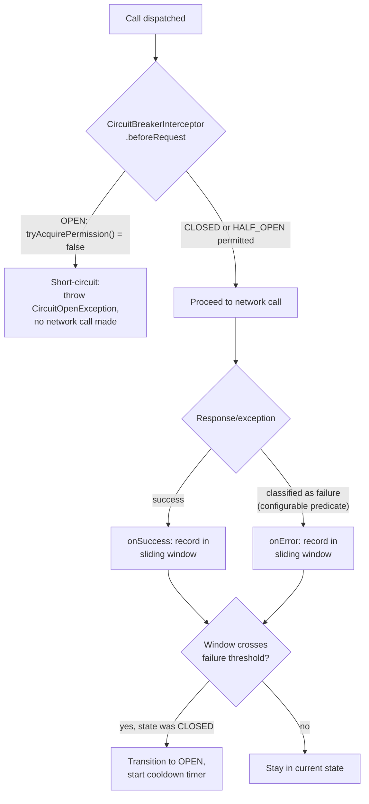
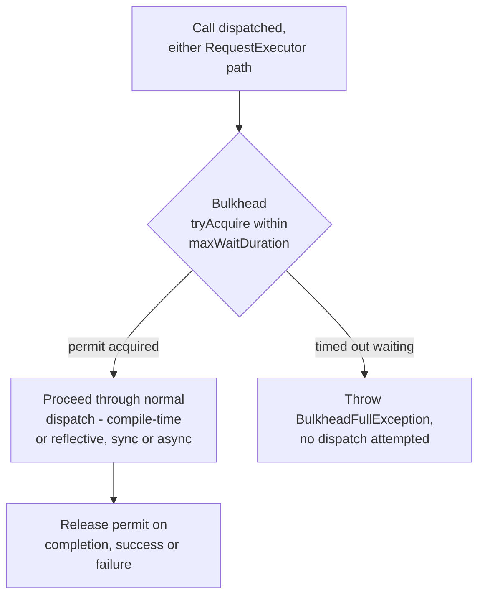

# Design: Circuit breaker + bulkhead per client

Status: **chunk 3 (the bulkhead) landed**, on top of chunk 2 (the circuit
breaker) - `BulkheadConfig`, `BulkheadFullException`, `BulkheadCoordinator`,
and `RipClientConfig.Builder#bulkhead(...)`, sync path (both dispatch
paths). One real deviation from §6.2/§8's sketch, caught before merging:

- **`BulkheadFullException` is not special-cased by `RetryExecutor` the
  way `CircuitOpenException` is.** §8's open question about the exception
  hierarchy didn't settle this, but it follows from the same reasoning
  either way: a circuit breaker's cooldown is long and deterministic (every
  retry attempt during it would fail identically), so `@Retry` bypasses its
  own retryable-status check entirely and rethrows immediately. A
  bulkhead's fullness has no such guarantee - a permit can free up the
  moment any in-flight call completes, arbitrarily soon - so
  `BulkheadFullException` instead falls through to the ordinary
  "any transport-level failure is retryable" path every other
  `RuntimeException` already gets, letting `@Retry`'s own backoff delay
  give the bulkhead a real chance to free a permit before trying again.
  No `RetryExecutor` code change was needed for this - it already treated
  every non-`CircuitOpenException` `RuntimeException` this way.

Extends `RestInPeaceException` directly (matching `CircuitOpenException`'s
own shipped precedent from chunk 2, not the `RestInPeaceResilienceException`
common-ancestor option §8 was leaning toward), for consistency with what
actually landed rather than what was sketched before chunk 2 existed.

Async parity (chunk 4), the provider SPI (chunk 5), and Spring Boot starter
wiring (chunk 6) not started.

Two real deviations from §6.1/§6.3's sketch, both caught before merging, not
after:

- **Not an interceptor - a coordinator, wrapping the same supplier chain
  `CacheCoordinator`/short-circuit already wrap.** §6.1 originally assumed
  `RequestInterceptor`'s `beforeRequest`/`afterResponse` hooks were the
  right integration point. They're the wrong one: `afterResponse` is only
  notified for a call that actually receives a response - a transport-level
  failure (connection refused, timeout, no response at all) never reaches
  it, the exact same gap already documented on `MetricsInterceptor` for the
  same reason. That gap is precisely wrong for a feature whose entire
  premise (§1) is catching "the downstream is completely down" - usually a
  connection failure, not a polite 5xx. The actual implementation
  (`CircuitBreakerCoordinator`, package-private, `internal`) instead wraps
  the exact `Supplier<HttpResponse<B>>` chain `RequestExecutor` already
  passes through `CacheCoordinator`/`InterceptorDispatcher`'s short-circuit,
  as the *outermost* layer (so an open breaker skips cache lookups,
  short-circuit checks, and the network call entirely), with a
  `try/catch` around the inner call so it sees both a real response (via
  its status code) and a thrown transport exception uniformly. §6.1's own
  text has been left as the original sketch for history; §7 and the
  javadoc on `CircuitBreakerCoordinator`/`RetryExecutor` describe the
  actual shape.
- **`recordFailure` takes an `IntPredicate` on the status code, not a
  `Predicate<Throwable>`.** §6.3's original sketch
  (`recordFailure(ex -> ex instanceof RestInPeaceHttpException http && ...)`)
  assumed a `RestInPeaceHttpException` was available to classify against at
  this integration point - it isn't: that exception is only thrown later,
  by `responseDecoder.decodeOrThrow`, *outside* the supplier chain this
  coordinator wraps. Inside the wrap, a non-2xx response is just an
  ordinary `HttpResponse` with a non-2xx status - nothing throws for it at
  all. Renamed to `recordFailureForStatus(IntPredicate)`, defaulting to
  `status -> status >= 500`, unchanged in intent (5xx + any transport
  exception, still the default failure predicate) but classifying against
  the actual data available. `RestInPeaceHttpException.getStatus()` (not
  `getStatusCode()`, which doesn't exist) is the correct accessor
  elsewhere, for the record.

`CircuitOpenException` is never retried (`RetryExecutor` special-cases it
ahead of the ordinary retryable-status check) - confirmed by
`CircuitBreakerIntegrationTest#circuitOpenException_isNeverRetried` against
a method with a real `@Retry` whose `retryOnStatus` would otherwise retry
the triggering response.

## 1. Problem

`@Retry` and `@Timeout` already exist and solve two real, related problems:
`@Retry` says "try again if this fails," `@Timeout` says "give up waiting
after N ms." Neither solves a third, distinct problem: **a downstream that
is currently, completely down**. Without anything else in place, every
single call to that downstream still pays the full cost of finding that
out - a timeout, then every configured retry attempt, then finally
failing - even though, statistically, the outcome was certain after the
first failure. During a real outage that's not a rounding error: hundreds
or thousands of calls each burning multiple seconds on network attempts
that were never going to succeed, adding load to a downstream that's
already struggling and adding latency to every caller waiting on it.

A second, structurally different problem shows up alongside the first in
real deployments: **resource starvation across unrelated downstreams**. RIP
dispatches every call through a shared HTTP client (Unirest, backed by
Apache HttpClient's connection pool). If `PaymentApi` starts hanging, every
in-flight call to it holds a connection (and, on the reflective dispatch
path, a thread) until it times out. Enough concurrent hung `PaymentApi`
calls can exhaust that shared pool - at which point calls to a completely
unrelated, perfectly healthy `InventoryApi` start failing too, purely from
resource starvation, not from anything wrong with `InventoryApi` itself.

These are the two patterns this item names:

- **Circuit breaker** - stop even attempting calls to a downstream once
  it's shown itself to be failing, for a cooldown period, so failing fast
  replaces failing slow.
- **Bulkhead** - cap how many concurrent calls any one downstream can ever
  have in flight, so one downstream's failure mode can't consume resources
  needed by calls to a different downstream.

They answer different questions ("is this downstream broken?" vs. "how
much of my resources can this one downstream ever consume?") and are
usually offered as a pair - resilience4j and the now-maintenance-mode
Netflix Hystrix both ship them side by side - precisely because a real
production incident tends to need both at once: the breaker stops paying
the cost of talking to the broken thing, the bulkhead limits the blast
radius while that's being figured out.

## 2. Goals

- A per-client circuit breaker: configurable failure-rate/count threshold,
  sliding window, open-state cooldown, and half-open trial-call count -
  the standard CLOSED → OPEN → HALF_OPEN → CLOSED state machine (§4.1).
- A per-client bulkhead: a configurable cap on concurrent in-flight calls
  to that client, with a bounded wait for a free slot before rejecting
  (§4.2).
- Both configurable per `@RestClient` interface via `RipClientConfig`, the
  same place `@Retry`'s per-client retry budget (already shipped) and
  `@Timeout`'s connect/read timeouts already live - not global settings,
  since failure/concurrency characteristics are a property of one
  downstream, not the whole application.
- A configurable **failure classification predicate**, mirroring `@Retry`'s
  own retry-condition logic, so an application-level "expected" non-2xx
  response (a `404` from an existence check, the same kind of outcome E6's
  negative caching already treats as a valid, cacheable answer rather than
  an error) doesn't falsely trip a breaker meant for genuine outages.
- Both features work identically regardless of dispatch path
  (compile-time-generated or reflective) and regardless of call style
  (synchronous or `CompletableFuture` async) - the same transparency
  guarantee §6 of the Spring Boot starter design doc already established
  for that module, extended here to a feature that actually does touch the
  call lifecycle (unlike that module, which never did).
- A **build-your-own default with a pluggable override to delegate to
  resilience4j** (or any other implementation) - see §5 for the full
  scoping decision. Neither "hand-roll everything, no interop" nor "take a
  hard dependency on resilience4j" alone is the right default; §5 explains
  why and what the escape hatch looks like.

## 3. Non-goals

- Not a general-purpose resilience framework. This item is scoped to what
  a `@RestClient` interface calling one downstream needs, not a standalone
  library usable outside RIP the way resilience4j itself is. A consumer
  who wants resilience4j's full surface (rate limiters, time limiters,
  cache decorators unrelated to HTTP calls) already has resilience4j
  itself available as a normal dependency; RIP isn't replacing it.
- Not a service mesh / sidecar-proxy-level circuit breaker (Envoy/Istio
  outlier detection). This operates inside the calling JVM process, at the
  granularity of one `@RestClient` interface - it has no visibility into
  other processes or instances of the same service, and doesn't attempt
  cluster-wide failure detection.
- Not touching `@Retry`'s own logic, `RequestExecutor`, or either dispatch
  path's method-level codegen/reflection. Both features are pure
  *wrapping* concerns around a call, the same category `@Timeout` and
  `@Retry` already occupy - see §4 for exactly where each wraps.
- Not solving distributed rate limiting, request coalescing/deduplication,
  or a pagination helper (a separate, already-parked roadmap item) - all
  adjacent but distinct problems.

## 4. Personas and usage scenarios

Both features solve real problems, but they're easy to conflate (see §1) -
these are meant to be concrete enough that "which one do I need, and with
what settings" has an obvious answer for a given shape of consumer. Every
persona below is a `@RestClient` consumer; none require anything beyond
what `RipClientConfig` already exposes today plus this item's additions.

### 4.1 Circuit breaker personas

**The checkout service, calling a payments provider.** `PaymentApi` has
occasional, real outages (a provider-side incident, a deploy that goes
briefly wrong) lasting anywhere from seconds to several minutes. Without a
breaker, every checkout attempt during that window pays the full
`@Timeout` + `@Retry` cost - each one hangs the user's checkout flow for
several seconds before finally failing. With a breaker tuned to trip once
the failure rate over the last 20 calls crosses 50%, subsequent checkout
attempts fail in under a millisecond, letting the UI show "payments are temporarily
unavailable, please try again shortly" immediately instead of hanging -
and the breaker's own HALF_OPEN trial calls detect recovery without a
human needing to notice the outage ended and manually resume traffic.

**The aggregator/dashboard service.** A single page load calls five
independent downstream services (`UserApi`, `OrdersApi`, `RecommendationApi`,
`InventoryApi`, `NotificationsApi`) to assemble one response. If
`RecommendationApi` degrades, the *slow, still-technically-answering*
version of this problem is arguably worse than an outright outage: without
a breaker, every page load keeps waiting out `RecommendationApi`'s full
timeout on every request, even though the other four downstreams are
healthy. A per-client breaker on `RecommendationApi` alone lets the
aggregator fail fast on just that one call (falling back to "recommendations
unavailable" in the response) while `UserApi`/`OrdersApi`/etc. keep working
normally - the breaker's per-client scope is what makes this possible; a
single application-wide breaker would have no way to isolate the one
degraded downstream from the four healthy ones.

**The nightly batch/reconciliation job.** A job calls a partner API
thousands of times per run. If that partner starts returning 5xxs under
load (their systems can't handle the request rate), `@Retry` alone makes
this *worse* - it multiplies the load on an already-struggling partner
with every retried attempt. A breaker that trips once its failure-rate
threshold is crossed, backs off entirely for a cooldown window, then trial-probes
recovery is exactly the "stop hammering something that's clearly
struggling" behavior a batch job's blast radius needs, distinct from an
interactive request's need to fail fast for a human waiting on a UI.

**The internal microservice calling a sibling mid-deployment.** During a
rolling deploy, a sibling service is briefly returning connection-refused
or 503s as old instances drain and new ones start. A breaker's HALF_OPEN
trial-call mechanism is a lightweight way to detect "is the new deployment
actually serving traffic yet" without standing up a separate health-check
polling system - the very next real call after the cooldown *is* the
health check.

### 4.2 Bulkhead personas

**The multi-tenant proxy/gateway.** A service fans out to N different
tenant-specific downstream APIs (`TenantApi` instances sharing one
`RestClient` interface, different base URLs per tenant) from one shared
Unirest connection pool. If Tenant A's API is slow or hanging, without a
bulkhead every connection in the shared pool can end up allocated to
Tenant A's hung calls - starving Tenant B, C, and D's calls, which have
nothing to do with Tenant A's problem. A bulkhead capping concurrent calls
*per client instance* (or, if the gateway registers one `RipClientConfig`
per tenant, per tenant) contains the damage to the one tenant actually
experiencing the outage.

**The mixed-criticality caller.** A service calls both `PaymentApi`
(business-critical) and `RecommendationApi` (nice-to-have, degrades
gracefully) from the same process. Without a bulkhead, a `RecommendationApi`
slowdown can consume enough of the shared connection pool/thread capacity
to start starving `PaymentApi` calls too - a strictly worse outcome than
`RecommendationApi` alone being slow. Capping `RecommendationApi`'s
bulkhead low (say, 5 concurrent calls) guarantees it can never take more
than a small, known slice of shared capacity, regardless of how badly it
degrades - protecting the critical path by construction, not by hoping the
non-critical one behaves.

**The webhook fan-out service.** A service sends outbound webhooks to
many different customer-controlled URLs (one `@RestClient` interface,
dynamic `@Url` per call - see the core README's `@Url` support). One
customer's endpoint being slow/hanging (their server, not RIP's problem to
fix) shouldn't be able to consume the entire outbound-webhook capacity
meant for delivering to every other customer. A bulkhead on the shared
`WebhookApi` client caps how many of those deliveries can be in flight at
once, guaranteeing a slow customer endpoint degrades only its own delivery
throughput, not everyone else's.

**The high-fan-out async consumer.** A service dispatches large numbers of
concurrent `CompletableFuture`-returning calls to the same downstream (a
batch enrichment pipeline calling `EnrichmentApi` for every item in a large
collection, in parallel). Even with the downstream fully healthy, an
unbounded fan-out can overwhelm it (accidentally self-inflicted, not the
downstream's fault) or exhaust local resources (threads on the async
executor, connections in the pool) before any failure ever occurs. A
bulkhead here acts as a *concurrency throttle* independent of any actual
failure - the queueing behavior (§4.2 below) matters more than the
rejection behavior for this persona, since the goal is smoothing fan-out,
not protecting against an already-broken downstream.

## 5. Build-your-own vs. resilience4j: the scoping decision

This is the real design fork, and it's worth being explicit about the
tradeoffs rather than picking one silently.

**Option A - pure build-your-own, no resilience4j awareness at all.**
Consistent with RIP's existing philosophy: `LoggingInterceptor` and
`MetricsInterceptor` both define a small "bring your own sink" interface
(`MetricsSink`) rather than taking a hard dependency on Micrometer or
anything else, so RIP itself stays dependency-light and framework-agnostic.
A hand-rolled breaker (an `AtomicReference`-backed state machine over a
sliding window) and a hand-rolled bulkhead (a `Semaphore` wrapping
dispatch) are both genuinely small - resilience4j's core `CircuitBreaker`
implementation is conceptually a sliding window plus a state machine, not
a large surface. Downside: a consumer who's already standing up
resilience4j elsewhere in their stack (most JVM shops with any resilience
story at all already have it, since it's the de facto standard, Hystrix's
maintained successor) gets a second, RIP-specific breaker implementation
to reason about, with its own metrics/dashboards/tuning knobs disconnected
from the ones they already have for every other service call in their
stack.

**Option B - take a hard dependency on resilience4j.** Every RIP consumer
gets resilience4j on their classpath whether they want it or not, and
config maps directly onto `resilience4j.circuitbreaker.CircuitBreakerConfig`/
`resilience4j.bulkhead.BulkheadConfig`. Downside: this directly violates
the same "bring your own X, don't force a dependency" principle
`MetricsInterceptor` was explicitly built to preserve for metrics - a
consumer with zero interest in resilience4j (using a different
library, or none at all, because their downstreams don't need it) now
carries it anyway. This is the wrong default for the same reason RIP
doesn't hard-depend on Micrometer.

**Option C - the actual scope for this item: build-your-own default,
pluggable override to delegate to resilience4j.** RIP ships its own
minimal breaker/bulkhead as the zero-dependency default (Option A's
implementation), but defines a small SPI a consumer can implement to
delegate the *decision* (should this call proceed, right now?) to whatever
resilience4j (or any other library) instance they already manage
elsewhere:

```java
public interface CircuitBreakerProvider {
    /** @return true if the call should proceed; false to fail fast. */
    boolean tryAcquirePermission();
    void onSuccess(long durationNanos);
    void onError(long durationNanos, Throwable t);
}

public interface BulkheadProvider {
    boolean tryAcquirePermission();
    void onComplete();
}
```

A consumer wires their own resilience4j instance in with a thin adapter -
conceptually identical to how `MetricsSink` already lets a consumer wire
Micrometer in without RIP depending on it:

```java
CircuitBreaker r4jBreaker = CircuitBreaker.ofDefaults("payment-api");

RipClientConfig config = RipClientConfig.builder()
    .circuitBreaker(new CircuitBreakerProvider() {
        public boolean tryAcquirePermission() {
            return r4jBreaker.tryAcquirePermission();
        }
        public void onSuccess(long durationNanos) {
            r4jBreaker.onSuccess(durationNanos, TimeUnit.NANOSECONDS);
        }
        public void onError(long durationNanos, Throwable t) {
            r4jBreaker.onError(durationNanos, TimeUnit.NANOSECONDS, t);
        }
    })
    .build();
```

For the common case where a consumer has no existing resilience4j
investment, RIP's own built-in implementation is used automatically the
moment `.circuitBreaker(CircuitBreakerConfig...)`/`.bulkhead(BulkheadConfig...)`
is configured with RIP's own config objects (§6) - no explicit provider
wiring needed, no dependency added. The provider interface only comes into
play for a consumer explicitly opting into a different backend. This is
strictly additive to Option A: the zero-dependency default ships first and
stands alone; the provider SPI is the escape hatch layered on top, not a
prerequisite for the default to work.

**Why this is the right scope, not just the safest-sounding one:** it
mirrors a pattern this codebase has already committed to twice
(`RequestInterceptor`'s pluggable per-call hooks, `MetricsSink`'s pluggable
metrics backend) rather than inventing a new one, and it resolves both
options' downsides - a consumer with no resilience4j investment gets a
working feature with zero new dependencies; a consumer who already has
resilience4j gets to keep using it, with the same dashboards/tuning/alerts
they already built, instead of RIP silently introducing a second, disjoint
resilience story.

## 6. Proposed architecture

### 6.1 Circuit breaker: reuses the existing interceptor short-circuit hook

E11 already built the mechanism this needs: an interceptor's
`beforeRequest` can return a synthetic response without ever making the
network call (see the core README's interceptor short-circuit
documentation). A `CircuitBreakerInterceptor`, installed per-client
whenever `RipClientConfig.Builder.circuitBreaker(...)` is set, uses exactly
that hook:



No new integration point in `RequestExecutor` or either dispatch path -
this is a new interceptor implementation using plumbing that already
exists, the same way a consumer's own custom `RequestInterceptor` would.
State (the sliding window, current state, cooldown deadline) lives inside
the interceptor instance, one per client, mirroring the already-shipped
per-client `RetryBudget`'s lifecycle and scope.

### 6.2 Bulkhead: wraps dispatch itself, both paths and both call styles

Unlike the breaker, this isn't an interceptor concern - it's a concurrency
cap around the call itself, needed *before* an interceptor or the network
call ever runs, and needed identically whether the call resolves
synchronously or via `CompletableFuture`. A `java.util.concurrent.Semaphore`
(or an equivalent async-aware limiter for the `CompletableFuture` path, so
acquiring a permit doesn't block a caller thread that's supposed to be
non-blocking) sized to the configured `maxConcurrentCalls`, acquired before
dispatch and released in a `finally`/completion callback:



This is the one piece that genuinely needs to sit in front of both dispatch
paths rather than inside an interceptor, since it must reject *before* any
per-call work (including interceptor invocation) happens - queueing at the
interceptor layer would already have consumed the resources (a thread, a
partially-built request) the bulkhead exists to protect.

### 6.3 Failure classification

Both `CircuitBreakerConfig` and the failure side of `onError` need a
predicate deciding what counts as a "failure" for breaker-tripping
purposes - not every non-2xx response should count (see §1/§2's `404`
example). Mirrors `@Retry`'s own existing retry-condition shape:

```java
CircuitBreakerConfig.builder()
    .slidingWindowType(SlidingWindowType.COUNT_BASED)  // default; TIME_BASED also supported (§6.4)
    .slidingWindowSize(20)                             // last 20 calls
    // .slidingWindowSize(Duration.ofSeconds(20))      // the TIME_BASED overload instead (§6.4) - a Duration,
                                                         // not resilience4j's bare int-always-means-seconds
    .minimumNumberOfCalls(10)                          // don't evaluate the rate below this
    .failureRateThreshold(50)                          // trip at 50% failures within the window
    .waitDurationInOpenState(Duration.ofSeconds(30))
    .permittedCallsInHalfOpenState(3)
    .recordFailure(ex -> ex instanceof RestInPeaceHttpException http
        && http.getStatusCode() >= 500)   // default: only 5xx + transport failures count
    .build();
```

Default predicate: 5xx responses and transport-level exceptions
(connection refused, timeout) count as failures; 4xx responses do not -
the same "client error vs. server error" boundary `@Retry`'s own default
retry condition already draws, kept consistent rather than inventing a
second convention.

### 6.4 Sliding window: count-based and rate-dependent, not time-based or raw-count

Worth stating explicitly, since the shape above (`failureRateThreshold` +
`slidingWindowSize`) doesn't spell out the decision on its own: the window
is **count-based** (the last N *calls*, e.g. the last 20 - not the last N
*seconds*), and the trip condition is a **failure rate**, evaluated as a
percentage of that window, not a raw failure count. This is resilience4j's
own default shape (`SlidingWindowType.COUNT_BASED` + `failureRateThreshold`)
and the reasoning for matching it rather than inventing something else:

- **Count-based over time-based, as the default.** A time-based window
  (the last N seconds) makes the trip decision dependent on how much
  traffic happened to arrive during that window - for a low-traffic
  client, "the last 30 seconds" might contain zero or one call, making a
  rate meaningless (or requiring a `minimumNumberOfCalls` gate that, in
  the worst case, never fills up for a genuinely idle client). A
  count-based window (the last 20 calls, whenever they happened to occur)
  doesn't have that failure mode, and is deterministic for testing - a
  test can drive exactly 20 calls and assert the trip, with no
  `Thread.sleep`/wall-clock dependency the way asserting a time-based
  window's behavior would need. `SlidingWindowType.TIME_BASED` is still
  worth exposing as a configurable alternative (resilience4j supports
  both), for a consumer who specifically wants "rate over the last minute
  regardless of call volume" - but it isn't the default, for the reasons
  above.
- **`TIME_BASED` window size is a `Duration`, not resilience4j's bare
  `int` seconds.** Worth flagging since it's a real wart in the library
  this design otherwise deliberately mirrors: resilience4j's own
  `slidingWindowSize(int)` is *always* interpreted as seconds when
  `TIME_BASED` is selected - there's no minutes/millis option, and no
  `Duration`-typed overload; wanting a one-minute window means passing
  `slidingWindowSize(60)` and knowing that's seconds from documentation
  alone, not from the method signature. RIP's own `TIME_BASED`
  implementation is a from-scratch build (§5, Option C - the
  `CircuitBreakerProvider` override is the only path that ever touches a
  real resilience4j instance), so there's no reason to inherit that
  constraint: `CircuitBreakerConfig.Builder.slidingWindowSize(Duration)`
  when `slidingWindowType(TIME_BASED)` is selected, consistent with
  `waitDurationInOpenState` already being `Duration`-typed in the same
  config object rather than a second bare-int convention living
  alongside it.
- **Rate over raw count, always.** 5 failures in the last 20 calls (25%)
  and 5 failures in the last 10,000 calls are completely different
  signals about whether a downstream is actually degraded - a raw count
  threshold conflates them, and would need constant re-tuning per client
  based on that client's typical call volume to mean anything consistent.
  A rate threshold, gated by a configurable `minimumNumberOfCalls` (so a
  rate is never evaluated off a tiny, statistically meaningless sample -
  e.g. 1 failure out of 2 calls is technically 50%, but shouldn't trip a
  breaker tuned for a 20-call window), is the shape that stays meaningful
  regardless of how much traffic a given client actually sees. A simpler
  "trip after N consecutive failures" model was considered (and is what
  an early draft of §4.1's personas described) but rejected as the
  default: a single stray success resets a pure consecutive-failure
  counter to zero, which can mask a downstream that's genuinely degraded
  but still occasionally succeeding - exactly the case a rate-over-a-window
  is designed to catch instead.

## 7. Interaction with existing features

- **`@Retry`**: runs *inside* the breaker's permitted-call path, unchanged.
  A retried call that ultimately fails still reports one failure to the
  breaker's window per RIP-level attempt (mirroring how `MetricsInterceptor`
  already reports one sample per `@Retry` attempt, verified by its own
  three-sample test) - not one failure for the whole retried sequence,
  since each attempt is a real, separate network call the breaker needs to
  see.
- **`@Timeout`**: unaffected; a timeout is one of the transport-level
  failures the default failure predicate (§6.3) already classifies as
  breaker-relevant.
- **`MockRestServer`**: both features need to be inert by default in tests
  unless a test explicitly exercises them - the same "opt-in per test" shape
  `RipClientConfig` already has for every other per-client setting. No
  special `MockRestServer` integration is anticipated; a test that wants to
  assert breaker/bulkhead behavior configures a real, small
  `CircuitBreakerConfig`/`BulkheadConfig` against the mock server the same
  way `RipRetryIntegrationTest` already exercises `@Retry` against it.
- **Async (`CompletableFuture`) dispatch**: both the breaker's
  `beforeRequest` short-circuit and the bulkhead's permit acquisition need
  async-safe implementations that don't block a caller thread waiting on a
  synchronous `Semaphore.acquire()` - likely a `CompletableFuture`-returning
  acquire, mirroring how `RetryExecutor`'s own async parity work (already
  shipped) handled the same "don't block the async path" constraint for
  retries.
- **Compile-time vs. reflective dispatch**: fully transparent to both -
  the breaker is an interceptor (already dispatch-path-agnostic by
  construction) and the bulkhead wraps dispatch itself rather than
  depending on how a method's return type was decoded, so unlike the
  parked `CallAdapter` item, no codegen changes are needed in
  `RestClientProcessor` at all.

## 8. Open questions to resolve before implementation starts

- Exact shape of the async-safe bulkhead permit (a bounded
  `CompletableFuture`-based queue vs. a virtual-thread-friendly primitive) -
  needs a small spike, not a design-doc-level decision, since it's an
  implementation detail with no API surface impact either way.
- Whether `CircuitOpenException`/`BulkheadFullException` extend
  `RestInPeaceHttpException` (giving them a natural place in existing
  `@ErrorType`/exception-handling code) or a new common
  `RestInPeaceResilienceException` - leaning toward the latter, since
  neither represents an actual HTTP response and forcing them into the
  HTTP-exception hierarchy would be misleading, but this needs the same
  scrutiny `@Retry`'s idempotency-key work gave its own exception-shape
  decisions.
- Whether bulkhead concurrency is scoped per `RipClientConfig` instance or
  per distinct base URL - matters specifically for the multi-tenant proxy
  persona (§4.2), where one `@RestClient` interface might back many
  different runtime base URLs. Current lean: per `RipClientConfig`
  instance, matching every other per-client setting's scope, with the
  multi-tenant persona expected to register one config per tenant if
  per-tenant isolation is actually needed - but worth confirming against a
  real consumer before committing to it.

## 9. Rollout plan (chunked)

Mirrors the chunking convention both existing design docs use - each chunk
its own PR, verified and merged before the next starts.

1. **This design doc.** ✅
2. **Circuit breaker** ✅ - `CircuitBreakerConfig`, `CircuitOpenException`,
   `CircuitBreakerCoordinator` (a coordinator, not an interceptor - see the
   Status line above for why), wired into `RipClientConfig.Builder`. Sync
   path, both dispatch paths. Both `COUNT_BASED` and `TIME_BASED` sliding
   windows fully implemented, not deferred. Verified via
   `CircuitBreakerConfigTest`, `CircuitBreakerCoordinatorTest` (14 cases:
   every state transition, both window types, the minimum-sample-size gate,
   a custom failure predicate), and `CircuitBreakerIntegrationTest` against
   a real `MockRestServer` (proving the network call is genuinely skipped
   once open, recovery via a half-open trial call, and that
   `CircuitOpenException` is never retried even when `@Retry`'s own
   `retryOnStatus` would otherwise retry the triggering response).
3. **Bulkhead** ✅ - RIP's own built-in implementation (§6.2), sync path
   only. `BulkheadConfig`/`BulkheadFullException`/`BulkheadCoordinator`,
   wired into `RipClientConfig.Builder`. Verified via
   `BulkheadConfigTest`, `BulkheadCoordinatorTest`, and
   `BulkheadIntegrationTest` against a real `MockRestServer` (proving a
   full bulkhead genuinely skips the network call, a released permit lets
   a waiting call through, and `maxWaitDuration` lets a call queue for a
   permit instead of failing immediately).
4. **Async parity** for both, mirroring `RetryExecutor`'s own async-parity
   precedent (§7).
5. **`CircuitBreakerProvider`/`BulkheadProvider`** override SPI (§5, Option
   C) - the resilience4j-delegation escape hatch, plus a documented
   example adapter (not a hard dependency - the example lives in docs/a
   sample, never in `core`'s own `pom.xml`).
6. **Spring Boot starter wiring** - `RipClientConfig`'s new
   `circuitBreaker`/`bulkhead` settings bound from
   `rest-in-peace.clients.<name>.*`, the same `Binder` mechanism §4.4 of
   `docs/design/spring-boot-starter.md` already established for
   timeout/proxy.

Each chunk should update this doc's Status line with what actually landed
and any real deviations from the sketch above, the same convention both
existing design docs follow.
