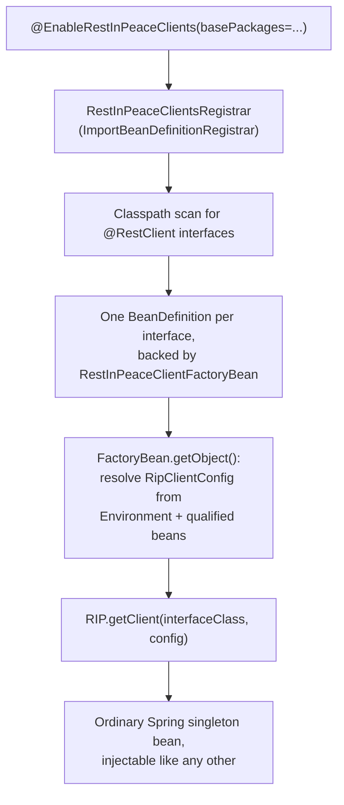

# Design: Spring Boot starter module

Status: **in progress - chunk 5 landed**. Chunk 1 (this doc), then chunk 2
(standalone project scaffolding, targeting **Spring Boot 4.x** rather than
3.x - 3.x reached its own open-source end of life shortly after this doc's
first draft, and 4.x keeps the same Java 17 floor §2 already assumed), then
chunk 3 (`@EnableRestInPeaceClients`, `RestInPeaceClientsRegistrar`, and
`RestInPeaceClientFactoryBean` - see that chunk's own note below).

Chunk 4 added `baseUrlProperty`/`name` and their `Environment` resolution
(§4.3), surfacing two real design turns along the way:

- **§4.3's original sketch put `baseUrlProperty` directly on the core
  library's `@RestClient` annotation** - a real source change to the core
  module, contradicting this doc's own §2 goal and §3 non-goal as first
  written. First fix: introduce `@RestInPeaceClient` as a second,
  starter-only annotation applied *alongside* `@RestClient`, keeping the
  core library's source untouched. That shipped in chunk 4's first PR, but
  the maintainer then explicitly reconsidered the two-annotation shape
  (`Is it absolutely necessary to have another new annotation?`) and, after
  weighing the tradeoffs below, decided to fold `baseUrlProperty`/`name`
  into the core's `@RestClient` directly instead - **a deliberate maintainer
  decision, not a bug fix**, and this doc's §2 goal of "zero core changes"
  is explicitly superseded by it:
  - *Against reuse* (the case for the two-annotation split, and my own
    recommendation at the time): every non-Spring consumer of the core
    library now sees Spring-flavored attributes on `@RestClient` whether or
    not they use Spring; future tweaks to these two attributes force a core
    release even for Spring-only changes.
  - *For reuse* (the maintainer's actual call): one annotation to look up
    instead of two on the same interface; both attributes are inert,
    documented as starter-only metadata, and add no behavior to
    `RIP.getClient(...)` or anything else in core - the coupling is
    textual, not run-time.
  - `@RestInPeaceClient.java` was deleted; `RestClient.java` (core) gained
    `baseUrlProperty()`/`name()`, both defaulting to `""` and documented as
    read only by the optional starter module. §4.1, §4.3, §4.4, and §6 below
    describe this final shape.
- **The registrar resolves `baseUrlProperty` eagerly, at bean-registration
  time** (matching the core library's own fail-fast-at-construction
  philosophy - see `RIP.getClient(...)`'s own javadoc), which means every
  `@RestClient` interface in a scanned package needs its property already
  resolvable, whether or not that particular bean is ever actually
  requested. Harmless for real application code (an app should configure
  every client it registers), but it broke test isolation the moment two
  test classes shared one scanned package - one test's interface with an
  unset property crashed a *different* test's context on startup. Fixed by
  giving each test its own dedicated fixture sub-package
  (`.registration`, `.baseurl`, ...), a convention every later chunk's
  tests should keep following.

Chunk 5 added `RipClientConfig`'s connect/read timeout and proxy, bound
from `rest-in-peace.clients.<name>.*` (§4.4, minus the `ObjectMapper`/
`Cache`/interceptor bean wiring - that's chunk 6):

- **`RestInPeaceClientFactoryBean` now always goes through
  `RIP.getClient(Class, RipClientConfig)`**, not the `Class`/`Class,String`
  overloads it branched between before - a `RipClientConfig` with every
  field unset already behaves identically to `RIP.getClient(Class)` (see
  that class's own javadoc on the "keeps sharing the static client" case),
  so unifying on it removed a branch instead of adding one.
- **A new package-private `RestInPeaceClientProperties`** (plain JavaBean
  getters/setters, not a Java record) holds one client's `connectTimeoutMillis`/
  `readTimeoutMillis`/`proxy`, bound via Spring Boot's `Binder` -
  `Binder.get(environment).bind("rest-in-peace.clients.<name>", ...)` -
  the same eager, registration-time resolution `baseUrlProperty` already
  gets, for the same fail-fast-at-construction reason.
- **Real bug caught by the existing tests, not a new one of theirs**:
  `ConfigurationPropertyName.of(...)` (what `Binder.bind(String, ...)` calls
  internally) only accepts an already-canonical, kebab-case name - relaxed
  binding matches a canonical name against differently-cased keys already
  *in* a property source, but never accepts a differently-cased name to
  parse as the binding target in the first place. A derived bean name like
  `pingApi` therefore threw `InvalidConfigurationPropertyNameException`
  immediately, failing every existing test's context startup the moment
  this chunk's binder call was added - not just the new chunk 5 test.
  Fixed with a small `toKebabCase(String)` helper (`pingApi` → `ping-api`)
  applied only to the property-path segment; the registered bean name
  itself stays camelCase, unaffected.

Chunk 3's own note, unchanged from when it landed: one deviation from
§4.2's sketch, caught by its bean-naming test -
`ClassUtils.getShortName(...)` includes the enclosing class's name for a
nested interface (`Outer.PingApi`, not `PingApi`); `Class.getSimpleName()`
is the correct call for deriving a bean name.

Verified end to end with real local `HttpServer`-backed tests (6/6
passing): annotate, scan, register (by `@BaseUrl`, `baseUrlProperty`, or
per-client timeout/proxy), inject, call - the timeout/proxy tests mirror
core's own `RipClientConfigIntegrationTest` shapes (300ms server delay vs.
a 50ms read timeout; an unreachable `localhost:1` proxy) to prove the
bound properties actually reach `RipClientConfig`, not just that binding
doesn't throw. See §7 for the full chunked rollout plan and which chunk is
next. Roadmap item: "Spring/Micronaut integration module" in `ROADMAP.md`.

## 1. Problem

Wiring a `@RestClient` interface into a Spring-managed app today means one
hand-written `@Bean` method per interface:

```java
@Bean
public UserApi userApi(@Value("${user-api.base-url}") String baseUrl) {
    return RIP.getClient(UserApi.class, baseUrl);
}
```

Fine for a handful of clients, tedious past a dozen - exactly the gap
OpenFeign's `@EnableFeignClients` closes for its own model. Two problems
being conflated as one, worth separating up front:

1. **Discovery/registration boilerplate** - one `@Bean` method per
   interface, all doing the same three things (resolve config, call
   `RIP.getClient(...)`, return it).
2. **A genuine language constraint, not just missing glue code**:
   `@BaseUrl`'s `value()` must be a compile-time constant (Java annotation
   attributes always are), so it can never hold a Spring property
   placeholder like `${user-api.base-url}` - not a RIP limitation, a Java
   one. Something has to bridge annotation-declared metadata and Spring's
   runtime `Environment` for a Spring consumer to configure a base URL the
   way they configure everything else.

## 2. Goals

- Auto-register every `@RestClient` interface found on the classpath as a
  Spring-managed singleton bean, removing the one-`@Bean`-per-interface
  boilerplate entirely for the common case.
- Base URL, connect/read timeout, and proxy configurable per client from
  `application.yml`/`.properties`, the way every other Spring Boot
  integration is configured - not from Java constants.
- `ObjectMapper`/`Cache`/`RequestInterceptor` beans already in the Spring
  context get wired into the right client(s) automatically - a consumer
  defines them once as ordinary `@Bean`s/`@Component`s, same as they would
  for any other Spring integration.
- Dedicated Spring Boot test support for `MockRestServer` - the one thing
  that doesn't fall out for free from "call `RIP.getClient(...)` for you"
  (see §3).
- Zero changes to `RequestExecutor` or any of its collaborators, and no
  changes to the request lifecycle itself for any `@RestClient` interface -
  every annotation (`@PathParam`, `@Multipart`, `@Retry`, ...), every return
  type, and both dispatch paths (compile-time-generated and reflective)
  already work identically regardless of how the client instance was
  constructed, because `RIP.getClient(...)` is the single choke point both
  this starter and today's hand-written `@Bean` method call into. This
  module is purely about *constructing and registering* clients.
  (Originally scoped as "zero changes to `@RestClient` itself" too - see the
  chunk 4 status entry above for why that got explicitly superseded:
  `baseUrlProperty()`/`name()` are now two small, inert, optional attributes
  on the core annotation, read only by this starter.)

## 3. Non-goals

- Not a Micronaut module. Spring's classpath-scanning + runtime bean
  registration model (`ImportBeanDefinitionRegistrar`) maps directly onto
  what's needed here; Micronaut's DI is itself compile-time (its own
  annotation processor generates bean definitions ahead of time), so a
  Micronaut integration is a structurally different second effort that has
  to cooperate with `RestClientProcessor`'s own codegen, not a port of this
  module. Tracked as a separate future item if there's real demand.
- Not touching the existing single-module `pom.xml`, `ci.yml`,
  `release.yml`, `maven-publish.yml`, or `javadoc.yml`. The starter is a
  new **standalone** Maven project (its own `pom.xml`, depending on
  `com.shri:rest-in-peace` as an ordinary dependency), the same shape
  `samples/compile-time-proxy-consumer` already is - not a reactor
  submodule of the core library's POM. Full "modularization" of the core
  artifact itself (splitting `rest-in-peace` into multiple published
  artifacts) is a separate, larger roadmap item this design deliberately
  does not depend on or block.
- Not solving how the starter itself gets published for real consumption
  (own Maven coordinates, its own release cadence) - deferred to the last
  rollout chunk (§7), once the feature is functionally complete and there's
  something worth versioning.
- Not adding a `CallAdapter`-style pluggable return-type system (a
  separate, already-parked roadmap item) - this module never touches
  return-type decoding.

## 4. Proposed architecture

### 4.1 New standalone project, not a reactor module

```
REST-in-peace/
├── pom.xml                        # unchanged - still packages the core jar
├── src/, samples/, docs/          # unchanged
└── spring-boot-starter/           # new, standalone Maven project
    ├── pom.xml                    # depends on com.shri:rest-in-peace + spring-boot-autoconfigure
    └── src/main/java/com/shri/restinpeace/spring/
        ├── EnableRestInPeaceClients.java
        ├── RestInPeaceClientsRegistrar.java   # ImportBeanDefinitionRegistrar
        ├── RestInPeaceClientFactoryBean.java
        └── RestInPeaceClientProperties.java   # per-client timeout/proxy, bound via Binder (§4.4)
```

`@RestClient`'s own `baseUrlProperty()`/`name()` attributes (core library,
§4.3) carry the per-interface Spring metadata - no separate annotation
class in this project.

Building/testing it locally or in CI mirrors exactly what
`sample-consumer-test.yml` already does for the sample consumer: install
the core library's current commit (`mvn install -DskipTests` at the repo
root), then build the standalone project against whatever version was just
installed.

### 4.2 Registration flow



`RestInPeaceClientFactoryBean<T>` is the only piece that ever calls
`RIP.getClient(...)` - once per interface, at bean-creation time, matching
the "construct once, reuse" guidance already in the README's
[Integrating with your project](../../README.md#integrating-with-your-project)
section.

### 4.3 Base URL resolution

**Final shape, after an explicit maintainer decision** (see the chunk 4
status entry above for the full back-and-forth): `baseUrlProperty()` and
`name()` live directly on the core library's own `@RestClient` annotation,
as two optional attributes both defaulting to `""`. Both are documented on
the annotation itself as inert metadata read only by this optional starter
module - every other consumer of `@RestClient` (the reflective path, the
compile-time codegen processor, any non-Spring caller of
`RIP.getClient(...)`) ignores them entirely:

```java
@RestClient(baseUrlProperty = "user-api.base-url")
interface UserApi {
    @GET("/users/{id}")
    User getUser(@PathParam("id") String id);
}
```

```yaml
user-api:
  base-url: https://api.example.com
```

`baseUrlProperty` is a plain `String` naming a property *key* - a valid
compile-time constant - not the resolved value itself. The registrar
resolves it via the `Environment` (injected through
`ImportBeanDefinitionRegistrar`'s `EnvironmentAware` callback, a standard
Spring extension point) at bean-*registration* time, after Spring's
`Environment` exists but before any client is constructed - mirroring what
a hand-written `@Value("${user-api.base-url}") String baseUrl` parameter
does today. Both attributes are entirely optional: an interface that leaves
`baseUrlProperty` unset keeps working exactly as chunk 3 shipped it (a real
`@BaseUrl`, resolving with no runtime override).

### 4.4 Per-client configuration and bean wiring

```yaml
rest-in-peace:
  clients:
    user-api:                 # matched to @RestClient(name = "user-api"), or
                               # a decapitalized default derived from the
                               # interface's simple name if name() is left unset
      connect-timeout-millis: 2000
      read-timeout-millis: 10000
      proxy: { host: proxy.example.com, port: 8080 }
```

`connect-timeout-millis`/`read-timeout-millis`/`proxy` (chunk 5, landed) bind
straight into a `RipClientConfig.Builder` per named client, via Spring
Boot's `Binder` against `rest-in-peace.clients.<name>` at the same
bean-registration time `baseUrlProperty` already resolves at - **not** a
registered `@ConfigurationProperties` bean (there's no single bean that
could hold "every client's config" before the set of clients is even known,
since that set comes from the classpath scan itself). `ObjectMapper`/`Cache`
beans (chunk 6, not yet built) will resolve by type, qualified to a client
name when more than one bean of that type exists in the context
(`@Qualifier("user-api")`), falling back to a single unqualified bean shared
by every client without its own - mirroring `RIP.setObjectMapper(...)`/
`RIP.setCache(...)`'s existing "shared default" role. Any Spring bean
implementing `RequestInterceptor` with no client qualifier will be
registered globally (`RIP.addInterceptor(...)`, once, from the
auto-configuration) at context startup; one qualified to a client name will
go into that client's own `RipClientConfig.Builder.interceptors(...)`
instead - same "per-client interceptors run in addition to global ones"
semantics the core library already documents.

### 4.5 `MockRestServer` test support

The one piece that doesn't fall out of "call `RIP.getClient(...)` for you":
a test needs every registered client's base URL redirected to a running
`MockRestServer` instance for the test's duration.

```java
@SpringBootTest
@AutoConfigureMockRestServer
class UserServiceTest {
    @Autowired MockRestServer server;
    @Autowired UserApi userApi;   // already pointed at server.baseUrl()

    @Test
    void getUser_returnsDecodedBody() {
        server.on(HTTPMethod.GET, "/users/{id}", MockResponse.json(new User("42", "Shrinivas")));
        assertEquals("Shrinivas", userApi.getUser("42").name);
    }
}
```

`@AutoConfigureMockRestServer` starts a `MockRestServer`, exposes it as an
injectable bean, and overrides every registered client's resolved base URL
to `server.baseUrl()` for that test's application context - a genuinely new
piece of Spring-test-specific code, not a thin wrapper.

## 5. Async and daemon threads

A Spring Boot app is long-running, so the README's
["short-lived program hangs after an async call"](../../README.md#faq--troubleshooting)
FAQ entry is largely moot in this context. The auto-configuration calls
`RIP.useDaemonThreadsForAsync()` once at context startup as a sane default -
a long-running Spring app has no reason to want non-daemon I/O threads
outliving its own shutdown.

## 6. What's genuinely new vs. what's untouched

Everything method/parameter-level - `@PathParam`/`@QueryParam`/`@QueryMap`/
`@HeaderParam`/`@HeaderMap`/`@Headers`/`@Body`/`@Multipart`/`@Part`/
`@PartMap`/`@FormUrlEncoded`/`@Field`/`@FieldMap`, every return type,
`@ErrorType`/`RestInPeaceHttpException`, `@Retry`, `@Timeout` - needs zero
changes and zero Spring awareness, because Spring only ever constructs the
*client instance*, never touches a method call. Compile-time vs. reflective
dispatch stays fully transparent too, for the same reason. The genuinely
new surface is small: two optional, inert attributes on the core library's
`@RestClient` (`baseUrlProperty`, `name`), and, fully contained to this new
project, a small `Binder`-bound properties class (`RestInPeaceClientProperties`),
a registrar + `FactoryBean`, an auto-configuration class, and the
`MockRestServer` test-support piece.

## 7. Rollout plan (chunked)

Each chunk is its own PR, verified and merged before the next starts,
mirroring how compile-time proxy generation itself shipped in slices (see
`docs/design/compile-time-proxy-generation.md` §8-§9).

1. **This design doc.** ✅ (once merged)
2. **Standalone project scaffolding** - `spring-boot-starter/pom.xml`
   (depends on `com.shri:rest-in-peace`, `spring-boot-autoconfigure`,
   `spring-context`), a new `spring-boot-starter-test.yml` CI workflow
   mirroring `sample-consumer-test.yml`'s "install core locally, build the
   standalone project against it" pattern. No production code yet - just a
   building, empty-but-real Maven project wired into CI.
3. **Minimal registration** - `@EnableRestInPeaceClients(basePackages)`,
   the registrar, and `RestInPeaceClientFactoryBean` calling
   `RIP.getClient(Class)` alone - interfaces must still use a real
   `@BaseUrl` at this point, no property resolution yet. Smallest possible
   end-to-end slice: annotate, scan, register, inject, call.
4. **Base URL from Spring properties** - the `baseUrlProperty` attribute
   and its `Environment` resolution (§4.3).
5. **Per-client `RipClientConfig` properties** - timeout and proxy bound
   from `application.yml` (§4.4, minus bean wiring).
6. **`ObjectMapper`/`Cache`/interceptor bean wiring** - the qualified/
   unqualified bean-resolution rules in §4.4.
7. **`MockRestServer` test support** - `@AutoConfigureMockRestServer` (§4.5).
8. **Sample Spring Boot consumer + docs + publishing decision** - a
   `samples/spring-boot-consumer` project exercising the whole starter end
   to end (mirroring `samples/compile-time-proxy-consumer`'s role for
   compile-time codegen), README/`ROADMAP.md` updates, and an explicit
   decision on how the starter itself gets published (own Maven
   coordinates, own version, own release workflow) before calling this
   roadmap item done.

Each chunk after the first should update this doc's Status line with what
actually landed and any real deviations from the sketch above, the same
way `docs/design/compile-time-proxy-generation.md` §9 records its own
rollout history.
